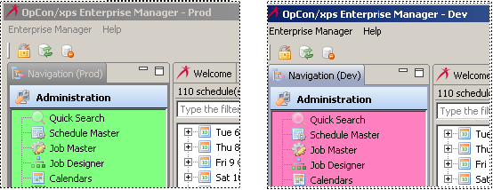

# Managing Connection Profiles

When using the Enterprise Manager for the first time or to set up a new database connection, a profile needs to be defined. This will have the database name where you wish to connect as well as other information, such as the database login and password information. It is also possible to set a background color associated with a profile. This could be useful to distinguish between two separate databases (e.g., a profile connecting to a production machine database and one that connects to a test machine database).

.png "More Info icon")

Related Topics

- [Setting up New Profiles](Setting-up-New-Profiles.md)
- [Editing Profiles](Editing-Profiles.md)
- [Deleting Profiles](Deleting-Profiles.md)
- [Copying Profiles](Copying-Profiles.md)
