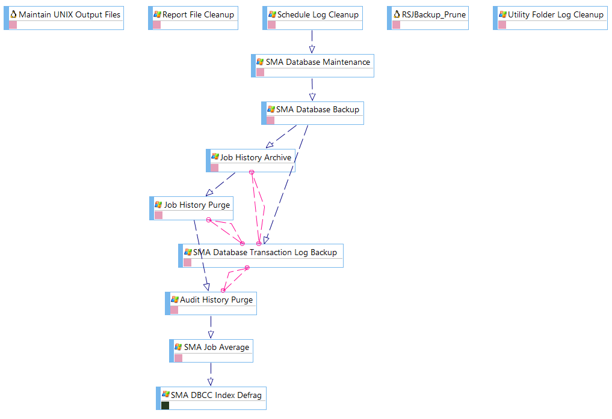
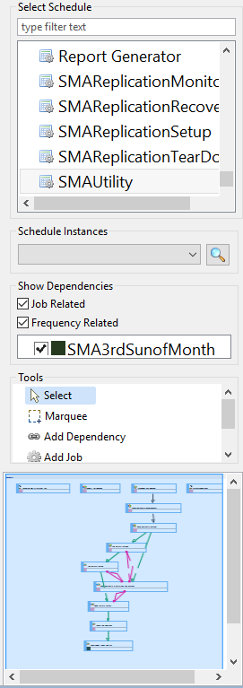

# Using Workflow Designer

The **Workflow Designer** has three main elements: [display area](#Workflow), [action panel](#Workflow2), and [toolbar](#Workflow3).

## Workflow Designer Display Area

The **display area** provides the graphical display and workflow (also
referred to as a *flow diagram* or *flow map*) for a selected schedule.
Each node on the layout represents a job (rectangle), threshold (rounded
rectangle), or resource (oval). The [lines between nodes](Workflow-Designer-Dependency-Lines.md) represent their
dependency relationships. The interface provides the ability to drag and
drop dependencies for jobs, thresholds, and resources as well as
provides [right-click functionality](Workflow-Designer-Right-Click-Menus.md) for nodes
and dependency lines.

Example Flow Diagram

## Workflow Designer Action Panel

The **action panel**, to the right of the display area, contains a list
of schedules and subschedules with different layout choices for viewing
the job dependency relationships. Specific diagram tools are also
provided in the panel to add jobs and dependencies, and select
thresholds and resources to add to the display. The lower portion of the
panel displays a small map of the entire schedule to provide easier
navigation to the different clusters of information in the display.

Workflow Designer Action Panel

## Workflow Designer Toolbar

The toolbar resides at the top-right corner of the screen and allows you
to perform various functions. Click on any specific icon or control on
the toolbar below to learn more about its functionality.

.png "More Info icon")
Related Topics

- [Understanding Flow Diagram     Icons](Workflow-Designer-Flow-Diagram-Icons.md)
- [Understanding Dependency     Lines](Workflow-Designer-Dependency-Lines.md)
- [Using Right-Click     Menus](Workflow-Designer-Right-Click-Menus.md)
- [Displaying Schedule Layouts](Displaying-Schedule-Layouts.md)
- [Displaying Schedules showing Job-Related/Frequency-Related     Information](Displaying-Schedules-with-Info.md)
- [Adding New Schedules](Adding-New-Schedules.md)
- [Adding Jobs to Schedule     Layouts](Adding-Jobs-to-Schedule-Layouts.md)
- [Adding Thresholds to     Layouts](Adding-Thresholds-to-Layouts.md)
- [Adding Resources to Layouts](Adding-Resources-to-Layouts.md)

:::
