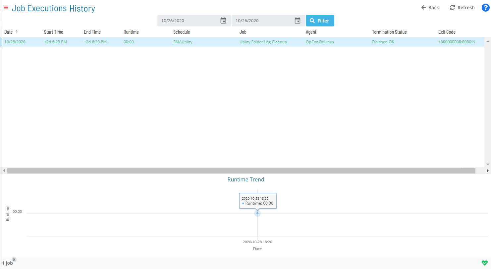

# Accessing Job Executions History

In the **Operations** module, you can access and view all iterations (i.e., the executions history) of a job as well as the job output on past executions. A runtime trend is also available at the bottom of the page to reflect the runtime trend for a range of job executions.

When viewing job executions history, the following information is displayed per execution:

- **Date**: The date of the Daily schedule for which the job executed.
- **Start Time**: The actual date and time the schedule started in a 24-hour clock time format (00:00).
- **End Time**: The date and time the job ended in a 24-hour clock time format (00:00).
- **Runtime**: The amount of time the job ran in minutes.
- **Schedule**: The name of the schedule containing the selected job.
- **Job**: The name of the selected job.
- **Agent**: The name of the LSAM machine for which the job executed. For jobs that "run on each machine" in a group, the machine name will display for each copy of the job that ran.
- **Termination Status**: The completion status of the job (whether it terminated successfully or not).
- **Exit Code**: The numeric value that is returned when the job has terminated (or has been executed).

This information is presented in table format and can be easily sorted. Click on the column heading to sort the column in ascending order (indicated by a small arrow pointing down). Click on the column heading again to sort the column in descending order (indicated by a small arrow pointing up).

To access job execution history:

1. Click on the **Processes** button at the top-right of the **Operations Summary** page. The **Processes** page will display.
2. Ensure that both the **Date** and **Schedule** toggle switches are enabled so that you can make your date and schedule selection, respectively. Each switch will appear green when enabled.
3. Select the desired **date(s)** to display the associated schedule(s).
4. Select one or more **schedule(s)** in the list.
5. Select one **job** in the list. A record of your selection will display in the [status bar](SM-UI-Layout.md#Status) at the bottom of the page in the form of a breadcrumb trail.
6. Click on the job record (e.g., 1 job(s)) in the status bar to display the **Selection** panel.
7. Click the **Job Executions History** button  at the top-left corner of the panel to access the **Job Executions History** page. By default, the history of executions for the selected date are displayed.
8. Enter a *Start Date* and *End Date* in the date fields at the top of the page. Alternatively, you can click on the **calendar icon** (to the right of the Start and End dates) and select the **date**.
9. Click the **Filter** button to display the results. If multiple executions exist, the runtime trend for the period is displayed.
10. Select a job executions history record that is listed on the page then right-click on it to access any available job output in the **Selection** panel to the right.
    :::note
    The job output record for the historical instance of the job must still exist on the target platform for this operation to be successful.
    :::
11. Click the **Refresh** button to fetch a list both of any existing or new job output files for the selected job. When clicked, the button toggles to **Cancel**. At any time during the refresh, you can click the **Cancel** button to cancel the action.
12. Click the **Close** button to close the panel.

:::note
Job execution history can also be accessed while in PERT View. For more information, refer to [PERT View Job Executions History Access](Using-PERT-View.md#PERT11).
:::

.png "More Info icon") Related Topics

- [Accessing Job Summary](Accessing-Job-Summary.md)
- [Using PERT View](Using-PERT-View.md)
