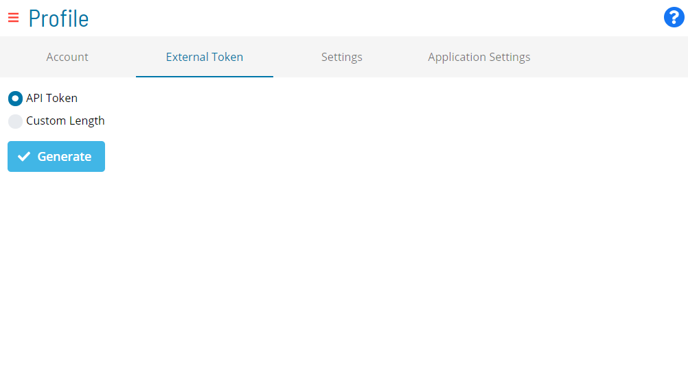

# Generating External Tokens

An external token along with a valid OpCon User Login ID is required to execute an external event in OpCon. External tokens can be generated in Solution Manager as either API tokens or Custom Length tokens.

To generate external tokens:

Log into the Solution Manager, if not already logged in.

Click on the **user profile** button located in the **Navigation** menu,
as shown in the graphic.

The **Profile** page will display.

Select the **External Token** tab on the **Profile** page, as shown in
the graphic.

Select one of the following radio buttons to specify which type of
external token to generate:

- **API Token**: Selecting this option will allow you to generate an
    external token that can also be used for API authentication.
- **Custom Length**: Selecting this option will allow you to set the
    length (ranging from 8 to 35 characters) of the external token that
    will be generated. If this option is selected, then the token cannot
    be used for API authentication.

Click **Generate** to generate the external token.
