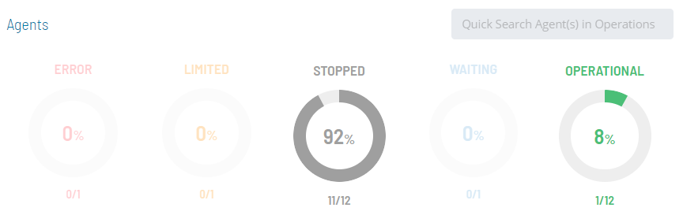
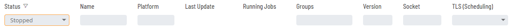
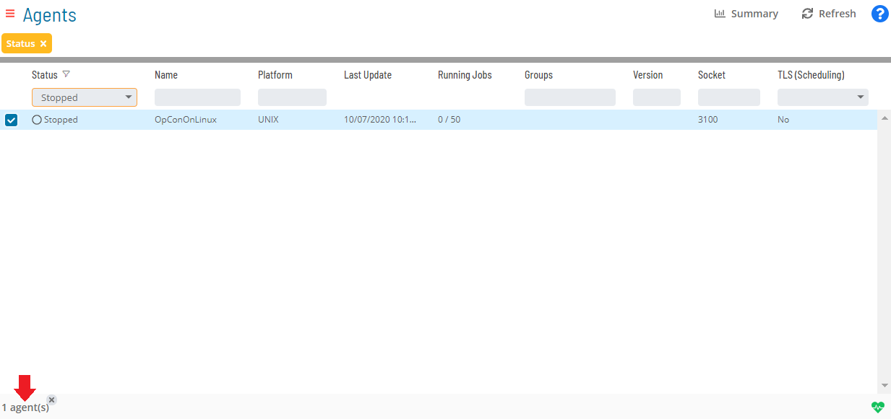
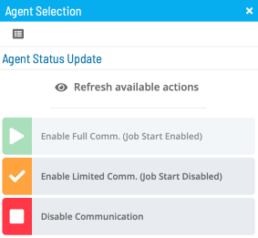

# Performing Agent Status Updates

The **Operations** module allows you to perform Agent status updates
using a few simple steps.

To perform agent status updates:

Click on one of the five operation dials (Error, Limited, Stopped,
Waiting, or Operational) or use the **Quick Search** field (type the
keyword and click **Enter**) in the **Agents** section on the
**Operations Summary** page.

The **Agents** page will display.

*(Optional)* Use the **Filter Bar** to filter the list
of Agent machines.

:::note
As an [alternative filtering option](Managing-Daily-Processes.md#Interactive), you can use the interactive color-coded **Statistics Bar** above the list of Agent machines to filter the list by status. Click on any color in the bar to filter the view by the current status.
:::

:::note
You can sort the list of Agent machines as well. Click on the column heading to sort the column in ascending order (indicated by a small arrow pointing down). Click on the column heading again to sort the column in descending order (indicated by a small arrow pointing up).
:::

Select any **Agent(s)** in the list. A record of your selection(s) will
display in the [status bar](SM-UI-Layout.md#Status) at the bottom
of the page in the form of a breadcrumb trail.

Click on the Agent record in the status bar to display the **Action**
panel.

:::note
As an alternative, you can right-click on any Agent machine selected in the list to display the **Action** panel.
:::

*(Optional)* Click the **Refresh available actions**
button to verify which status update actions are available for the
current selection. This option is particularly helpful when more than
one Agent machine has been selected since all status update buttons are
enabled by default.

Select one of the following actions (if enabled) to be applied to the
selected Agent(s):

- **Enable Full Communication (Job Start Enabled)**: This option, when
    enabled, allows the Agent to send job execution results to OpCon and
    OpCon to send job start/execution requests to the Agent.
- **Enable Limited Communication (Job Start Disabled)**: This option,
    when enabled, limits communication so that OpCon does not send any
    new job start/execution requests to the Agent. However, the
    completion status (execution results) of any tasks already running
    on the Agent will be reported to OpCon.
- **Disable Communication**: This option, when selected, disables
    communication between the Agent and OpCon. OpCon will not attempt to
    communicate with the Agent and the Agent will not attempt to
    communicate with OpCon.

*(Optional)* When a single Agent machine is selected,
the **View Active Jobs** button is available. This option will navigate
to the **Processes** page with a filter applied to display jobs in a
Waiting, Held, or Running status for the selected machine.

Close the **Action** panel when done.

.png "More Info icon")
Related Topics

- [Performing Schedule Status     Changes](Performing-Schedule-Status-Changes.md)
- [Performing Job Status     Changes](Performing-Job-Status-Changes.md)
- [Performing Bulk Status Job Updates (Schedule     Level)](Performing-Bulk-Job-Status-Updates-Schedule-Level.md)
- [Viewing Job Output](Viewing-Job-Output.md)
- [Using PERT View](Using-PERT-View.md)
- [Managing Daily Processes](Managing-Daily-Processes.md)
