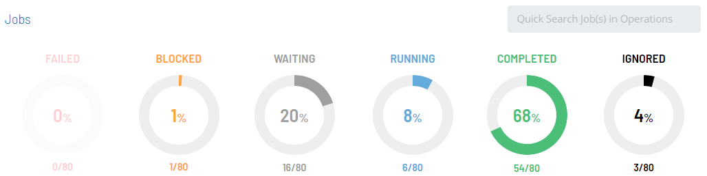
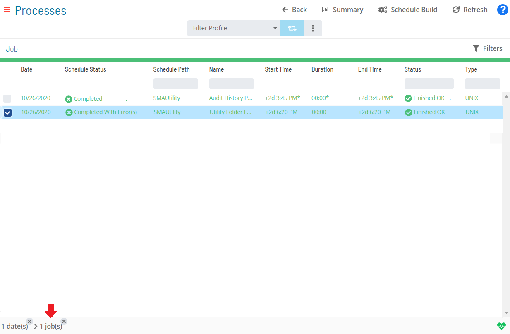
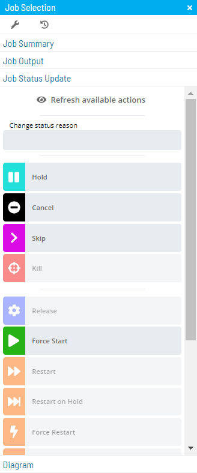

# Performing Job Status Changes

The **Operations** module allows you to perform job status changes using
a few simple steps.

To perform job status changes:

Click on one of the six operation dials (Failed, Blocked, Waiting,
Running, Completed, or Ignored) or use the **Quick Search** field (type
the keyword and click **Enter**) in the **Jobs** section on the
**Operations Summary** page.

:::note
The "Ignored" operation dial groups any job with a job status of Cancelled or Skipped.
:::

The **Processes** page will display.

*(Optional)* Filter and/or sort the list of jobs
displayed.

Filtering:

a.  For [quick filtering](Managing-Daily-Processes.md#Quick), you
    can use the **Filter Bar** just above the list of jobs to filter the
    list. You simply type the keyword in the appropriate field and click
    **Enter**, and the list will filter accordingly.
b.  For [alternative     filtering](Managing-Daily-Processes.md#Interactive), use the
    interactive color-coded **Statistics Bar** above the list of jobs to
    filter the list by status. Click on any color in the bar to filter
    the view by the current job status.
c.  For more [in-depth     filtering](Managing-Daily-Processes.md#In-depth), you can use
    the 
    button to display the **Filter** panel then filter the list of jobs
    by job status, tag, department, or access code. The filter button
    icon will change to dark yellow and also display the number of
    filters currently turned on ().
    Click on the **x** at the top-right corner of the button to remove
    all selected filters at once.

Sorting:

Click on the column heading to sort the column in ascending order
(indicated by a small arrow pointing down). Click on the column heading
again to sort the column in descending order (indicated by a small arrow
pointing up).

Select any **job(s)** in the list. A record of your selection(s) will
display in the [status bar](SM-UI-Layout.md#Status) at the bottom
of the page in the form of a breadcrumb trail.

Click on the job record (e.g., 1 job(s)) in the status bar to display
the **Selection** panel.

:::note
As an alternative, you can right-click on any job selected in the list to display the **Selection** panel.
:::

Select the **Job Status Update** accordion-style tab in the panel.

*(Optional)* Click the **Refresh available actions**
button to verify which status update actions are available for the
current selection. This option is particularly helpful when more than
one job has been selected since all status update buttons are enabled by
default.

*(Optional)* Enter or select a change status reason.

:::note
Depending on application configuration, the **Change Status Reason** drop-down list may store a number of the previous reasons entered for Job or Schedule status updates.
:::

Select one of the following status updates to apply to the selected
job(s):

- **Hold**: This option allows you to place the selected job(s) on
    hold.
- **Cancel**: This option allows you to cancel the selected job(s).
    The job does not process unless manually started by a user or an
    event.
- **Skip**: This option allows you to place the selected job(s) in a
    Job to be Skipped state until the job(s)     qualify to start. When the job(s) qualify, they are skipped and the
    job dependencies of all subsequent jobs are met.
- **Kill**: This option allows you to send a request to abort one ore
    more jobs on an Agent machine. If the kill is successful, the
    application reports the killed job as Failed.     If the Kill is not successful, the job continues to show a
    Running status in the application.
- **Release**: This option allows you to release the selected job(s)
    from a Held state.
- **Force Start**: This option allows you to force start the selected
    job(s). This causes the job(s) to ignore all dependencies, and to
    start immediately.
- **Restart**: This option allows you to place the selected job(s)
    back in a Qualifying state. All dependencies     must be met before the job(s) are submitted.
- **Restart on Hold**: This option allows you to place the selected
    job(s) back in a Qualifying state, and the     job(s) will process when all dependencies have been met.
- **Force Restart**: This option allows you to force restart the
    selected job(s) and ignore the start time and all dependencies. The
    job(s) restart as soon as this option is selected as long as a
    machine is available.
- **Restart On Step**: This option allows you to select a step on
    which to restart a job. This option can only be triggered if the job
    type supports this feature and there is an available list of steps
    in the database returned by the Agent during runtime.
- **Mark Finished OK**: This option allows you to change the selected
    job(s) to a Finished OK status regardless of     the job's current status. All events are processed as if the job(s)
    had Finished OK without intervention. If a job     is Marked Finished OK before it starts, both
    the start and finish time saved in history equal the time the job is
    marked.
- **Mark Failed**: This option allows you change the selected job(s)
    to a Failed status regardless of the job's     current status. All events are processed as if the job(s) had failed
    without intervention. If a job is Marked Failed     before it starts, both the start and finish time saved in history
    equal the time the job is marked.
- **Mark Under Review**: This option allows you to change the selected
    job(s) to an Under Review status (and being     worked on) when the job is in a Failed, Marked
    Failed, or Initialization Error state.
- **Mark Fixed**: This option allows you to change the selected job(s)
    to Fixed status when the job is in a Failed, Marked Failed,
    Initialization Error, or Under Review state.

:::note
For more information about job status changes, refer to [Schedule and Job Status Change Commands](../../../operations/status-change-commands.md) in the **Concepts** online help.
:::

Close the **Selection** panel when done.

.png "More Info icon")
Related Topics

- [Performing Schedule Status     Changes](Performing-Schedule-Status-Changes.md)
- [Performing Bulk Status Job Updates (Schedule     Level)](Performing-Bulk-Job-Status-Updates-Schedule-Level.md)
- [Performing Bulk Status Job Updates (Date     Level)](Performing-Bulk-Job-Status-Updates-Date-Level.md)
- [Performing Agent Status     Updates](Performing-Agent-Status-Updates.md)
- [Viewing Job Output](Viewing-Job-Output.md)
- [Using PERT View](Using-PERT-View.md)
- [Managing Daily Processes](Managing-Daily-Processes.md)
