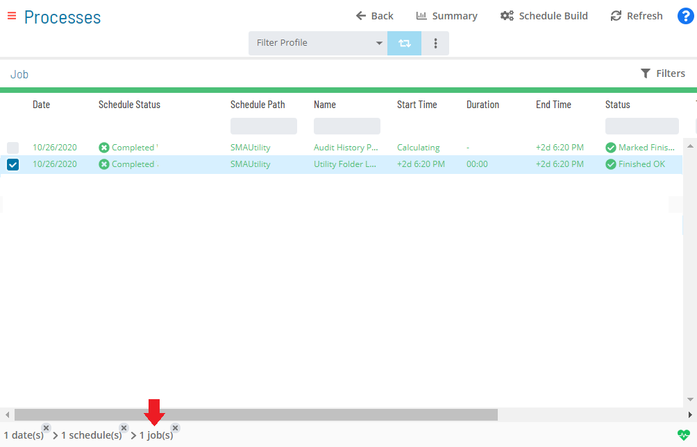
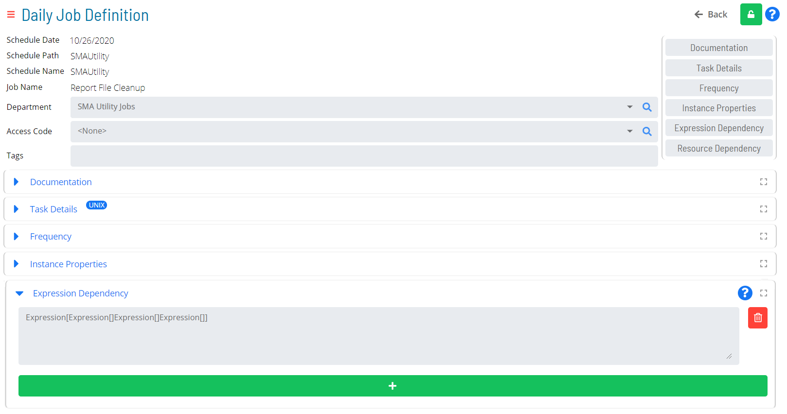

# Viewing and Updating Expression Dependencies

The **Expression Dependency** panel in **Daily Job Definition** displays
any defined expression dependencies related to the selected job.

- The panel can be placed in **Full Screen** mode by simply clicking
    the icon ()
    to the far-right side of the panel bar. Escape **Full Screen** mode
    by clicking on the icon again.
- When the panel contains defined properties, a blue circular
    indicator containing a number ()
    will appear to the right of the panel name to indicate the number of
    properties that have been defined.

## Adding or Updating Expression Dependencies

In **Admin** mode, expression dependencies can be updated. For
conceptual information, refer to [Property Expressions API Syntax](../../../reference/property-expressions-syntax.md)
 in the **Concepts** online help. For examples and use cases,
refer to the [Use Cases](../../../reference/property-expressions-syntax.md#Use)
 section.

:::note
Only those with the appropriate permissions will have access to the **Lock** button and can update job properties. For details about privileges, refer to [Required Privileges](Accessing-Daily-Job-Definition.md#Required) in the **Accessing Daily Job Definition** topic.
:::

:::note
Changes made to the job properties in the **Daily Job Definition** will take place immediately. If the job has already run, the changes will take effect the next time the job runs.
:::

To perform this procedure:

Click on the **Processes** button at the top-right of the **Operations
Summary** page. The **Processes** page will display.

Ensure that both the **Date** and **Schedule** toggle switches are
enabled so that you can make your date and schedule selection,
respectively. Each switch will appear green when enabled.

Select the desired **date(s)** to display the associated schedule(s).

Select one or more **schedule(s)** in the list.

Select one **job** in the list. A record of your selection will display
in the [status bar](SM-UI-Layout.md#Status) at the bottom of the
page in the form of a breadcrumb trail.

Click on the job record (e.g., 1 job(s)) in the status bar to display
the **Selection** panel.

:::note
As an alternative, you can right-click on the job selected in the list to display the **Selection** panel.
:::

.png "Job Summary Tab in Operations")

Click the **Daily Job Definition** button 
at the top-left corner of the panel to access the **Daily Job
Definition** page. By default, this page will be in **Read-only** mode.

Click the **Lock** button 
at the top-right corner to place the page in **Admin** mode. The button
will switch to display a white lock unlocked on a green background

when enabled.

:::note
The **Lock** button will not be visible to users who do not have the appropriate permissions.
:::

Expand the **Expression Dependency** panel to expose its content.

Do any of the following to make updates:

a.  Edit or delete any existing property expression if necessary.
b.  Click the green **Add** button (**+**) to define a new property
    expression by entering the expression syntax in the designated
    field. Each property expression field permits up to 4000 characters.
    You are allowed to have up to two (2) properties expressions for a
    job.

:::note
Click the **Undo** button if you wish to undo your changes for any reason.
:::

Click the **Save** button.
