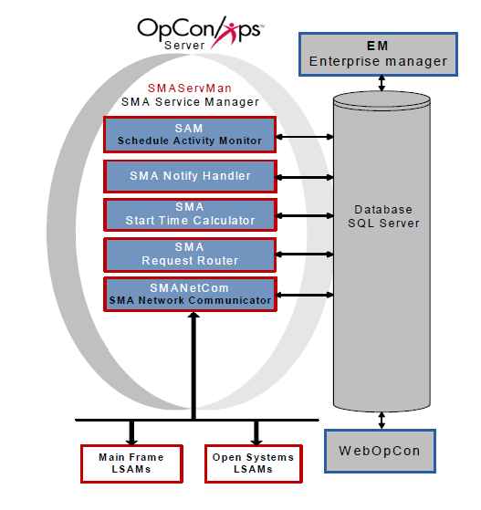

# Getting Started with OpCon

The OpCon Server components include the database and Schedule Activity Monitor (SAM) and supporting services. On user workstations, desktop clients connect to the database and web-based interfaces connect to web services to manage the data for automation. The agents responsible for executing jobs are called Local Schedule Activity Monitors (LSAMs).

## OpCon Architecture Overview

## OpCon Components

### Graphical User Interfaces

OpCon provides two primary graphical user interfaces. One interface is a rich client interface for installation on Windows and Linux operating systems called the Enterprise Manager (EM). The other interface is a browser-based interface called the Solution Manager. These interfaces are the primary means of controlling the data used by OpCon. These applications access the OpCon database to manage the data for automation. These interfaces also manage operations once the automation is configured. For additional information on the Enterprise Manager, refer to the **Enterprise Manager** online help. For additional information on the Solution Manager, refer to the **Solution Manager** online help.

### Database

The OpCon database is installed on Microsoft SQL Server on a Windows Server. This database contains all of the data defining the automation requirements, operational processing, and historical information. For additional information, refer to **Database Information** online help.

#### Auditing

The database installation for OpCon ensures that changes made to all OpCon objects are audited. All OpCon user accounts and many of the core services are tracked through the audit history. The following information is recorded for every change:

- **Date**: The date and time stamp the change occurred.
- **User**: The user or application that made the change.
  - If an OpCon user account made the change, that user account is recorded with the change.
  - If an OpCon application was audited, the name appears with an asterisk in front of the name. For example, SAM entries are recorded under the user of **\*SMASAM**.
  - If a change was made to the database by an unregistered application (e.g., a user makes an update through a SQL Query window), those entries are recorded under the user **Unknown**.
- **Data Changed**: The name of the item that changed.
- **Original Value**: The original value for the data item.
- **Final Value**: The final value for the item.
- **Category**: The OpCon object category affected by the change.
- **Name**: Shows the name of the exact item that was affected. For example, when the Data Changed column shows "Job Record," the value for the Name would show the name of the job that was changed (e.g., ScheduleABC:Job299).

:::info
For viewing audit records, refer to [Viewing and Exporting Audit Records](./Files/UI/Enterprise-Manager/Viewing-and-Exporting-Audit-Records.md) in the **Enterprise Manager** online help.

For information on cleaning up old audit records, refer to [Audit History Cleanup](./utilities/Command-line-Utilities/Audit-History-Cleanup.md) in the **Utilities** online help.
:::

### SAM and Supporting Services (SAM-SS)

The SAM and supporting services (SAM-SS) are the components that manage all automation processing. For additional information, refer to the [Server Programs](./server-programs/introduction.md) online help.

#### Schedule Activity Monitor (SAM)

The Schedule Activity Monitor (SAM) is the logical processor for OpCon workflow automation. The SAM monitors schedule and job start times, dependencies, and user commands to determine when a particular job will be executed. The SAM also watches for and processes OpCon events that control the event driven nature of OpCon automation. The SAM communicates job and event information with the LSAMs via SMANetCom. For additional information, refer to [Schedule Activity Monitor (SAM)](./server-programs/schedule-activity-monitor.md) in the **Server Programs** online help.

#### SMA Network Communications Module (SMANetCom)

The SMA Network Communications Module (SMANetCom) is responsible for communication of platform-specific automation information between SAM and all LSAMs. Through tables in the database, SAM and SMANetCom maintain reliable communication and data integrity. SMANetCom communicates with each LSAM independently via TCP/IP. For additional information, refer to [SMA Network Communications Module (SMANetCom)](./server-programs/network-communications.md) in the **Server Programs** online help.

#### SMA Notify Handler

The SMA Notify Handler processes notifications caused by Machine, Schedule, and Job status triggers. The SMA Notify Handler can send e-mails, text messages, write to the Windows Event Log, send SNMP traps, and perform various other notifications. For additional information, refer to [SMA Notify Handler](./server-programs/notify-handler.md) in the **Server Programs** online help.

#### SMA Request Router

The SMA Request Router is the component responsible for sending various requests to designated Request Handlers. The SMA Request Router also writes completion information from the Request Handlers to the OpCon database. Request Handlers are responsible for such things as schedule maintenance processing and job output retrieval. For additional information, refer to [SMA Request Router](./server-programs/request-router.md) in the **Server Programs** online help.

#### SMA Start Time Calculator

The SMA Start Time Calculator component periodically recalculates the estimated start time for all the jobs in the OpCon daily tables. Following its calculations, this service updates the database. For additional information, refer to [SMA Start Time Calculator](./server-programs/start-time-calculator.md) in the **Server Programs** online help.

### Local Schedule Activity Monitors (LSAMs)

Local Schedule Activity Monitors (LSAMs) are agents that reside on the platform where the jobs are executed. LSAMs are written in the native language of their platforms making them efficient agents for executing jobs. The LSAMs communicate with SMANetCom via TCP/IP for job processing information and sending OpCon events. OpCon supports automation with LSAMs for the following job types:

- [BIS](./job-types/bis.md)
- [Container](./job-types/container.md)
- [File Transfer](./job-types/file-transfer.md)
- [IBM i](./job-types/ibm-i.md)
- [MCP](./job-types/mcp.md)
- [Null](./job-types/null.md)
- [OS2200](./job-types/os-2200.md)
- [SAP BW](./job-types/sap-bw.md)
- [SAP R/3 and CRM](./job-types/sap.md)
- [SQL](./job-types/sql.md)
- [Tuxedo ART](./job-types/tuxedo-art.md)
- [UNIX](./job-types/unix.md)
- [Windows](./job-types/windows.md)
- [z/OS](./job-types/zos.md)
