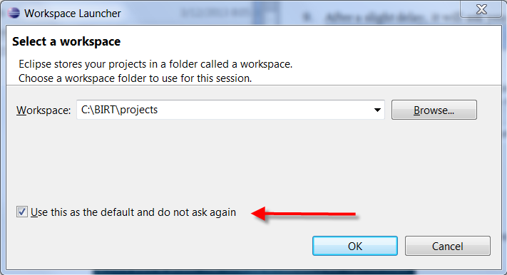
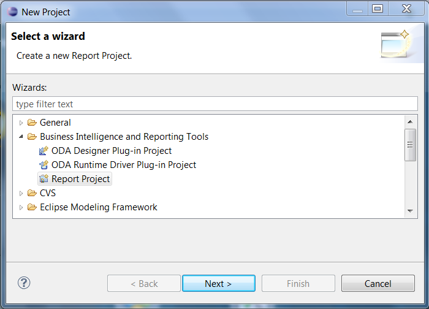
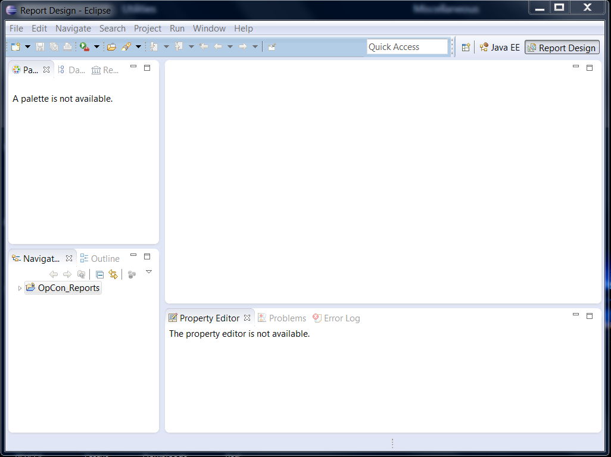
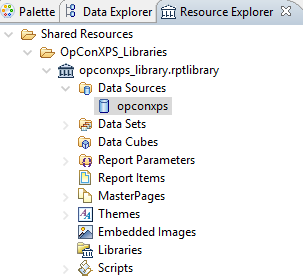
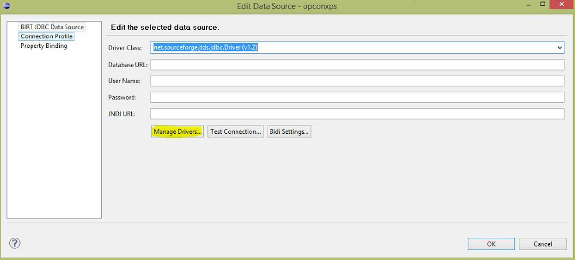
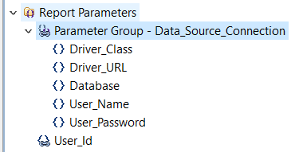

# Custom Reports

## Introduction

This topic is intended to serve as a guide on how to create an environment that allows users to edit the BIRT reports supplied by SMA Technologies or create their own.

## Install the Environment

1. Create a *BIRT directory* to hold the environment. This should be a
    complete, standalone directory structure containing everything
    needed for report modification.

2. Create a *projects directory* under the *BIRT directory*.

3. Locate the **jtds-1.2.5.jar** file and copy it to the *BIRT
    directory*.

4. Download **BIRT** for the correct environment from [http://archive.eclipse.org/birt/downloads/build.php?build=R-R1-3_7_1-201109131734](http://archive.eclipse.org/birt/downloads/build.php?build=R-R1-3_7_1-201109131734).

5. Move the *downloaded file* to the *BIRT directory*.

6. Extract the *zip file* to the *BIRT directory*. The directory
    structure should look similar to the following:

7. Navigate to the **eclipse** sub-directory and double-click the
    **eclipse.exe** file to run the program.

8. Browse to the *projects directory* created earlier.

9. Select the **Use this as the default and do not ask again**
    checkbox.

    

10. Launch after setting the workspace.

11. Use menu path **File\> New \> Project** to create the
    **OpCon_Reports** project. A wizard will display allowing you to
    select the project type.

12. Expand the **Business Intelligence and Reporting Tools** folder.

13. Select **Report Project**.

    

14. Click **Next**.

15. Enter **OpCon_Reports** in the **Project name** field. Leave **Use
    default location** selected.

16. Click **Finish**.

17. Select **Remember my decision** when asked if you want to open the
    **Report Designer perspective**.

18. Click **Yes**.

19. Click on the **x** to the right of the **Welcome** tab to close the
    Welcome screen (if displayed).

20. The resulting screen should look similar to the following:

    

## Install the SMA Reports

1. Use menu path: **File \> Import\...**. The **Import** wizard will
    start.
2. Expand the **General** folder.
3. Select **File System**.
4. Click **Next**.
5. Browse to the *reports sub-directory* under the Enterprise Manager
    directory.
6. Select the **reports** folder to include all of the sub-directories.
7. Click **OK**.
8. Select the **reports** folder checkbox.
9. Enter **OpCon_Reports** in the **Into folder** field (if empty).
10. Click **Finish**.

Now you can edit SMA Reports or create your own.

## Create a New Report

1. Right-click on **OpConXPS_Reports**.

2. Use menu path: **New \> Report**.

3. Enter a *file name*.

4. Click **Finish**.

5. Navigate to the **OpConXPS_Libraries** folder.

6. Use path: **opconxps_library.rptlibrary \> data sources \>
    opconxps**.

    Resource Explorer

    

7. Right-click on **opconxps** and add it to the report.

8. Navigate to the **Data Explorer** tab.

9. Double-click on **opconxps** under **Data Sources**.

10. Enter **net.sourceforge.jtds.jdbs.Driver(v1.2)** in the **Driver
    Class** field to connect to BIRT.

    Edit Data Source

    

11. Click **Manage Drivers**.

12. Click the **Add\...** button.

13. Navigate to the *BIRT directory* to add the **jtds-1.2.5.jar** file.

14. Click **OK**.

## Import the Database Connection Parameters

You need to be connected to the database to receive the data. Use the
following steps to import the following two parameters:

- **Parameter Group -- Data_Source_Connection**: This parameter is a
    database connection.
- **User_Id**: To add the privileges access to the report, you can
    grant access with this parameter and filter it in the query.

1. Use path: **Shared Resources \> OpConXPS_Libraries \>
    opconxps_library.rptlibrary \> Report Parameters**.
2. Expand the **Report Parameters** folder.
3. Right-click on **Parameter Group - Data_Source_Connection** and
    select **Add to report**.
4. Right-click on **User-Id** and select **Add to report**.

In the workplace section, you should see the following:

Report Parameters



You can modify the parameters to connect the report to your own
database.

**Driver_Class**: The default value should always be the following:
net.sourceforge.jtds.jdbc.Driver.

**Driver_URL**: Enter the URL for the database using the format the
driver requires.

:::tip Example
The format for a MySQL database is the following:

```shell
jdbc:mysql://<host>:<port>/<database>
```

:::

- Enter the database path for you environment in the database URL.
    From the former example, "jdbc:jtds:sqlserver://" is the
    connection with the database. Change the server name and the port
    number to match your environment, e.g., jdbc:jtds:sqlserver://server
    name/database name
- If you have a SQL instance, please add ";instance=< instance
    name\>" at the end of the database URL.

**Database**: This parameter defines the database name, which is
"opconxps" by default.

**User_Name** and **User_Password**: Enter the login for the database
for these parameters.

After editing the report, copy the report from the OpConXPS_Reports
folder, e.g., C:\\BIRT\\projects\\OpCon_Reports\\OpConXPS_Reports, to
the reports sub-directory under the Enterprise Manager directory, e.g.,
C:\\Program Files\\OpConxps\\EnterpriseManager
x64\\reports\\OpConXPS_Reports.

## Schedule the New Reports

1. Add the *report(s)* to the path: **<OpCon Install
    Folder\>\\SAM\\BIRT\\ReportEngine\\OpConXPS_Reports**.
2. Create or use an existing **Schedule** in the Enterprise Manager.
3. Create a **Windows** job with the *report name* as the *job name*.
4. Select the Windows **Primary Machine**.
5. Select **Run Program** in the **Job Action** drop-down menu.
6. Select **Use Service Account** in the **User Id** drop-down menu.
7. Enter **\[\[SMAOpConPath\]\]\\Utilities\\BIRTRptGen.exe** followed     by the *report name* as **-rReportName** in the **Command Line**
    field.
8. *(Optional)* Add parameters after the report name
    using the following format: **-pParameterName=ParameterValue**.
9. Enter **\[\[SMAOpConPath\]\]\\Utilities\\** in the **Working     Directory** field.
10. Enter a *frequency*.
11. Build the **job**.
