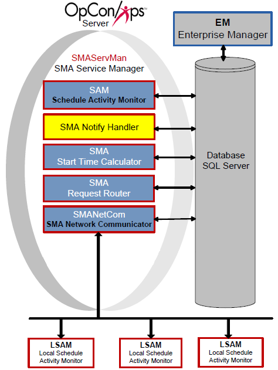

# SMA Notify Handler

The SMA Notify Handler component is responsible for reading the NOTIFY table in the OpCon database and writing the message to the appropriate location. For more information, refer to [Using Notification Manager](../Files/UI/Enterprise-Manager/Using-Notification-Manager.md) in the **Enterprise Manager** online help.

The SMA Notify Handler can send the following basic notifications after reading the NOTIFY table:

- Windows Event Log
- Email (SMTP) (For more information on configuring notifications for SMTP, refer to [Configuring SMTP Notifications](../notifications/Notification-Configuration.md#Configur3) in the **Concepts** online help.)
- SNMP Trap (For more information on configuring notifications for SMTP, refer to [Configuring SNMP Notifications](../notifications/Notification-Configuration.md#Configur) in the **Concepts** online help.)
- Unisys Single Point of Operations (SPO) AL and CO Reports (For more information on configuring notifications for SMTP, refer to [Configuring SPO Notifications](../notifications/Notification-Configuration.md#Configur2) in the **Concepts** online help.)
- Text Messages (SMS)
- OpCon Events
- Command

## Configuration

SMA Notify Handler configuration determines basic application and logging behavior.

All of the SMA Notify Handler's configuration settings exist in the Enterprise Manager's Server Options. For more information, refer to [Managing Server Options](../Files/UI/Enterprise-Manager/Managing-Server-Options.md) in the **Enterprise Manager** online help.

### Processing

When processing notifications:

- The SMA Notify Handler resolves tokens before sending any notifications. Tokens can resolve to any valid property in OpCon.
- For all Schedules, SMA Notify Handler looks up the Schedule Name for the notification from the Daily tables to ensure that all notifications containing a Schedule Name will contain the unique schedule name instance for the customer to follow up on if necessary.
- Any OpCon Events are passed in the SAM's MSGIN directory for processing. SMA Notify Handler automatically supplies the user name and password.
- For all notification types with message or text fields, SMA Notify Handler inserts a Notification ID as the first few characters of the message. This ID provides a way for users to look up the source of a notification.
- Email and Text Messaging SMTP server usage:
  - SMTPSERVER and SMTPSERVER2 will be used for email notifications and only used for SMS if SMTPSERVER3 and SMTPSERVER4 are not configured.
  - SMTPSERVER3 and SMTPSERVER4 will only be used for SMS notification if they are configured.
  - SMTPSERVER2 is used as the alternative to SMTPSERVER if it is configured and a notification fails on the primary.
  - SMTPSERVER4 is used as the alternative to SMTPSERVER3 if it is configured and a notification fails on the primary.
- Network Message Processing:
  - SMA Notify Handler uses Msg.exe to send network messages. If that message fails, SMA Notify Handler logs an error and cannot successfully send the message.
  - When using MSG.exe, SMA Notify Handler always uses asterisk (\*) for the user name and assumes the "Recipients" defined are either Host Names or IP Addresses.
  - For a successful message, the Authentication User (UNC Access) and Authentication Password (UNC Access) must be defined in the Server Options. The user must be an Administrator on the SAM application server and on every machine to which it will send messages. For more information, refer to [Authentication User (UNC Access)](../administration/server-options.md#Authentication_User_(UNC_Access)) and [Authentication Encrypted Password (UNC Access)](../administration/server-options.md#Authentication_Encrypted_Password_(UNC_Access)) in the **Concepts** online help.
