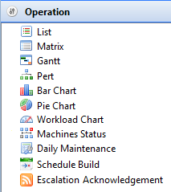

# Working with Operation

The **Operation** views display all schedules to which the current user
account has access in the Daily tables. Each view provides different
ways of looking at schedules and jobs.

Click on any **Operation** function item in the graphic to learn more about that item.

## Operation Toolbar Common Icons

  ----------------------------------------------------------------------------------------------------------- --- -----------------------------------------------------------------------------------------------------------------------------------------------------------------------------------------------------------------------------------------------------------------------------------------------
         The **Gantt**, **PERT**, **Bar Chart**, **Pie Chart**, and **Workload Chart** views require the **Listen for selection changes in other views** setting (located on the toolbar at top-right side of screen) to be activated in order to view the individual dates and schedules information.
  ----------------------------------------------------------------------------------------------------------- --- -----------------------------------------------------------------------------------------------------------------------------------------------------------------------------------------------------------------------------------------------------------------------------------------------

+-------------------------------+---+-------------------------------+
|  |   | views** setting (located on   |
|                               |   | toolbar at top-right side of  |
|                               |   | screen) to be activated in    |
|                               |   | order to send the individual  |
|                               |   | dates and schedule            |
|                               |   | information to the            |
|                               |   | appropriate views.            |
|                               |   |                               |
|                               |   |                               |
|                               |   |                               |
|                               |   | The **Listen for selection    |
|                               |   | changes in other views**      |
|                               |   | setting can also be set up in |
|                               |   | the **List** and **Matrix**   |
|                               |   | views in order to view the    |
|                               |   | same information in a         |
|                               |   | different view (e.g., view    |
|                               |   | the same schedule information |
|                               |   | from the **Daily list** view  |
|                               |   | in the **Matrix** view).      |
|                               |   |                               |
|                               |   |                               |
|                               |   |                               |
|                               |   | In order to refer to the      |
|                               |   | changes simultaneously in     |
|                               |   | both views, refer to the      |
|                               |   | [Synchronizing Data between   | |                               |   | Matrix and List               |
|                               |   | Views](Synchro                |
|                               |   | nizing-Data-between-Mat |
|                               |   | rix-and-List-Views.md) |
|                               |   | procedure.                    |
+-------------------------------+---+-------------------------------+

## Operation Right-click Menus

In the **Operation** views, you can right-click on a schedule or job to
access the **Operations** right-click menus.

### Schedule Right-click Menu

Right-clicking on a schedule in the **Daily List** and **Matrix** views
will show the following menu items:

- **Schedule Information**: Refer to [Schedule     Information](Schedule-Information.md).
- **Schedule History**: Refer to [Schedule     History](Schedule-History.md).
- **Maintenance**: Hovering over this menu item will show the
    following menu items:
  - **Edit Daily Schedule**:
    - Daily List: Refer to [Editing Daily             Schedules](Performing-Schedule-Procedures-List.md#Editing).
    - Matrix: Refer to [Editing Daily             Schedules](Performing-Schedule-Procedures-Matrix.md#Editing).
  - **Edit Master Schedule**:
    - Daily List: Refer to [Editing Master             Schedules](Performing-Schedule-Procedures-List.md#Editing2).
    - Matrix: Refer to [Editing Master             Schedules](Performing-Schedule-Procedures-Matrix.md#Editing2).
  - **Check Schedule**:
    - Daily List: Refer to [Checking             Schedules](Performing-Schedule-Procedures-List.md#Checking).
    - Matrix: Refer to [Checking             Schedules](Performing-Schedule-Procedures-Matrix.md#Checking).
  - **Delete Schedule**:
    - Daily List: Refer to [Deleting             Schedules](Performing-Schedule-Procedures-List.md#Deleting).
    - Matrix: Refer to [Deleting             Schedules](Performing-Schedule-Procedures-Matrix.md#Deleting).
  - **Add Jobs**:
    - Daily List: Refer to [Adding             Jobs](Performing-Schedule-Procedures-List.md#Adding).
    - Matrix: Refer to [Adding             Jobs](Performing-Schedule-Procedures-Matrix.md#Adding).
- **Schedule Status choices**: All schedule status change command
    dialogs display the schedule date and schedule name. Refer to
    [Schedule Status Change     Commands](../../../operations/status-change-commands.md#schedule)
     in the **Concepts** online help.
- **Update Jobs Statuses**: The **Update Job statuses** dialog
    displays the schedule date and schedule name at the top and allows
    you to update all jobs or jobs by status within the selected
    schedule. Refer to [Jobs Status Change     Commands](../../../operations/status-change-commands.md#jobs)
     in the **Concepts** online help.

### Job Right-click Menu

Right-clicking on a job in the **Daily List**, **Matrix**, **PERT**, or
**Gantt** views will show the following menu items:

- **SubSchedule Information**: For a Container job, displays the
    **SubSchedule Information** screen. Refer to [SubSchedule     Information](SubSchedule-Information.md).
- **Job Information**: Refer to [Job     Information](Job-Information.md).
- **Job History**: Refer to [Job History](Job-History.md).
- **Comment**: Provides a dialog to enter a quick comment about a
    completed job to the history record for the most recent instance of
    the job.
  - Daily List: Refer to [Adding Job Completion         Comments](Performing-Job-Procedures-List.md#Adding).
  - Matrix: Refer to [Adding Job Completion         Comments](Performing-Job-Procedures-Matrix.md#Adding).
  - Gantt or PERT: Refer to [Adding Job Completion         Comments](Performing-Job-Procedures-Gantt.md#Adding).
- **View Job Output**:
  - Daily List: Refer to [Viewing Job         Output](Performing-Job-Procedures-List.md#Viewing).
  - Matrix: Refer to [Viewing Job         Output](Performing-Job-Procedures-Matrix.md#Viewing).
  - Gantt or PERT: Refer to [Viewing Job         Output](Performing-Job-Procedures-Gantt.md#Viewing).
- **Window To Host**: This menu provides a dialog to open the emulator
    of choice to log in to the machine for the selected job. For
    information on configuring an emulator, refer to [Setting     Preferences for Window To
    Host](Preferences-for-Windows-To-Host.md) .
  - Daily List: Refer to [Opening Window to         Host](Performing-Job-Procedures-List.md#Opening).
  - Matrix: Refer to [Opening Window to         Host](Performing-Job-Procedures-Matrix.md#Opening).
  - Gantt or PERT: Refer to [Opening Window to         Host](Performing-Job-Procedures-Gantt.md#Opening).
- **Maintenance**: Hovering over this menu item will show the
    following menu items:
  - **Edit Daily Job**:
    - Daily List: Refer to [Editing Daily             Jobs](Performing-Job-Procedures-List.md#Editing2).
    - Matrix: Refer to [Editing Daily             Jobs](Performing-Job-Procedures-Matrix.md#Editing2).
    - Gantt or PERT: Refer to [Editing Daily             Jobs](Performing-Job-Procedures-Gantt.md#Editing2).
  - **Edit Master Job**:
    - Daily List: Refer to [Editing Master             Jobs](Performing-Job-Procedures-List.md#Editing).
    - Matrix: Refer to [Editing Master             Jobs](Performing-Job-Procedures-Matrix.md#Editing).
    - Gantt or PERT: Refer to [Editing Master             Jobs](Performing-Job-Procedures-Gantt.md#Editing).
  - **Delete Job**:
    - Daily List: Refer to [Deleting             Jobs](Performing-Job-Procedures-List.md#Deleting).
    - Matrix: Refer to [Deleting             Jobs](Performing-Job-Procedures-Matrix.md#Deleting).
    - Gantt or PERT: Refer to [Deleting             Jobs](Performing-Job-Procedures-Gantt.md#Deleting).
- **Job Status choices**: All job status change command dialogs
    display the schedule date, schedule name, and job name. Refer to
    [Jobs Status Change     Commands](../../../operations/status-change-commands.md#Jobs)
     in the **Concepts** online help.
- **SAP Child Processes**: For SAP R/3 and CRM jobs, this option
    provides a dialog to monitor and/or restart child processes. This
    dialog can remain open while you continue to work inside the primary
    EM screen. Refer to [SAP Child     Processes](../../../operations/SAP-Job-Menu-Options.md#SAP)
     in the **Concepts** online help.
  - Daily List: Refer to [Monitoring SAP Child         Processes](Performing-Job-Procedures-List.md#Monitori) and
        [Restarting SAP Child         Processes](Performing-Job-Procedures-List.md#Restarti)
        .
  - Matrix: Refer to [Monitoring SAP Child         Processes](Performing-Job-Procedures-Matrix.md#Monitori)
        and [Restarting SAP Child         Processes](Performing-Job-Procedures-Matrix.md#Restarti)
        .
  - Gantt or PERT: Refer to [Monitoring SAP Child         Processes](Performing-Job-Procedures-Gantt.md#Monitori)
        and [Restarting SAP Child         Processes](Performing-Job-Procedures-Gantt.md#Restarti)
        .
- **SAP Job Spools**: For SAP R/3 and CRM jobs, this option provides a
    dialog that retrieves individual spool files generated by a job.
    Refer to [SAP Job     Spools](../../../operations/SAP-Job-Menu-Options.md#SAP2)
     in the **Concepts** online help.
  - Daily List: Refer to [Viewing SAP Job         Spools](Performing-Job-Procedures-List.md#Viewing2)
        .
  - Matrix: Refer to [Viewing SAP Job         Spools](Performing-Job-Procedures-Matrix.md#Viewing2)
        .
  - Gantt or PERT: Refer to [Viewing SAP Job         Spools](Performing-Job-Procedures-Gantt.md#Viewing2)
        .
