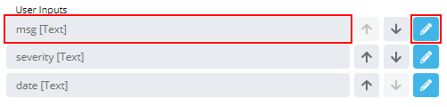
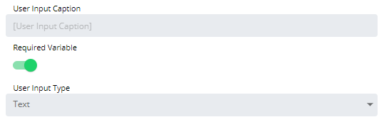

# Configuring Text User Inputs

When configured, the Text User Input will be displayed to users as a
text box with validation rules when they run the Service Request.

To configure the user input:

Double-click on the specific User Input in the **User Inputs** list on
the **Service Request definition** page or click the blue **Edit**
button next to the desired user input to edit.

The **Configure User Input** page will display.

Enter the *User Input Caption* to display when users run the Service
Request. By default, the Variable name is used.

Toggle the **Required Variable** switch if you want to require the user
to input a value for this field.

Select **Text** in the **User Input Type** drop-down list to define that
type of input to present when users run the Service Request.

Specify the validation rules for the User Input, using the following
options:

**Secret**: Allows you to specify that this User Input is a
password/secret field, in which case the value the user enters will be
masked. One such use case would be injecting a password somewhere in the
Events to send to OpCon (e.g., job instance property).

**Minimum Characters**: Allows you to specify a minimum character length
restriction.

**Maximum Characters**: Allows you to specify a maximum character length
restriction.

**Invalid Characters**: Allows you to identify any invalid
\[restricted\] characters.
**Regular Expression**: Allows you to define the following options:

- **Regular Expression Pattern**: Allows you to build a regular
    expression matcher pattern to validate what the user has entered in
    the text field before it is injected.

- **Custom Error Message**: Allows you to define a customized error
    message that will be displayed to users if there is a regular
    expression text validation exception thrown, thus enriching the user
    experience. For example, the following might be a custom error
    message provided to users when they have entered incorrect phone
    number formats: "Please enter a 10-digit phone number with hyphens
    (e.g., 281-446-5000)."

Specify how to format the value being injected within the OpCon Event,
using the following output formatting options:

- **Characters to Strip**: Allows you to specify which character(s) to
    remove from the User Input (after it has been validated).
- **Padding**: Allows you to specify the padding direction
    (left/right), the padding length, and the character used to pad.

Click the **OK** button to confirm User Input configuration, or click
the **Cancel** button to discard changes. This will return you to the
**Service Request definition** page.
:::
