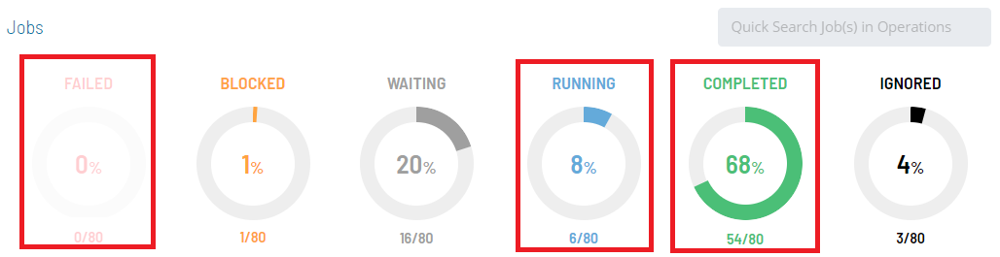
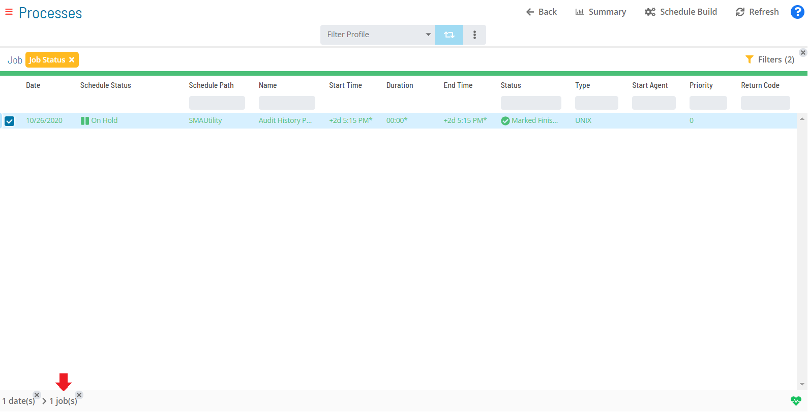
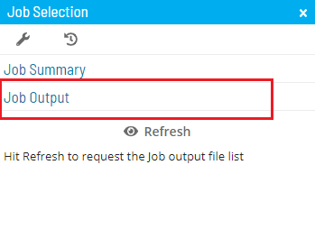

# Viewing Job Output

The **Operations** module allows you to retrieve the output file(s) for
a job if it:

- is completed or has started
- is not a NULL or Container job
- does not have a status of Waiting, On Hold, Cancelled, Missed
    Start Time, or Skipped

:::note
Before attempting to view a job's output file, first refer to [Viewing a Job Output File](../../../operations/job-output.md) in the **Concepts** online help.
:::

To view job output:

Click on the **Failed**, **Running**, or **Completed** operation dial or
use the **Quick Search** field (type the keyword and click **Enter**) in
the **Jobs** section on the **Operations Summary** page.

The **Processes** page will display.

Select one **job** in the list. A record of your selection will display
in the [status bar](SM-UI-Layout.md#Status) at the bottom of the
page in the form of a breadcrumb trail.

Click on the job record (e.g., 1 job(s)) in the status bar to display
the **Selection** panel.

:::note
As an alternative, you can right-click on the job selected in the list to display the **Selection** panel.
:::

Select the **Job Output** accordion-style tab in the panel.

Click the **Refresh** button to fetch a list both of any existing or new
job output files for the selected job. When clicked, the button toggles
to **Cancel**. At any time during the refresh, you can click the
**Cancel** button to cancel the action.

:::note
The **Refresh** button will be disabled in the panel if no job output is available for the selected job.
:::

Click on any **Job Output** button that displays after the refresh to
view the job output file.

The **Job Output** page displays.

Select any of the following options:

- **Refresh/Cancel**: This toggle button allows to refresh the data in
    the output file or cancel the refresh operation.
- **Export**: This button allows you to save the job output file
    locally to your machine.

Click the **Close** button to return to the previous page.

Close the **Selection** panel when done.

.png "More Info icon")
Related Topics

- [Performing Job Status     Changes](Performing-Job-Status-Changes.md)
- [Performing Schedule Status     Changes](Performing-Schedule-Status-Changes.md)
- [Performing Bulk Status Job Updates (Schedule     Level)](Performing-Bulk-Job-Status-Updates-Schedule-Level.md)
- [Performing Agent Status     Updates](Performing-Agent-Status-Updates.md)
- [Using PERT View](Using-PERT-View.md)
- [Managing Daily Processes](Managing-Daily-Processes.md)
