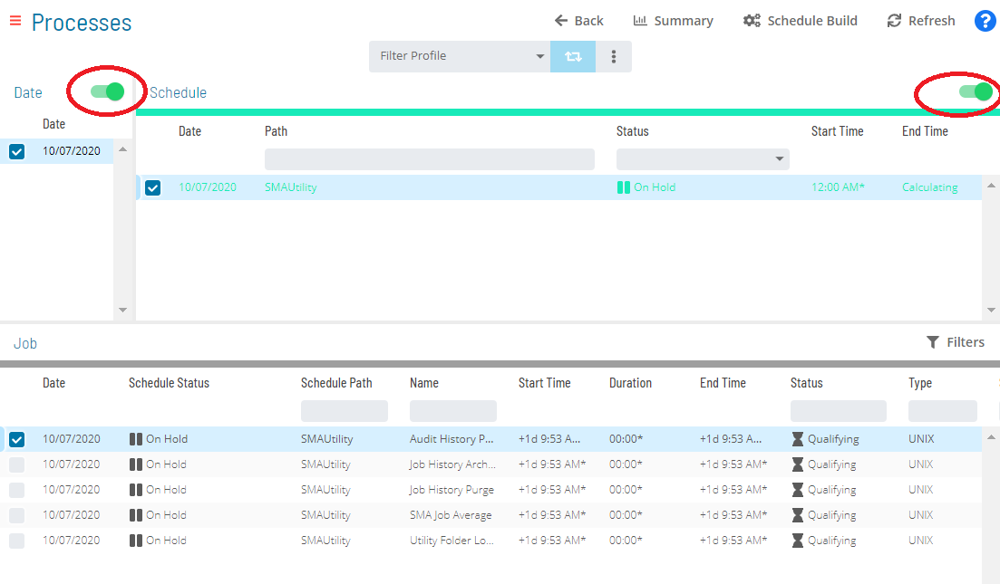
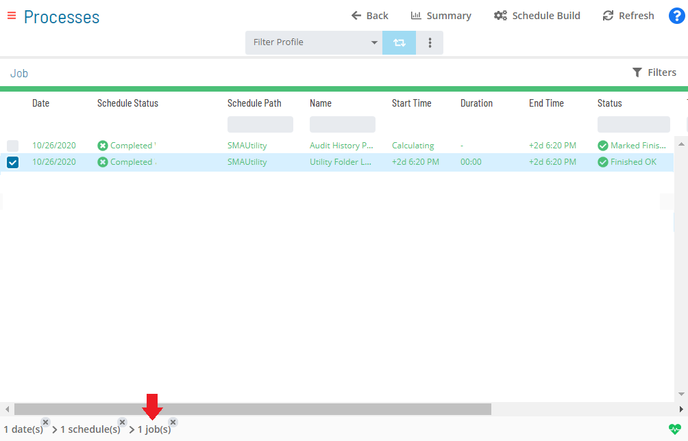
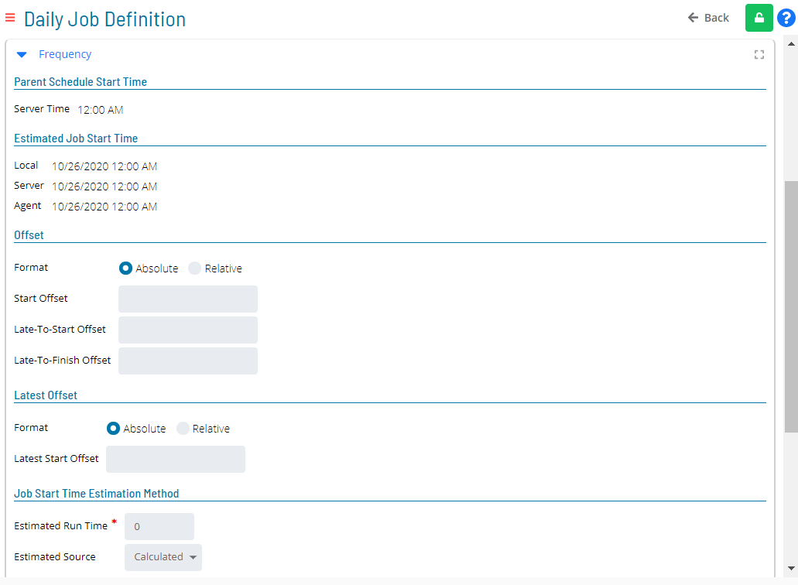

# Viewing and Updating Job Frequencies

The **Frequency** panel in **Daily Job Definition** displays all of the
frequency information for a job.

- The panel can be placed in **Full Screen** mode by simply clicking
    the icon ()
    to the far-right side of the panel bar. Escape **Full Screen** mode
    by clicking on the icon again.
- When the panel contains defined properties, a blue circular
    indicator containing a number ()
    will appear to the right of the panel name to indicate the number of
    properties that have been defined.

## Adding or Updating Job Frequencies

In **Admin** mode, job frequencies can be updated. For conceptual
information, refer to [Job Frequency](../../../job-components/frequency.md) in the
**Concepts** online help.

:::note
Only those with the appropriate permissions will have access to the **Lock** button and can update job properties. For details about privileges, refer to [Required Privileges](Accessing-Daily-Job-Definition.md#Required) in the **Accessing Daily Job Definition** topic.
:::

:::note
Changes made to the job properties in the **Daily Job Definition** will take place immediately. If the job has already run, the changes will take effect the next time the job runs.
:::

To perform this procedure:

Click on the **Processes** button at the top-right of the **Operations
Summary** page. The **Processes** page will display.

Ensure that both the **Date** and **Schedule** toggle switches are
enabled so that you can make your date and schedule selection,
respectively. Each switch will appear green when enabled.

Select the desired **date(s)** to display the associated schedule(s).

Select one or more **schedule(s)** in the list.

Select one **job** in the list. A record of your selection will display
in the [status bar](SM-UI-Layout.md#Status) at the bottom of the
page in the form of a breadcrumb trail.

Click on the job record (e.g., 1 job(s)) in the status bar to display
the **Selection** panel.

:::note
As an alternative, you can right-click on the job selected in the list to display the **Selection** panel.
:::

.png "Job Summary Tab in Operations")

Click the **Daily Job Definition** button 
at the top-left corner of the panel to access the **Daily Job
Definition** page. By default, this page will be in **Read-only** mode.

Click the **Lock** button 
at the top-right corner to place the page in **Admin** mode. The button
will switch to display a white lock unlocked on a green background

when enabled.

:::note
The **Lock** button will not be visible to users who do not have the appropriate permissions.
:::

Expand the **Frequency** panel to expose its content.

The **Parent Schedule Start Time** frame displays the start time
information for the schedule containing the selected job. This frame has
the following read-only field:

- **Server Time**: The time on the SAM server.

**In the Estimated Job Start Time frame:**

The **Estimated Job Start Time** frame displays the information about
the estimated start times that OpCon will use. This frame has the
following read-only fields:

- **Local**: The time on the local client (web client).
- **Server**: The time on the SAM server.
- **Agent**: The time on the start Agent machine.

**In the Offset frame:**

The **Offset** frame is used to define and calculate start offsets for
the job.

Specify which of the following formats to use to calculate the Start
Offset:

- **Absolute**: This option indicates that the job's Start Offset
    will be calculated from the assigned start time of the schedule.
- **Relative**: This option indicates that the job's Start Offset
    will be calculated from the time the schedule was released for
    execution.

Enter the positive number of hours and minutes to offset the start time
of the job from the start time of the schedule (Start Offset).

Enter the positive number of hours and minutes to offset the
Late-To-Start Offset from the job Start Offset (taking into
consideration the Absolute or Relative setting).

:::note
If the time arrives and the job has not yet started, it will be set to a status of Late to Start. The time at which the job will be set to a status of Late to Start is calculated by adding the **Schedule Start Time + Job Start Offset + Late to Start**. The default value of 00:00 disables this feature.
:::

Enter the positive number of hours and minutes to offset the
Late-To-Finish Offset from the job Start Offset (taking into
consideration the Absolute or Relative setting).

:::note
If the time arrives and the job is still running, it will be set to a status of Running; Late to Finish. The time at which the job will be set to a status of Late to Finish is calculated by adding the **Schedule Start Time + Job Start Offset + Late to Finish**. The default value of 00:00 disables this feature.
:::

**In the Latest Offset frame:**

The **Latest Offset** frame is used to define and calculate the latest
start offset for the job.

Specify which of the following settings to use to calculate the Latest
Start Offset:

- **Absolute**: This option indicates that the job's Latest Start
    Offset will be calculated from the assigned start time of the
    schedule.
- **Relative**: This option indicates that the job's Latest Start
    Offset will be calculated from the time the schedule was released
    for execution.

Enter the positive number of hours and minutes to offset the latest
start time of the job from the start time of the schedule (Latest Start
Offset).

:::note
If the latest start time is passed before the job qualifies for execution, the job is set to a Missed Latest Start Time status and will not automatically execute. The default value of 00:00 disables the feature.
:::

**In the Job Start Time Estimation Method frame:**

The **Job Start Time Estimation Method** frame is used to define the
method for the SMA Start Time Calculator to use when predicting the
estimated start time of the job.

Specify the estimated runtime in minutes for the job. Either manually
input the estimated run time or utilize the input field selectors to
make your selections.

Select one of the following sources to use for predicting the estimated
start time:

- **Calculated**: (Default) This option uses the job's start offset
    value and dependency chain to calculate the estimated start time.
    When a job has no external dependencies, this is the best option.
- **History**: This option uses the job's average start time by
    frequency from history as the estimated start time. The History
    option is useful when a job depends on external events or user
    interaction to start the job.
- **User Defined**: This option uses a hard-coded Predicted Start Time
    in days, hours, and minutes offset from the schedule's start time.
    The User Defined option is useful when the History option does not
    prove to be an accurate enough estimated start time.

**In the Job Execution frame:**

The **Job Execution** frame is used to set the priority and maximum run
time for the job.

Specify a number for the job's priority, zero (0) being the lowest.
Either manually input the priority number or utilize the input field
selectors to make your selections.

:::note
If the SAM can submit more jobs at the same time to a machine than the machine allows, the SAM uses the priority values to submit the most important jobs first.
:::

Specify the maximum run time in minutes for the job. Either manually
input the maximum run time or utilize the input field selectors to make
your selections.

**In the When Job Fails frame:**

The **When Job Fails** frame is used to specify whether or not a job
should be automatically restarted after a job failure.

Specify whether or not there should be attempts made to restart the job
if it fails by utilizing the **Retry** toggle switch. When enabled, the
switch will appear green.

Specify the interval between restart attempts in minutes. Either
manually input the number or utilize the input field selectors to make
your selections.

Specify the maximum number of restart attempts that should be made.
Either manually input the number or utilize the input field selectors to
make your selections.

:::note
The Retry feature is useful for situations where a job may fail because of timing (e.g., a database is currently unavailable, or a file has not yet arrived). OpCon will process the events, threshold/resource updates, and subsequent job dependencies only upon job failure after the maximum retry.
:::

**In the When Job Finishes Ok frame:**

The **When Job Finishes Ok** frame is used to specify whether or not a
job is automatically rescheduled after a successful run.

Select one of the following available options to determine if a job
should be rescheduled after it runs successfully:

**None**: This option indicates that a job reschedule will not take
place after a successful run.

**Recurring Instances**: This option allows you to reschedule a
successful job to run at fixed times throughout the day. Available
options are:

- **Add**: Use this button to add new restart times in days, hours,
    and minutes. Specified times appear in the Recurring Instance
    Time(s) list box in chronological order.
- **Delete**: Use this button to delete existing restart times.
- **Edit**: Use this button to update existing restart times.
- **Action on Overlap of Job Recurrence**: This option allows you to
    specify what happens if a previous job run time overlaps the next
    scheduled start time. Available options are:
  - **Skip**: Select this option to skip the run for \[that\]         scheduled time after the previous run finishes successfully.
  - **Start On Completion**: Select this option to start the next
        scheduled time as soon as the previous run finishes
        successfully.

**Restart Offset**: This option allows you to reschedule a successful
job to run at regular intervals throughout the day. Available options
are:

- **Minutes from Start to Start**: This option is used to specify the
    run interval. If selected from the **Run Interval** drop-down, use
    the **value** field to specify the number of minutes from the start
    time of one iteration of the job to the start time for the next
    iteration of the job.
- **Minutes from End to Start**: This option is used to specify the
    run interval. If selected from the **Run Interval** drop-down, use
    the **value** field to specify the number of minutes from the end of
    one iteration of the job to the start time for the next iteration of
    the job.
- **Latest Run Time (Offset)**: This option is used to specify the
    latest possible start time for the recurring job based on the
    schedule's start time. The value entered in the field is an offset
    that will be added to the schedule's defined Schedule Date and
    scheduled Start Time in the Daily tables.
- **Number of Runs**: This option is used to specify the total number
    of times for the recurring job to run.

:::note
Click the **Undo** button if you wish to undo your changes for any reason.
:::

Click the **Save** button.
