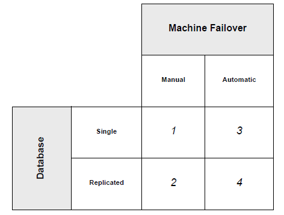
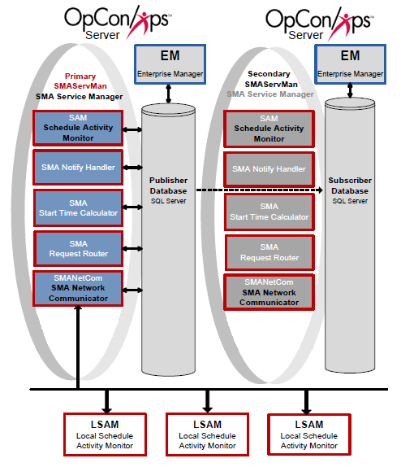
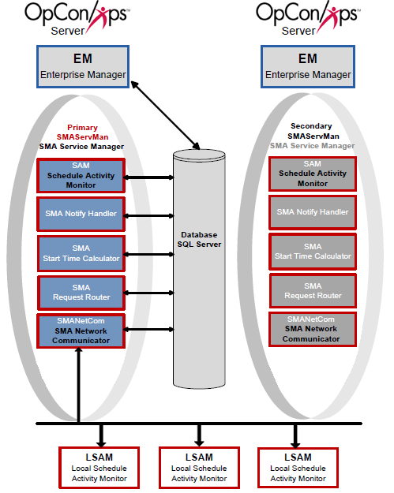
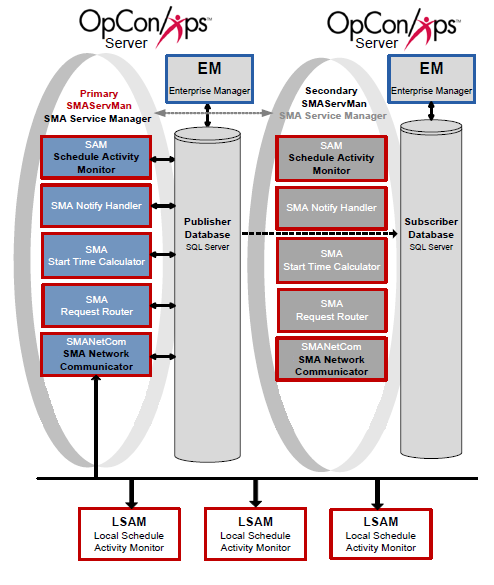
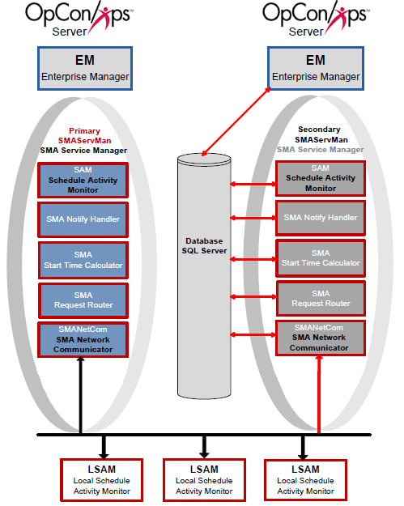

# Failover Scenarios

## Introduction

Failover is the shutdown of the primary SMA Service Manager (SMAServMan) and the startup of the secondary SMAServMan. The SMAServMan controls the activation and shutdown of an application group defined in its configuration file. Simply, the primary SMAServMan runs on the primary machine and the secondary SMAServMan runs on the secondary machine (refer to the information on [Configuration Scenarios](#Configur)). A machine without a failover configuration is a Stand Alone machine. In addition to configuring the SMA Service Manager(s), failover must also consider the database configuration.

OpCon supports two types of failover:

- Automatic Failover
- Manual Failover

## Automatic Failover

On a network, two SMAServMans can communicate with each other to orchestrate automatic failover. When the SMAServMans are properly configured, Automatic Failover can occur in the following, situations:

- When the Primary SMAServMan shuts down abnormally. (For information on abnormal shutdown, refer to [Abnormal Shutdown of the Primary SMAServMan](#Abnormal).)
- When the Secondary SMAServMan can no longer communicate with the Primary SMAServMan. (For information on communication loss, refer to [Communication Loss between SMAServMans](#Communic).) Loss of communication can occur because of one of the following:
  - The network connection between the two machines fails.
  - The Primary machine crashes.
- When the Primary SMAServMan shuts down normally. Normal shutdown can occur because of one of the following:
  - The administrator shuts down the SMA Service Manager through the Windows Service Control Manager (SCM) or through the `net stop` command.
  - The administrator manually performs a normal machine shutdown (e.g., through the Start \> Shutdown menu).

### Failover Rules

- Failover is **always** from the Primary SMAServMan to the Secondary SMAServMan.
- Following failover, returning the primary SMAServMan to an active state requires manual intervention (i.e., OpCon does not support automatic recovery). For information on restoring the primary machine, refer to [Normal Shutdown of the Primary SMAServMan](#Normal).
- The Secondary SMAServMan only starts its application group based on criteria defined by a user.

:::note
When the Secondary SMAServMan's application group is active, starting the Primary SMAServMan has no effect.
:::

:::note
The administrator must activate at least one failover option in the Secondary SMAServMan's configuration file for automatic failover to occur.
:::

### Choosing Failover Triggers

In addition to defining both the Primary and Secondary SMAServMans, the administrator must carefully choose the triggers that cause failover.

#### Abnormal Shutdown of the Primary SMAServMan

If a customer chooses automatic failover, SMA Technologies strongly recommends configuring the Secondary SMAServMan to take control of processing upon an abnormal shutdown of the Primary SMAServMan. The abnormal shutdown occurs in the following situations:

- If there is a critical Windows error or Windows exception shutting down the Primary SMAServMan.
- Exceeding the defined maximum number of retries, the Primary SMAServMan shuts down with an error after attempting to restart a **critical** application.
- For information on configuring failover based on abnormal shutdown on the Primary, refer to the [PrimaryAbnormalShutdownFailover](../../server-programs/service-manager.md#PrimaryAbnormalShutdownFailover) and [PrimaryAbnormalShutdownScript](../../server-programs/service-manager.md#PrimaryAbnormalShutdownScript) settings in the **Server Programs** online help.

#### Communication Loss between SMAServMans

In most cases, SMA Technologies does not recommend configuring the Secondary SMAServMan to take control of processing upon communication loss. Communication loss can occur if the network connection becomes too slow or completely fails. Because the Secondary SMAServMan determines connection loss based on lack of ping response from the Primary SMAServMan, there is no distinction between a temporary network problem and a primary machine crash.

:::note
If configuring the Secondary SMAServMan to take control of processing upon connection loss, the customer must guarantee network connectivity.
:::

For information on configuring failover based on abnormal shutdown on the Primary, refer to the [SyncLostFailover](../../server-programs/service-manager.md#SyncLostFailover) and [SyncLostScript](../../server-programs/service-manager.md#SyncLostScript) settings in the **Server Programs** online help.

#### Normal Shutdown of the Primary SMAServMan

In most cases, SMA Technologies does not recommend configuring the Secondary SMAServMan to take control of processing upon normal shutdown of the Primary SMAServMan. With a controlled shutdown, failover is normally unnecessary; however, SMA Technologies includes failover on normal shutdown to support unique failover configurations.

For information on configuring failover based on normal shutdown on the Primary, refer to the [PrimaryNormalShutdownFailover](../../server-programs/service-manager.md#PrimaryNormalShutdownFailover) and [PrimaryNormalShutdownScript](../../server-programs/service-manager.md#PrimaryNormalShutdownScript) settings in the **Server Programs** online help.

#### Manual Failover

With manual failover, the administrator decides when to initiate failover to the Secondary SMAServMan. In this case, both SMAServMans should be StandAlone machines. Because there should only be one SAM accessing the OpCon database, the SMAServMan on the Secondary machine should never start without manual intervention. Ensure that the SMAServMan service on the Primary machine has a startup type of *Automatic (Delayed Start)* and the SMAServMan on the Secondary machine has a startup type of *Manual*.

##### Configure the SMAServMan Service on the Primary Machine

1. Use menu path: **Start \> Control Panel**.
2. In the Control Panel window: Double-click the **Administrative Tools** icon.
3. In the Administrative Tools window: Double-click the **Services** icon.
4. In the Services window: Click on the **SMA OpCon Service Manager** service.
5. Change the SMAServMan's Startup Type to **Automatic (Delayed Start)** using the following steps:
   1. Double-click on **SMA OpCon Service Manager**.
   2. Select **Automatic (Delayed Start)** in the **Startup type** drop-down list and click **OK**.
6. Click **Close ☒** to close the **Services** window.

##### Configure the SMAServMan Service on the Secondary Machine

1. Use menu path: **Start \> Control Panel**.
2. In the Control Panel window: Double-click the **Administrative Tools** icon.
3. In the Administrative Tools window: Double-click the **Services** icon.
4. In the Services window: Click on the **SMA OpCon Service Manager** service.
5. Change the SMAServMan's Startup Type to **Manual** using the following steps:
   1. Double-click on **SMA OpCon Service Manager**.
   2. In the SMA OpCon Service Manager Properties window:
   3. Select **Manual** in the **Startup type** drop-down list and click **OK**.
6. Click **Close ☒** to close the **Services** window.

## Configuration Scenarios

OpCon supports four failover scenarios:

- [Scenario One: Manual Failover with a Single Database](#Scenario)
- [Scenario Two: Manual Failover with Secondary Database](#Scenario2)
- [Scenario Three: Automatic Failover with No Secondary Database](#Scenario3)
- [Scenario Four: Automatic Failover with a Secondary Database](#Scenario4)

The table below represents the failover scenarios.

### Configuration and Process Flows

The configuration settings and process flows in this section are designed to give an administrator a clearer picture of the failover process. These four configurations are the most common implementations; nevertheless, numerous configurations are possible. The administrator should have a thorough understanding of all SMAServMan configuration options before implementing more elaborate failover solutions. Additionally, SMA Technologies strongly suggests customers perform failover and disaster recovery testing before employing any failover scenario in their production environment.

#### Scenario One: Manual Failover with a Single Database

Scenario One includes a primary machine, a secondary machine, and a single database. The Primary and Backup SMAServMans do not communicate with each other in this scenario.

##### Configuration

In the configuration for Scenario One, the primary SMAServMan is on the primary machine, and the Secondary SMAServMan is on the secondary machine. The database can reside on the primary, the secondary, or even a third machine. In this scenario, the SMAServMan manages the SAM and Supporting Services. For more information, refer to the [Introduction](../../server-programs/introduction.md) in the **Server Programs** online help.

The following tables list configuration settings critical for this failover type and sample values for each setting. This configuration scenario employs scripts invoking the SMALogEvent utility for notification. Refer to [SMALogEvent](../../utilities/Command-line-Utilities/SMALogEvent.md) in the **Utilities** online help.

|SMAServMan.ini Setting|Primary Machine Value|
|--- |--- |
|Mode|StandAlone|
|TerminationScript|""<Termination Event Script\>""|

|SMAServMan.ini Setting|Secondary Machine Value|
|--- |--- |
|Mode|StandAlone|
|InitializationScript|""<Initialization Event Script\>""|

|SMA Connection Configuration Setting|Primary Machine Value|
|--- |--- |
|Server\Instance Name|SMAProdDBServer|
|Database Name|OpConxps|
|Database Login ID|opconsam|

|SMA Connection Configuration Setting|Secondary Machine Value|
|--- |--- |
|Server\Instance Name|SMAProdDBServer|
|Database Name|OpConxps|
|Database Login ID|opconsam|

##### Process Flows

Based on the above configuration values, the following process flows show SMAServMan's expected behavior.

###### Good Startup

The following table presents the general steps for the normal initiation of the SAM-SS with a failover machine.

|Step|Description|
|--- |--- |
|1|Primary StandAlone SMAServMan starts Primary SAM-SS.|
|2|Primary SAM-SS connects to Database.|
|3|Normal process flow.|

###### Critical Application Failure during Processing

The following table presents the general steps the SMAServMan takes after a successful startup of the SAM-SS.

|Step|Description|
|--- |--- |
|1|Normal Process Flow on primary StandAlone.|
|2|Critical application fails on primary StandAlone Machine one time more than the RestartApplicationLimit.|
|3|Primary StandAlone SMAServMan shuts down SAM-SS.|
|4|Primary StandAlone SMAServMan executes the TerminationScript. In this example, the script writes an event to the Windows Event Log notifying the administrator that the SAM-SS is shutting down.|
|5|Primary StandAlone SMAServMan shuts itself down.|

###### Manual Failover

The following table presents the general steps the OpCon administrator takes after receiving notification that the Primary SAM-SS is shutting down.

|Step|Description|
|--- |--- |
|1|The OpCon administrator reviews all SAM-SS logs to determine the cause of the failure. For information on the logs, refer to Logging in the Server Programs online help.|
|2|If possible, the OpCon administrator corrects the issue on the primary server.|
|3|If the OpCon administrator cannot resolve the issue quickly, the administrator sets the Primary SMAServMan service startup type to Manual and confirms the service is stopped.|
|4|On the Backup StandAlone machine, the OpCon administrator sets the SMAServMan startup type to Automatic and starts the service.|

#### Scenario Two: Manual Failover with Secondary Database

Scenario Two includes a Primary machine, a Secondary machine, and a replicated database. The Primary and Backup SMAServMans do not communicate with each other in this scenario.

##### Configuration

In the configuration for Scenario Two, the primary StandAlone SMAServMan is on the primary machine, and the backup StandAlone SMAServMan is on the secondary machine. The publishing database resides on the primary machine, and the subscribing database is on the secondary. In this scenario, the SMAServMan manages the following applications: SAM, SMANetCom, SMANotifyHandler, SMARequestRouter, and SMAStartTimeCalculator. This configuration scenario employs scripts invoking the SMALogEvent utility for notification. Refer to [SMALogEvent](../../utilities/Command-line-Utilities/SMALogEvent.md) in the **Utilities** online help.

The following tables list configuration settings critical for this failover type and sample values for each setting. All other values in the SMAServMan.ini files on each machine should remain at the SMA Technologies default settings. In addition to standard SMAServMan configuration, the administrator must establish replication between the databases and configure a special command file (StopRepl.cmd or StopRepl_WinAuth.cmd) to stop replication. For information on configuring replication, refer to [Manual Setup for Microsoft SQL Replication](Manual-Setup-for-Microsoft-SQL-Replication.md). For information on the StopRepl.cmd and StopRepl_WinAuth.cmd files, refer to [Determining Values for the Command Files](Manual-Setup-for-Microsoft-SQL-Replication.md#Determin).

|SMAServMan.ini Setting|Primary Machine Value|
|--- |--- |
|Mode|StandAlone|
|TerminationScript|""<Termination Event Script\>""|

|SMAServMan.ini Setting|Secondary Machine Value|
|--- |--- |
|Mode|StandAlone|
|InitializationScript|""<Initialization Event Script\>""|

|SMA Connection Configuration Setting|Primary Machine Value|
|--- |--- |
|Server\Instance Name|SMAProdDBServer|
|Database Name|OpConxps|
|Database Login ID|opconsam|

|SMA Connection Configuration Setting|Secondary Machine Value|
|--- |--- |
|Server\Instance Name|SMABckupDBServer|
|Database Name|OpConxps|
|Database Login ID|opconsam|

##### Process Flows

Based on the above configuration values, the following process flows indicate SMAServMan's expected behavior.

###### Good Startup

The following table presents the general steps for the normal initiation of the SAM-SS with a failover machine.

|Step|Description|
|--- |--- |
|1|Primary StandAlone SMAServMan starts Primary SAM-SS.|
|2|Primary SAM-SS connects to Publishing Database.|
|3|Normal process flow.|

###### Critical Application Failure during Processing

The following table presents the general steps the SMAServMan takes after a successful startup of the SAM-SS.

|Step|Description|
|--- |--- |
|1|Normal Process Flow on primary StandAlone.|
|2|Critical application fails on primary StandAlone Machine one time more than the RestartApplicationLimit.|
|3|Primary StandAlone SMAServMan shuts down SAM-SS.|
|4|Primary StandAlone SMAServMan executes the TerminationScript. In this example, the script writes an event to the Windows Event Log notifying the administrator that the Primary SAM-SS is shutting down.|
|5|Primary StandAlone SMAServMan shuts itself down.|

###### Manual Failover

The following table presents the general steps the OpCon administrator takes after receiving notification that the Primary SAM-SS is shutting down.

|Step|Description|
|--- |--- |
|1|The OpCon administrator reviews all SAM-SS logs to determine the cause of the failure. For information on the logs, refer to Logging in the Server Programs online help.|
|2|If possible, the administrator corrects the issue on the primary server.|
|3|If the administrator cannot resolve the issue quickly, the administrator sets the Primary SMAServMan service startup Type to Manual and confirms the service is stopped.|
|4|The administrator executes the StopRepl.cmd file on the backup StandAlone machine.|
|5|On the Backup StandAlone machine, the OpCon administrator sets the SMAServMan startup type to automatic and starts the service.|

#### Scenario Three: Automatic Failover with No Secondary Database

Scenario Three includes a Primary machine, a Secondary machine, and a single database. Additionally, the SMAServMans on each machine communicate with each other to provide automatic failover.

##### Configuration

In the configuration for Scenario Three, the Primary SMAServMan is on the primary machine, and the Secondary SMAServMan is on the secondary machine. The database can reside on the primary, the secondary, or even a third machine. In this scenario, the SMAServMan manages the following applications: SAM, SMANetCom, SMANotifyHandler, SMARequestRouter, and SMAStartTimeCalculator. This configuration scenario employs scripts invoking the SMALogEvent utility for notification. For information on the SMALogEvent utility, refer to [SMALogEvent](../../utilities/Command-line-Utilities/SMALogEvent.md) in the **Utilities** online help. The next tables list configuration settings critical for this failover type and sample values for each setting.

|SMAServMan.ini Setting|Primary Machine Value|
|--- |--- |
|Mode|Primary|
|FailOverSocketNumber|6500|
|TimeOutInSecondsForSync|60|
|SyncInitFailureScript|""<Synchronization Event Script\>""|

|SMAServMan.ini Setting|Secondary Machine Value|
|--- |--- |
|Mode|Secondary|
|FailOverSocketNumber|6500|
|PrimaryMachine|OpConxps1|
|SecondsBetweenPings|15|
|PingRetryCount|1|
|PingTimeOutInMilliseconds|500|
|SyncInitFailureScript|""<Synchronization Event Script\>""|
|PrimaryAbnormalShutdownFailover|Y|
|PrimaryAbnormalShutdownScript|""<Shutdown Script\>""|

|SMA Connection Configuration Setting|Primary Machine Value|
|--- |--- |
|Server\Instance Name|SMAProdDBServer|
|Database Name|OpConxps|
|Database Login ID|opconsam|

|SMA Connection Configuration Setting|Secondary Machine Value|
|--- |--- |
|Server\Instance Name|SMAProdDBServer|
|Database Name|OpConxps|
|Database Login ID|opconsam|

##### Startup Process Flows

Based on the above configuration values, the following process flows indicate SMAServMan's expected behavior.

###### Synchronization Failure

The following table presents the general steps when the Primary and Secondary SMAServMan's fail to synchronize.

|Step|Description|
|--- |--- |
|1|Primary and Secondary SMAServMan's attempt to synchronize.|
|2|If synchronization unsuccessful, the Primary SMAServMan continues to attempt synchronization after every number of seconds specified by the TimeOutInSecondsForSync configuration setting. The Secondary SMAServMan continues to attempt synchronization after every number of seconds specified by the SecondsBetweenPings configuration setting.|
|3|After every unsuccessful attempt at synchronization, the Primary and Secondary SMAServMan's execute the script specified by the SyncInitFailureScript configuration setting on each machine. In this example, the scripts write events to the Windows Event Log notifying the administrator that synchronization has failed between the machines.|
|4|After executing the scripts, both SMAServMan's restart the process of initializing synchronization. Refer to step 1.|

###### Good Startup

The following table presents the general steps for the normal initiation of the SAM-SS with a failover machine.

|Step|Description|
|--- |--- |
|1|Primary and Secondary SMAServMan's attempt to synchronize.|
|2|If synchronization successful, Primary SMAServMan sets Primary Application Group to ACTIVE.|
|3|If synchronization successful, Secondary SMAServMan sets Secondary Application Group to STANDBY.|
|4|Primary SMAServMan starts Primary SAM-SS.|
|5|Primary SAM-SS connects to Primary Database.|
|6|Normal Process Flow on Primary Machine with Primary Database.|
|7|Secondary SMAServMan continually pings Primary SMAServMan for status of the Primary Application Group.|

##### Failover Process Flow

Process Flow for Automatic SMAServMan Failover with No Secondary Database.

###### Critical Application Failure during Processing

The following table presents the general steps for a failover to a secondary machine after a successful startup of the SAM-SS. The failover is initiated by a critical application failure.

|Step|Description|
|--- |--- |
|1|Normal Process Flow on Primary.|
|2|Secondary SMAServMan continually pings Primary SMAServMan for status.|
|3|Critical application fails on Primary Machine one time more than the RestartApplicationLimit.|
|4|Primary SMAServMan shuts down SAM-SS.|
|5|Primary SMAServMan sets Primary Application Group to INACTIVE.|
|6|Secondary SMAServMan sets Secondary Application Group to ACTIVE because of the abnormal shutdown on the Primary.|
|7|Secondary SMAServMan starts Secondary SAM-SS.|
|8|Secondary SAM-SS connects to Primary Database.|
|9|Normal Process Flow on Secondary machine with Primary Database.|

#### Scenario Four: Automatic Failover with a Secondary Database

Scenario Four includes a Primary machine, a Secondary machine, and a replicated database. Additionally, the SMAServMans on each machine are aware of each other to provide hot failover.

##### Configuration

In the configuration for Scenario Four, the Primary SMAServMan is on the primary machine, and the Secondary SMAServMan is on the secondary machine. The publishing database resides on the primary machine, and the subscribing database resides on the secondary. In this scenario, the SMAServMan manages the following applications: SAM, SMANetCom, SMANotifyHandler, SMARequestRouter, and SMAStartTimeCalculator. This configuration scenario employs scripts invoking the SMALogEvent utility for notification. For more information, refer to [SMALogEvent](../../utilities/Command-line-Utilities/SMALogEvent.md) in the **Utilities** online help.

The following tables list configuration settings critical for this failover type and sample values for each setting. All other values in the SMAServMan.ini files on each machine should remain at the SMA Technologies default settings. In addition to Primary/Secondary SMAServMan configuration, the administrator must establish replication between the databases and configure a special command file to stop replication. For information on configuring replication, refer to [Manual Setup for Microsoft SQL Replication](Manual-Setup-for-Microsoft-SQL-Replication.md). For information on the StopRepl.cmd file, refer to [Determining Values for the Command Files](Manual-Setup-for-Microsoft-SQL-Replication.md#Determin).

|SMAServMan.ini Setting|Primary Machine Value|
|--- |--- |
|Mode|Primary|
|FailOverSocketNumber|6500|
|TimeOutInSecondsForSync|60|
|SyncInitFailureScript|""<Synchronization Event Script\>""|

|SMAServMan.ini Setting|Secondary Machine Value|
|--- |--- |
|Mode|Secondary|
|FailOverSocketNumber|6500|
|PrimaryMachine|OpConxps1|
|SecondsBetweenPings|15|
|PingRetryCount|1|
|PingTimeOutInMilliseconds|500|
|SyncInitFailureScript|""<Synchronization Event Script\>""|
|PrimaryAbnormalShutdownFailover|Y|
|PrimaryAbnormalShutdownScript|""C:\ProgramData\OpConxps\Utilities\Database\StopRepl.cmd""|

|SMA Connection Configuration Setting|Primary Machine Value|
|--- |--- |
|Server\Instance Name|SMAProdDBServer|
|Database Name|OpConxps|
|Database Login ID|opconsam|

|SMA Connection Configuration Setting|Secondary Machine Value|
|--- |--- |
|Server\Instance Name|SMABckupDBServer|
|Database Name|OpConxps|
|Database Login ID|opconsam|

##### Startup Process Flows

Based on the above configuration values, the following process flows indicate SMAServMan's expected behavior.

###### Synchronization Failure

The following table presents the general steps when the Primary and Secondary SMAServMan's fail to synchronize.

:::note
The Secondary SMAServMan.ini file is configured not to failover when there is a synchronization failure.
:::

|Step|Description|
|--- |--- |
|1|Primary and Secondary SMAServMan's attempt to synchronize.|
|2|If synchronization unsuccessful, the Primary SMAServMan continues to attempt synchronization after every number of seconds specified by the TimeOutInSecondsForSync configuration setting. The Secondary SMAServMan continues to attempt synchronization after every number of seconds specified by the SecondsBetweenPings configuration setting.|
|3|After every unsuccessful attempt at synchronization, the Primary and Secondary SMAServMan's execute the script specified by the SyncInitFailureScript configuration setting on each machine. In this example, the scripts write events to the Windows Event Log notifying the administrator that synchronization has failed between the machines.|
|4|After executing the scripts, both SMAServMan's restart the process of initializing synchronization. Refer to step 1.|

###### Good Startup

The following table presents the general steps for the normal initiation of the SAM-SS with a failover machine and database.

|Step|Description|
|--- |--- |
|1|Primary and Secondary SMAServMan's attempt to synchronize.|
|2|If synchronization successful, Primary SMAServMan sets Primary Application Group to ACTIVE .|
|3|If synchronization successful, Secondary SMAServMan sets Secondary Application Group to STANDBY.|
|4|Primary SMAServMan starts Primary SAM-SS.|
|5|Primary SAM-SS connects to Primary Database.|
|6|Normal Process Flow on Primary machine.|
|7|Primary Database continually Replicates to Secondary Database.|
|8|Secondary SMAServMan continually pings Primary SMAServMan for status of Primary Application Group.|

##### Failover Process Flow

###### Critical Application Failure during Processing

The following table presents the general steps for a failover to a secondary machine and to a secondary database after a successful startup of the SAM-SS. The failover is initiated by a critical application failure.

|Step|Description|
|--- |--- |
|1|Normal Process Flow on Primary.|
|2|Secondary SMAServMan continually pings Primary SMAServMan for status of Primary Application Group.|
|3|Critical application fails on Primary Machine one time more than the RestartApplicationLimit.|
|4|Primary SMAServMan shuts down SAM-SS.|
|5|Primary SMAServMan sets Primary Application Group to INACTIVE.|
|6|Secondary SMAServMan executes the PrimaryAbnormalShutdownScript that specifies the StopRepl.cmd file. This command file disconnects any users attached to the publishing database, deletes the subscriptions, and deletes the publication, and marks the publishing database as read-only.|
|7|Secondary SMAServMan sets Secondary Application Group to ACTIVE.|
|8|Secondary SMAServMan starts Secondary SAM-SS.|
|9|Secondary SAM-SS connects to what was the Subscribing Database.|
|10|Normal Process Flow on Secondary machine with what was Subscribing Database.|

## Recovery

Recovery back to the Primary SMAServMan requires manual intervention. Complete the procedures below to restore processing back to the original failover configuration.

### Recover from Failover with No Secondary Database

After remedying the problem that caused the failover, complete the following procedure to recover the primary machine.

1. Stop the SMA Service Manager on the Secondary Machine. Refer to [License Types](../../server-programs/licensing.md#license-types) in the **Server Programs** online help.
2. Start the SMA Service Manager on the Primary Machine. Refer to [License Types](../../server-programs/licensing.md#license-types) in the **Server Programs** online help.
3. If using hot failover, start the [Scenario Four: Automatic Failover with a Secondary Database](#Scenario4).

### Recover from Failover with a Secondary Database

After remedying the problem that caused the failover, complete the procedures in the Failover and Recovery with Replication chapters. Refer to [Failover and Recovery with Replication](Failover-and-Recovery-with-Replication.md).
