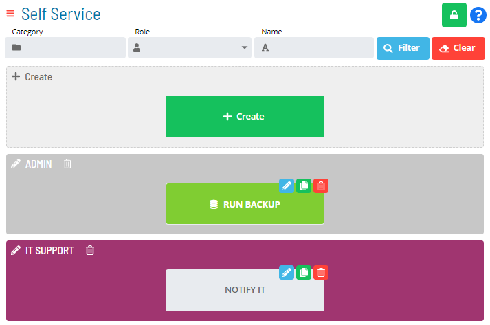
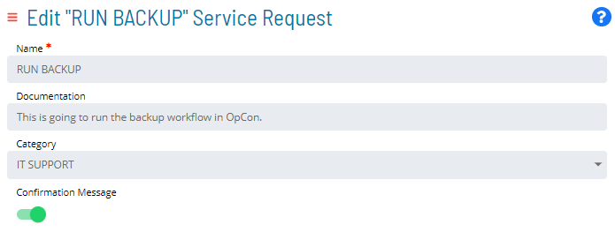

# Creating Categories

You can group the Service Requests into defined categories. For example,
a specific department or user group can be defined as a category and all
the Service Requests for which that department or user group must
perform can be associated with that category.

To create and associate a category:

1. Click the **+ Create** button, as shown in the example graphic.

2. Enter a unique name for the new category. As a best practice, when
    naming the category, choose a naming convention that helps refine
    the Service Request filtering query. For example, you could name the
    category: *Important/Saturday*. In doing so, "Saturday" could be
    used as the Category filter.

3. Select a background color for the new category. There are no
    restrictions on the multi-use of background colors. As a visual
    indicator, any color swatch reduced in size simply indicates that
    that particular color is currently in use for an existing category.

4. *(Optional)* Select the Service Request(s) that you
    wish to assign to the new category. Keep in mind that any Service
    Request can only be assigned to one category at a time.

5. Click **Save**. The new category should now display.

    

Besides modifying the settings of the category directly, you can also
edit a Service Request to change or set the category to which it
belongs, as such:

:::
