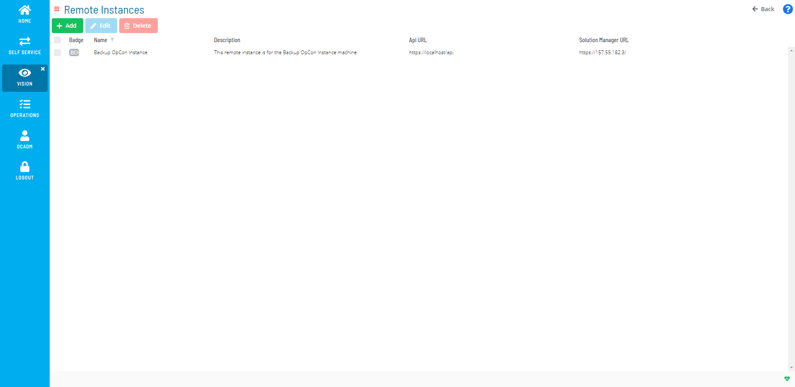

# Managing Vision Remote Instances

Vision Remote Instances provide the ability to define instances of OpCon
to be monitored that run and are accessed on a remote server. For more
information on remote instances, refer to [Remote Instances](../../../objects/remote-instances.md) in the
**Concepts** online help.

The following fields apply for setting Vision Remote Instances:

- **Name**: This field allows you to define the remote instance name.
- **Badge(Auto Gen.)**: This auto-generated field displays a
    two-character description based on the Name field. The badge icon
    will appear on cards defined to a remote instance.
- **Description**: *(Optional)* This field allows you
    to enter descriptions, explanations, and notes that can be updated
    for the defined remote instance.
- **Vision Instance Connection**: These fields define the API and
    Solution Manager credentials for the remote OpCon instance to be
    monitored.
  - **Api URL**: This field defines the API URL for the remote
        instance.
  - **Api User**: This field defines the API username for connecting
        to the database.
  - **Api Password**: This field defines the corresponding API
        password for the API user.
  - **Solution Manager URL**: This field defines the Solution
        Manager URL for the remote instance.
  - **Vision Action User**: This field defines the user for
        submitting Vision actions.
- **Complex Expression Connection**: These fields define the
    connection information that will enable the remote instance to be
    used in OpCon properties since OpCon expressions, by default, point
    to local properties.
  - **SQL Server**: This field defines the name of the server that
        the database resides.
  - **Database**: This field defines the name of the database to
        which to connect.
  - **Windows Auth**: This button specifies to use Windows
        Authentication as the authentication method to connect to the
        database.
    - If you want to use Windows Authentication, then you must
            make sure that the SMA Service Manager runs as a user that
            has privileges to the OpCon database. For more information,
            refer to [Add the OpConxps Active Directory Group to the SQL             Server](../../../installation/configuration.md#Add_the_OpConxps_Active_Directory_Group_to_the_SQL_Server)
             in the **OpCon Installation** online help.
  - **User**: This field defines the authorized SQL Server username
        for connecting to the database.
  - **Password**: This field defines the corresponding password for
        the authorized SQL Server user.
  - **Mirroring**: This button allows you to select whether
        mirroring, which indicates that the instance uses mirroring so
        that the proper connection string is used, is enabled or
        disabled.
  - **Transparent Network Ip Resolution**: This drop-down specifies
        how to resolve the IP address in cases where there are issues.
        Available options are:
    - **Disabled**: This option specifies that there should not be
            transparent Network IP resolution.
    - **Enabled**: This option specifies that there should be
            transparent Network IP resolution.
    - **Auto**: This option specifies that the Network IP
            resolution will be automatically detected. This is the
            default setting.

## Using the Vision Remote Instances Admin Page

The **Vision Remote Instances** page is the central location where you
can view all existing remote instances as well as add, edit, and delete
remote instances.

Vision Remote Instances Admin Page

:::note
A user must be in the «ocadm» role to define remote instances. For more information about Function Privileges including those pertaining to Vision, refer to [Function Privileges](../../../administration/privileges.md#function-privileges) in the **Concepts** online help.
:::

.png "More Info icon")
Related Topics

- [Adding Vision Remote Instances](Adding-Vision-Remote-Instances.md)
- [Editing Vision Remote Instances](Editing-Vision-Remote-Instances.md)
- [Deleting Vision Remote Instances](Deleting-Vision-Remote-Instances.md)
