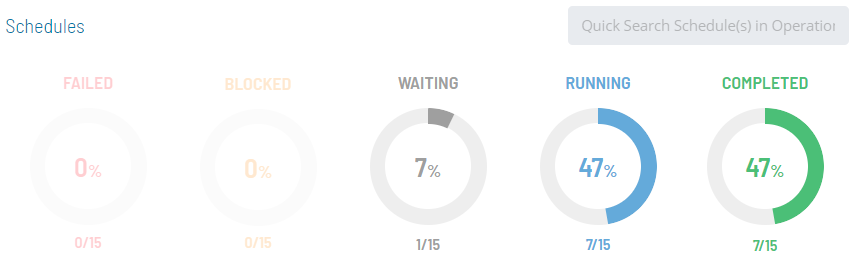
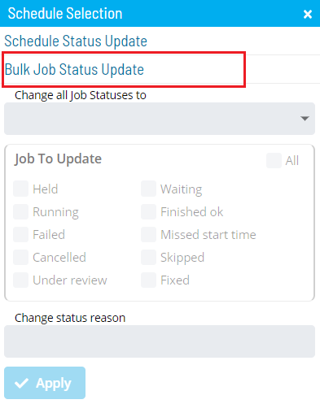

# Performing Bulk Job Status Updates (Schedule Level)

The **Operations** module has made performing mass action on job status
updates at the schedule level easier. Let's say, for example, that you
wanted to specify the following mass update conditions:

1. Update the job's status to Cancel for the selected schedule when the job's current state is Waiting.
2. Update the job's status to Cancel selected schedule when the job's current state is in Waiting, Held.

This is all possible in **Operations** with a few simple steps.

To perform bulk job status updates:

Click on one of the five operation dials (Failed, Blocked, Waiting,
Running, or Completed) or use the **Quick Search** field (type the
keyword and click **Enter**) in the **Schedules** section on the
**Operations Summary** page.

The **Processes** page will display.

Ensure that both the **Date** and **Schedule** toggle switches are
enabled so that you can make your date and schedule selections,
respectively. Each switch will appear green when enabled.

Select the desired **date(s)** and **schedule(s)** in each respective
list. A record of your selection(s) will display in the [status bar](SM-UI-Layout.md#Status) at the bottom of the page in the form
of a breadcrumb trail.

:::note
Depending on the number of schedules returned in general or after making date selections, you may wish to filter and/or sort the list of schedules to make it easier to make your schedule selections.

For filtering, use the **Filter Bar** just above the list of schedules to filter the list. Type the keyword in the appropriate field and click **Enter**, and the list will filter accordingly.

For sorting, click on the column heading to sort the column in ascending order (indicated by a small arrow pointing down). Click on the column heading again to sort the column in descending order (indicated by a small arrow pointing up).
:::

Click on the schedule record (e.g., 3 schedule(s)) in the status bar to
display the **Selection** panel.

:::note
As an alternative, you can right-click on any schedule selected in the list to display the **Selection** panel.
:::

Select the **Bulk Job Status Update** accordion-style tab in the panel.

Select one of the following options in the **Change all Job Statuses
to** drop-down list:

- **Cancel**: This option allows you to cancel all jobs for the
    selected schedule(s), based on a filter. Any jobs dependent on
    cancelled jobs do not have those dependencies met.
- **Hold**: This option allows you to suspend the processing of ALL
    jobs associated with the selected schedule(s), based on a filter.
- **Mark Failed**: This option allows you to mark all jobs on the
    selected schedule(s) as Failed, based on a     filter.
- **Mark Finished OK**: This option allows you to mark all jobs on the
    selected schedule(s) as Finished OK, based on a     filter.
- **Mark Under Review**: This option allows you to mark all jobs on
    the selected schedule(s) as Under Review, based     on a filter.
- **Mark Fixed**: This option allows you to mark all jobs on the
    selected schedule(s) as Fixed, based on a     filter.
- **Release**: This option allows you to place all held jobs on the
    selected schedule(s) back into a Qualifying     state, based on a filter. Jobs start as soon as all dependencies are
    met.
- **Restart**: This option allows you to place all jobs on the
    selected schedule(s) back in a Qualifying     state, based on a filter. Jobs are started as soon as all
    dependencies are met.
- **Restart on Hold**: This option allows you to place all jobs on the
    selected schedule(s) in an On Hold state on     restart, based on a filter.
- **Skip**: This option allows you to place all jobs on the selected
    schedule(s) in a Job to be Skipped state until     they qualify to start. When the jobs qualify, the jobs are skipped
    and the job dependencies of all subsequent jobs will be met.

:::note
For more information about job status changes, refer to [Schedule and Job Status Change Commands](../../../operations/status-change-commands.md) in the **Concepts** online help.
:::

Select the **checkbox(es)** for the current job status(es) that will
undergo the status change. Any selection made in the **Jobs To Update**
frame will serve as a status filter.

:::note
For more information about job statuses and allowed changes, refer to [Schedule and Job Status Descriptions and Allowed Status Changes](../../../operations/status-descriptions.md) in the **Concepts** online help.
:::

*(Optional)* Enter or select a change status reason.

:::note
Depending on application configuration, the **Change Status Reason** drop-down list may store a number of the previous reasons entered for Job or Schedule status updates.
:::

Click **Apply** to apply the job status change.

Close the **Selection** panel when done.

.png "More Info icon")
Related Topics

- [Performing Schedule Status     Changes](Performing-Schedule-Status-Changes.md)
- [Performing Job Status     Changes](Performing-Job-Status-Changes.md)
- [Performing Agent Status     Updates](Performing-Agent-Status-Updates.md)
- [Viewing Job Output](Viewing-Job-Output.md)
- [Using PERT View](Using-PERT-View.md)
- [Managing Daily Processes](Managing-Daily-Processes.md)
