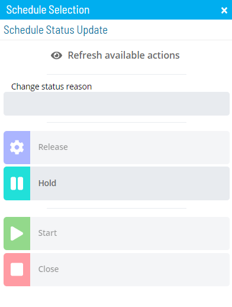

# Performing Schedule Status Changes

The **Operations** module allows you to perform schedule status change
using a few simple steps.

To perform schedule status changes:

Click on one of the five operation dials (Failed, Blocked, Waiting,
Running, or Completed) or use the **Quick Search** field (type the
keyword and click **Enter**) in the **Schedules** section on the
**Operations Summary** page.

The **Processes** page will display.

Ensure that both the **Date** and **Schedule** toggle switches are
enabled so that you can make your date and schedule selections,
respectively. Each switch will appear green when enabled.

Select the desired **date(s)** and **schedule(s)** in each respective
list. A record of your selection(s) will display in the [status bar](SM-UI-Layout.md#Status) at the bottom of the page in the form
of a breadcrumb trail.

:::note
Depending on the number of schedules returned in general or after making date selections, you may wish to filter and/or sort the list of schedules to make it easier to make your schedule selections.

For filtering, use the **Filter Bar** just above the list of schedules to filter the list. Type the keyword in the appropriate field and click **Enter**, and the list will filter accordingly.

For sorting, click on the column heading to sort the column in ascending order (indicated by a small arrow pointing down). Click on the column heading again to sort the column in descending order (indicated by a small arrow pointing up).
:::

Click on the schedule record (e.g., 3 schedule(s)) in the status bar to
display the **Selection** panel with the **Schedule Status Update** tab
in focus.

:::note
As an alternative, you can right-click on any schedule selected in the list to display the **Selection** panel.
:::

*(Optional)* Click the **Refresh available actions**
button to verify which status update actions are available for the
current selection. This option is particularly helpful when more than
one schedule has been selected since all status update buttons are
enabled by default.

*(Optional)* Enter or select a change status reason.

:::note
Depending on application configuration, the **Change Status Reason** drop-down list may store a number of the previous reasons entered for Job or Schedule status updates.
:::

Select one of the following status updates to apply to the selected
schedule(s):

:::note
Any status updates that are applied to the Schedule Names selected will effect ALL jobs that are scheduled to run on that specific date (as opposed to "just" the ones that are listed within the current scope being viewed).
:::

- **Release**: This option allows you to release the selected
    schedule(s) from a Held state. Jobs on the     schedule(s) continue processing from the point where they were
    stopped. If there are subschedules under the defined schedule and
    they are in a status of Parent Hold, those     subschedules will also be released.
- **Hold**: This option allows you to suspend the processing of the
    selected schedule(s). All currently running jobs continue to process
    to completion, but no new jobs on the schedule(s) start. If there
    are subschedules under the selected schedule and they are in a
    status of Waiting or In Process, those subschedules are placed in a
    status of Parent Hold.
- **Start**: This option allows you to override the selected
    schedule's start date(s) and time(s), and cause them to run
    immediately. The SAM begins processing the schedule(s) as soon as
    this option is selected. If there are subschedules under the defined
    schedule and they are in a status of Parent Hold, those subschedules will also be started.
- **Close**: This option allows you to mark the selected schedule(s)
    as Completed when the schedule(s) are still In Process only because they contain failed jobs.

:::note
For more information about job status changes, refer to [Schedule and Job Status Change Commands](../../../operations/status-change-commands.md) in the **Concepts** online help.
:::

Close the **Selection** panel when done.

.png "More Info icon")
Related Topics

- [Performing Job Status     Changes](Performing-Job-Status-Changes.md)
- [Performing Bulk Status Job Updates (Schedule     Level)](Performing-Bulk-Job-Status-Updates-Schedule-Level.md)
- [Performing Agent Status     Updates](Performing-Agent-Status-Updates.md)
- [Viewing Job Output](Viewing-Job-Output.md)
- [Using PERT View](Using-PERT-View.md)
- [Managing Daily Processes](Managing-Daily-Processes.md)
