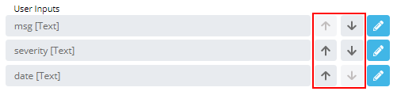

# Setting up User Inputs

When a Variable has been defined within the
OpCon Event definition, the Variable is then
recognized and available as a User Input. User Input fields will be
shown to users whenever they click the Service Request button.

By default, the system sets a new Variable as User Input of type «Text»
without any validation. This means users will be able to type anything
into the field, and the content of that text field will be placed in the
OpCon Event just before SAM receives it.

To change the order of the User Inputs, use the up/down arrows in the
User Input list. The order shown here is the order the fields will be
displayed to users when they click the Service Request button.

User Inputs Reordering Buttons

Click on any of the following links to learn how to configure the
available User Input Types:

- [Configuring Text User
    Inputs](Configuring-Text-User-Inputs.md)
- [Configuring Number User
    Inputs](Configuring-Number-User-Inputs.md)
- [Configuring Date User
    Inputs](Configuring-Date-User-Inputs.md)
- [Configuring
    Text Collection User
    Inputs](Configuring-Text-Collection-User-Inputs.md)

- [Configuring
    Master Schedule User
    Inputs](Configuring-Master-Schedule-User-Inputs.md)

- [Configuring
    Master Job User
    Inputs](Configuring-Master-Job-User-Inputs.md)

- [Configuring Choice User     Inputs](Configuring-Choice-User-Inputs.md)

:::
