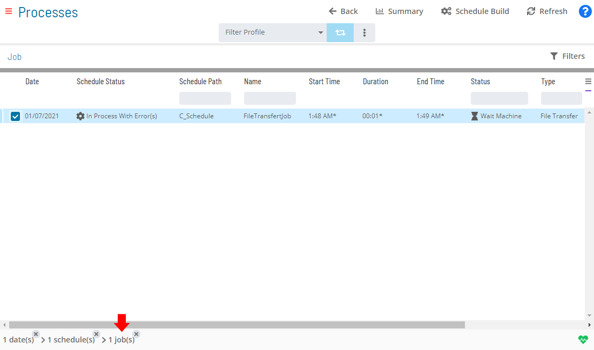

# Updating File Transfer Job Details

In **Admin** mode, Windows job type properties can be updated or
defined. For conceptual information, refer to [File Transfer Job Details](../../../job-types/file-transfer.md) in the **Concepts** online help.

:::note
Only those with the appropriate permissions will have access to the **Lock** button and can update job properties. For details about privileges, refer to [Required Privileges](Accessing-Daily-Job-Definition.md#Required) in the **Accessing Daily Job Definition** topic.
:::

:::note
If you do not have the Machine Privilege, then you will not be able to edit the daily job definition.
:::

:::note
Changes made to the job properties in the **Daily Job Definition** will take place immediately. If the job has already run, the changes will take effect the next time the job runs.
:::

## Updating File Transfer Job Details

To perform this procedure:

Click on the **Processes** button at the top-right of the **Operations
Summary** page. The **Processes** page will display.

Ensure that both the **Date** and **Schedule** toggle switches are
enabled so that you can make your date and schedule selection,
respectively. Each switch will appear green when enabled.

Select the desired **date(s)** to display the associated schedule(s).

Select one or more **schedule(s)** in the list.

Select one **job** in the list. A record of your selection will display
in the [status bar](SM-UI-Layout.md#Status) at the bottom of the
page in the form of a breadcrumb trail.

Click on the job record (e.g., 1 job(s)) in the status bar to display
the **Selection** panel.

:::note
As an alternative, you can right-click on the job selected in the list to display the **Selection** panel.
:::

.png "Job Summary Tab in Operations")

Click the **Daily Job Definition** button 
at the top-left corner of the panel to access the **Daily Job
Definition** page. By default, this page will be in **Read-only** mode.

Click the **Lock** button 
at the top-right corner to place the page in **Admin** mode. The button
will switch to display a white lock unlocked on a green background

when enabled.

:::note
The **Lock** button will not be visible to users who do not have the appropriate permissions.
:::

Expand the **Task Details** panel to expose its content.

:::note
All required fields are designated by a red asterisk.
:::

**In the Source frame:**

The **Source** frame is used to define the information for the source
file.

\

Select the **machine** with the source file to transfer.

:::note
The source machine must be Windows or UNIX.
:::

Select the **user** with access to the file on the Source machine.

Enter the *full path and file name* for the **file** to transfer.

Select the **data type** of the file on the source machine:

:::note
If anything other than Binary is defined as the Source Data Type, the integrity of the file is maintained but the file structure will likely be altered. This is done in an effort to present the transferred file in a user-friendly structure for the given platform.
:::

- **Text**: Indicates that the SMA File Transfer Agent and Server
    should use the default text data type for the platform when working
    with the file.
- **ASCII**: Indicates the file is a simple text file in ASCII format.
- **Binary**: Indicates the file's structure should be left intact
    during the transfer process.

**In the Destination frame:**

The **Destination** frame is used to define the information for the
destination file.

\

Select the **machine** that will receive the file.

:::note
The destination machine must be Windows or UNIX.
:::

Select the **user** with access to the location on the Destination
machine that will receive the file.

Enter the *full path and file name* for the destination **file**.

Select the final **data type** of the file that will be transferred to
the destination machine:

- **Text**: Indicates that the SMA File Transfer Agent and Server
    should use the default text data type for the platform when working
    with the file.
- **ASCII**: Indicates the file should be written to the Destination
    Machine as a simple text file in ASCII format.
- **Binary**: Indicates the file's structure should be left intact
    during the transfer process.

**In the Options frame:**

The **Options** frame is used to define the additional information for
the file transfer

\

Select the **If File Exists** option to determine how the SMA File
Transfer (SMAFT) Agent behaves when a target file exists:

- **Do Not Overwrite**: Indicates the SMAFT Agent checks for the
    existence of the file on the destination machine before starting the
    transfer.
- **Overwrite**: Indicates the SMAFT Agent transfers the file while
    overwriting any existing file on the destination machine.
- **Backup Then Overwrite**: Indicates the SMAFT Agent checks for the
    existence of the file on the destination machine before starting
    transfer.
- **Append**: Indicates the SMAFT Agent will append the source file to
    the destination file.
- **Backup Then Append**: Indicates the SMAFT Agent checks for
    existence of the file on the destination machine before starting
    transfer.

Select the **Delete Source File** option to determine if the deletion of
the Source File is disabled, required, or preferred (only the Windows
agent supports this feature at this time (other platforms will follow)):

- **No**: Indicates the Source File will not be deleted upon
    successful completion of the file transfer.
- **Required**: Indicates the SMAFT job will fail if the Source file
    is not deleted upon successful completion of the file transfer.
- **Preferred**: Indicates the deletion of the Source File is
    attempted upon successful completion of the file transfer.

Select the **Start Transfer On** option to determine where the job will
start.

- The valid options include:
  - **Source**: Choose this option to start the job on the Source
        machine.
  - **Destination**: Choose this option to start the job on the
        Destination machine.

Select the **Maximum Transfer Rate (kbits/s)** option to define the
transfer rate for the job. Valid values include 64, 128, 256, 512, 1024,
2048, and \>2048 kbits/second.

Select the **Compression** option to determine if compression is
disabled, required, or preferred. Supported compression types are tar,
gzip, and zip:

- **None**: Indicates the transfer does not use compression.
- **Required**: Indicates the transfer job fails if compression does
    not occur.
- **Preferred**: Indicates compression is attempted during the
    transfer.

:::caution
Both the agent and the server must both support the same compression type for compression to succeed.
:::

Select the **Encryption** option to determine if encryption is disabled,
required, or preferred. Supported encryption types are 3DES, AES, and
DES:

- **None**: Indicates the transfer does not use encryption.
- **Required**: Indicates the job fails if encryption does not occur.
- **Preferred**: Indicates encryption is attempted during the
    transfer.

:::caution
Both the agent and the server must both support the same encryption type for the encryption to succeed.
:::

Select the **TLS Security Override** option to determine if TLS Security
for file transfers is disabled, required, or preferred:

- **None**: Indicates that TLS Security should not be used by     the SMAFT Agent when connecting to the SMAFT Server.
- **Required**: Indicates that the SMAFT Agent **must** use TLS Security; otherwise, the job will be failed.
- **Preferred** (Default): Indicates that the OpCon job request
    assembly routine uses the SMAFT Server Port numbers and the SMAFT
    Server/Agent TLS Capability flags to decide what value to send in
    the TLS Security Mode field.

**In the Failure Criteria frame:**

The **Failure Criteria** frame is used to define the criteria for
OpCon to determine the final status of the
primary job.

\

Select the **Fails if preferred settings not satisfied** checkbox to
determine if the job should fail when the file transfer itself succeeds,
but the transfer did not comply with the preferred settings for Delete
Source File, Compression, and Encryption.

Click the **Save** button.
