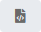

# Updating UNIX Job Details

In **Admin** mode, UNIX job type properties can be updated or defined.
For a UNIX job, you can:

- [Update Job Action: Run Program Job Details](#Updating)
- [Update Job Action: File Arrival Job Details](#Updating2)
- [Update Job Action: Embedded Script Job Details](#Updating3)

For conceptual information, refer to [UNIX Job Details](../../../job-types/unix.md) in the
**Concepts** online help.

:::note
Only those with the appropriate permissions will have access to the **Lock** button and can update job properties. For details about privileges, refer to [Required Privileges](Accessing-Daily-Job-Definition.md#Required) in the **Accessing Daily Job Definition** topic.
:::

:::note
If you do not have the Machine Privilege, then you will not be able to edit the daily job definition.
:::

:::note
Changes made to the job properties in the **Daily Job Definition** will take place immediately. If the job has already run, the changes will take effect the next time the job runs.
:::

## Updating Job Action: Run Program Job Details

To perform this procedure:

Click on the **Processes** button at the top-right of the **Operations
Summary** page. The **Processes** page will display.

Ensure that both the **Date** and **Schedule** toggle switches are
enabled so that you can make your date and schedule selection,
respectively. Each switch will appear green when enabled.

Select the desired **date(s)** to display the associated schedule(s).

Select one or more **schedule(s)** in the list.

Select one **job** in the list. A record of your selection will display
in the [status bar](SM-UI-Layout.md#Status) at the bottom of the
page in the form of a breadcrumb trail.

Click on the job record (e.g., 1 job(s)) in the status bar to display
the **Selection** panel.

:::note
As an alternative, you can right-click on the job selected in the list to display the **Selection** panel.
:::

.png "Job Summary Tab in Operations")

Click the **Daily Job Definition** button 
at the top-left corner of the panel to access the **Daily Job
Definition** page. By default, this page will be in **Read-only** mode.

Click the **Lock** button 
at the top-right corner to place the page in **Admin** mode. The button
will switch to display a white lock unlocked on a green background

when enabled.

:::note
The **Lock** button will not be visible to users who do not have the appropriate permissions.
:::

Expand the **Task Details** panel to expose its content.

:::note
All required fields are designated by a red asterisk.
:::

Select a **User Id** to use when running the job. Either use the default
value of "0/0" or assign it to an available batch user. Keep in mind
that user information must be defined as a Batch User ID in
OpCon Administration.

Select from the **Machines or Machine Group** drop-down list the
**machine** where the LSAM is installed. If you wish instead to specify a machine group, then toggle the **Machines** switch
to *Machine Group* then select the **machine group** from the drop-down
list. When toggled to Machine Group, the button will appear green
.

**In the Prerun frame:**

The **Prerun** frame is used to define the information for a
prerequisite process that runs immediately before the primary job.

\

Enable the **Prerun** switch .

Enter the *command line detail* for the prerun process. This should be
the full path to the executable file on the LSAM machine to execute immediately before the job specified in the Start Image. This
field permits up to 4000 characters.

**In the Run frame:**

The **Run** frame is used to define the information for running the
primary job.

\

Enter the *full path and file name of the program to execute in the UNIX
Start Image*. This field permits up to 4000 characters.

Enter any required *command-line parameters*. This field permits up to
4000 characters.

:::note
OpCon concatenates the Start Image and Parameters and inserts a space between them before sending the job to the UNIX LSAM.
:::

Enter the *NICE Value* to increase/decrease the priority of the job
and prerun (if present). Valid values range from -20 to 20 with a default of zero (0).

:::note
A lower NICE Value signifies a higher priority; therefore, entering a negative number raises the priority and a positive number lowers the priority.
:::

**In the Job Output Parsing frame:**

The **Job Output Parsing** frame is used to define the search criteria
for analyzing job output that matches the defined characters (string)
and will result in the defined exit code.

Click the green **Add** button (**+**) to define the parsing criteria.

Select the **Search Operation** from the drop-down list.

Enter the **String to Search**. Wildcard characters are supported in the
string. This field permits up to 255 characters.

Select or enter the **Exit Code**.

:::note
Remove any defined parsing criteria by clicking the **Delete** button at the end of the row.
:::

Enter the **Custom Application Log Path**. Wildcard characters are
supported for specifying multiple logs.

**In the Failure Criteria frame:**

The **Failure Criteria** frame is used to define the criteria for
OpCon to determine the final status of the
primary job.

\

Select an **operator** then enter or select the **exit code integer**.

Specify whether the defined criteria should be used to determine if the
job Failed or Finished OK.

Defining Multiple Failure Criteria:

Use the **and/or** field to define multiple failure criteria. This field
defines the way the strings are evaluated together.

:::note
You must define all "And" comparisons before the "Or" comparisons. Additionally, if the Comparison Operator on the previous group is "Equal To", then the *and/or* value must be set to "Or".
:::

Use the **Fail on Core Dump** switch to configure how the
LSAM should report the status of the job when the job does or does not create a core file.

- If the **Fail on Core Dump** switch is enabled 
    and a core dump is produced, then the job status will return     a failed exit code.
- If the **Fail on Core Dump** switch is enabled 
    and a core dump is not produced, then the job succeeds     (assuming all other exit code processing is good).

:::note
The final exit code processing has nothing to do with whether a core dump is produced or not. It simply is a final determination of whether the program produced an acceptable job status.
:::

Define up to five different signal failure criteria. If any signal
failure criterion is TRUE when a job finishes,
OpCon reports the job as Failed.

**In the Environment Variables frame:**

The **Environment Variables** frame is used to define the environment
variables for the job to use.

\

Click the green **Add** button (**+**) to define the environment
variables.

Enter a *name* in the **Name** field.

Enter a *value* in the **Value** field. Remove any defined environment
variable by clicking the **Delete** button at the end of the row.

Click the **OK** button to add the name/value.

:::note
Click the **Undo** button if you wish to undo your changes for any reason.
:::

Click the **Save** button.

## Updating Job Action: File Arrival Job Details

To perform this procedure:

1. Click on the **Processes** button at the top-right of the
    **Operations Summary** page. The **Processes** page will display.
2. Ensure that both the **Date** and **Schedule** toggle switches are
    enabled so that you can make your date and schedule selection,
    respectively. Each switch will appear green when enabled.
3. Select the desired **date(s)** to display the associated
    schedule(s).
4. Select one or more **schedule(s)** in the list.
5. Select one **job** in the list. A record of your selection will
    display in the [status bar](SM-UI-Layout.md#Status) at the
    bottom of the page in the form of a breadcrumb trail.
6. Click on the job record (e.g., 1 job(s)) in the status bar to
    display the **Selection** panel.
7. Click the **Daily Job Definition** button 
    at the top-left corner of the panel to access the **Daily Job
    Definition** page. By default, this page will be in **Read-only**
    mode.
8. Click the **Lock** button 
    at the top-right corner to place the page in **Admin** mode. The
    button will switch to display a white lock unlocked on a green
    background 
    when enabled.
9. Expand the **Task Details** panel to expose its content.
10. Select a **User Id** to use when running the job. Either use the
    default value of "0/0" or assign it to an available batch user.
    Keep in mind that user information must be defined as a Batch User
    ID in OpCon Administration.
11. Select from the **Machines or Machine Group** drop-down list the
    **machine** where the LSAM is installed. If you wish     instead to specify a machine group, then toggle the **Machines**
    switch to *Machine Group* then select the **machine group** from the
    drop-down list. When toggled to Machine Group, the switch will
    appear green.
12. Enter the *file path and name of the file to detect* in the **File
    Name** field. UNIX wildcard characters are supported in the file
    name (e.g., /usr/local/abc\*.txt). This field permits up to 4000
    characters.
13. Specify whether or not to search the sub-directory under the
    specified path by utilizing the **Sub-directory Search** toggle
    switch. When enabled, the switch will appear green.
14. Specify the time frame (*Start Time* and *End Time*) within which
    the file must arrive in the directory. Either manually input the
    time frame or utilize the input field selectors to make your
    selections.
15. Specify the amount of time in seconds (*Duration*) that the file
    size must remain stable. Either manually input the number of seconds
    or utilize the input field selector(s) to make your selection.
16. Select an **operator** then enter or select the **exit code
    integer**.
17. Specify whether the defined criteria should be used to determine if
    the job Failed or Finished OK.
18. Click the **Save** button.

## Updating Job Action: Embedded Script Job Details

For conceptual information, refer to [Embedded Scripts](../../../automation-concepts/embedded-scripts.md) in the
**Concepts** online help.

:::note
If you do not have the Script Privilege for the script, then you will not be able to see the task details or edit the daily job definition (the Lock button will be disabled).
:::

To perform this procedure:

Click on the **Processes** button at the top-right of the **Operations
Summary** page. The **Processes** page will display.

Ensure that both the **Date** and **Schedule** toggle switches are
enabled so that you can make your date and schedule selection,
respectively. Each switch will appear green when enabled.

Select the desired **date(s)** to display the associated schedule(s).

Select one or more **schedule(s)** in the list.

Select one **job** in the list. A record of your selection will display
in the [status bar](SM-UI-Layout.md#Status) at the bottom of the
page in the form of a breadcrumb trail.

Click on the job record (e.g., 1 job(s)) in the status bar to display
the **Selection** panel.

:::note
As an alternative, you can right-click on the job selected in the list to display the **Selection** panel.
:::

.png "Job Summary Tab in Operations")

Click the **Daily Job Definition** button 
at the top-left corner of the panel to access the **Daily Job
Definition** page. By default, this page will be in **Read-only** mode.

Click the **Lock** button 
at the top-right corner to place the page in **Admin** mode. The button
will switch to display a white lock unlocked on a green background

when enabled.

:::note
The **Lock** button will not be visible to users who do not have the appropriate permissions.
:::

Expand the **Task Details** panel to expose its content.

:::note
All required fields are designated by a red asterisk.
:::

Select a **User Id** to use when running the job. Either use the default
value of "0/0" or assign it to an available batch user. Keep in mind
that user information must be defined as a Batch User ID in
OpCon Administration.

Select from the **Machines or Machine Group** drop-down list the
**machine** where the LSAM is installed. If you wish instead to specify a machine group, then toggle the **Machines** switch
to *Machine Group* then select the **machine group** from the drop-down
list. When toggled to Machine Group, the switch will appear green.

**In the Embedded Script frame:**

The **Embedded Script** frame is used to associate an embedded script to
run with the job.

\

Select the **script** that you wish to associate with the job. The
**Type** field will populate to show the type of script selected.

Select the specific **version (or revision) of the script** to run for
this job. The **Comments** field will populate with any notes provided
about the script.

:::note
Selecting the "Latest" version means that just before the job runs, the latest version of the script will be used.
:::

Viewing Scripts:

To view the details about a script, click the **Preview** button
().
Once clicked, the **Script Viewer** pop-up window will display
information (e.g., name, description, type, version, version comment,
author, created, updated) about and the contents of the selected script.

:::note
The **Preview** button will only be enabled for embedded scripts for which the user is a member of a role with privileges to view the contents. A user must be a member of a role with All Administrative Functions, All Function Privileges, View Embedded Script Contents privilege, or must be in the ocadm role to view the contents.
:::

:::note
If you do not have the View Embedded Script Contents privilege, then you will not be able to see any of the script contents in **Preview** mode.
:::

**In the Runner frame:**

The **Runner** frame is used to configure the run definition that is
used to execute the script.

\

Select the **runner** (interpreter) that will be used to run the script.
The **Run Command Template** field will populate to show the syntax for
the runner.

Enter any *argument(s)* that you wish to pass to the script at runtime.
This field permits up to 255 characters.

:::note
When defining the argument, keep in mind the that the equal sign (=) is a restricted character.
:::

**In the Failure Criteria frame:**

The **Failure Criteria** frame is used to define the criteria for
OpCon to determine the final status of the
job.

\

Select an **operator** then enter or select the **exit code integer**.

Specify whether the defined criteria should be used to determine if the
job Failed or Finished OK.

Defining Multiple Failure Criteria:

Use the **and/or** field to define multiple failure criteria. This field
defines the way the strings are evaluated together.

:::note
You must define all "And" comparisons before the "Or" comparisons. Additionally, if the Comparison Operator on the previous group is "Equal To", then the *and/or* value must be set to "Or".
:::

Use the **Fail on Core Dump** switch to configure how the
LSAM should report the status of the job when the job does or does not create a core file.

- If the **Fail on Core Dump** switch is enabled 
    and a core dump is produced, then the job status will return     a failed exit code.
- If the **Fail on Core Dump** switch is enabled 
    and a core dump is not produced, then the job succeeds     (assuming all other exit code processing is good).

:::note
The final exit code processing has nothing to do with whether a core dump is produced or not. It simply is a final determination of whether the program produced an acceptable job status.
:::

Define up to five different signal failure criteria. If any signal
failure criterion is TRUE when a job finishes,
OpCon reports the job as Failed.

**In the Environment Variables frame:**

The **Environment Variables** frame is used to define the environment
variables for the job to use.

\

Click the green **Add** button (**+**) to define the environment
variables.

Enter a *name* in the **Name** field.

Enter a *value* in the **Value** field. Remove any defined environment
variable by clicking the **Delete** button at the end of the row.

Click the **OK** button to add the name/value.

:::note
Click the **Undo** button if you wish to undo your changes for any reason.
:::

Click the **Save** button.
