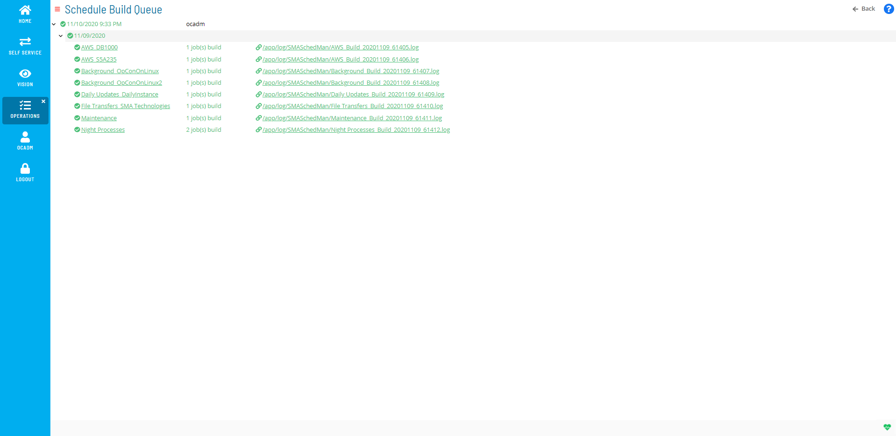

#  Using Schedule Build Queue

The **Schedule Build Queue** page provides a list that displays all
schedules that are currently building or have completed building.

 

Schedule Build Queue

 

Clicking the .log path following the link icon ()
will display the build log.

 

 

.png "More Info icon")
Related Topics

-   [Using Schedule Build](Using-Schedule-Build.md)
:::

 

