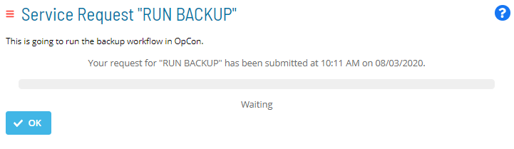
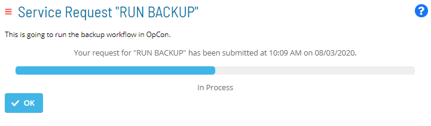
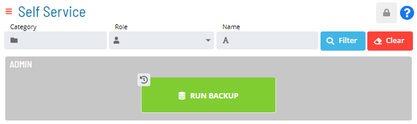
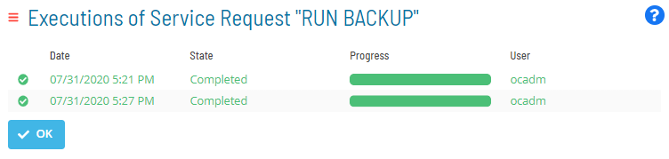

# Viewing Service Request Process Indicators

There are several ways to view the status of an executed status request.
Whenever you submit a Service Request (and the form validation
succeeds), a page displays to show you the execution status of the
submitted request via a progress bar. You can easily exit the page by
clicking the **OK** button.

Service Request Execution Status Pages

Once a Service Request is executed, an **Execution** indicator will also
appear at the top-left corner of the Service Request button.

Execution Indicator on Service Request Button

- The **Execution** indicator displayed as 
    indicates the number of concurrent Service Request executions that
    are still in process.
- The **Execution** indicator displayed as 
    indicates that the Service Request has a previous execution history
    record.

You can click on the **Execution** indicator to access the history
record of any processing or processed instances of that Service Request.
This history is presented in a sortable table that displays:

- The date on which the Service Request was triggered
- The current state and progress of the Service Request
- The user who triggered the Service Request

Service Request Execution History Record

:::
