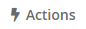
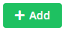
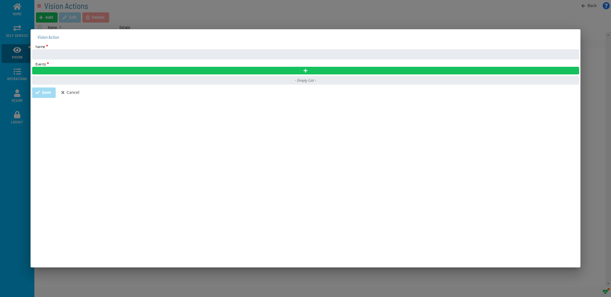
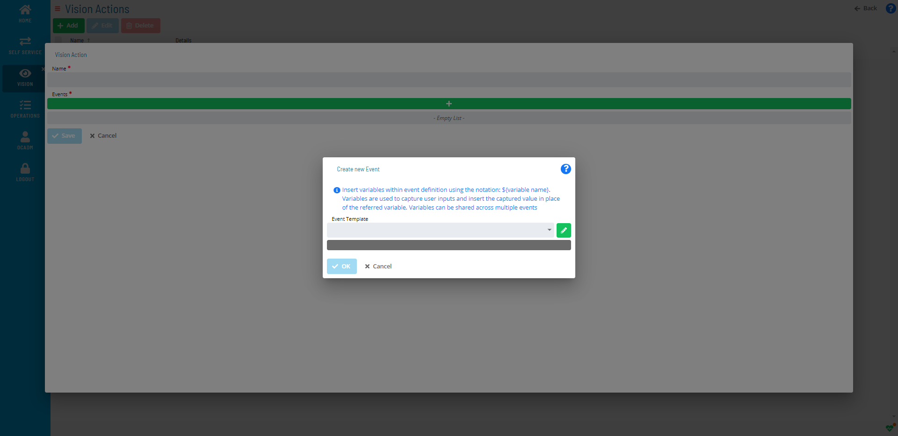

# Adding Vision Actions

To add a Vision Action:

Click the **Actions** button on the **Vision Live** page or the **Vision
Settings** page.

The **Vision Actions** page will display.

Click the **Add** button.

The **Vision Action** window will display.

Enter a *Name* for the action.

Click the **+** button to add **Events**.

\

The **Create new Event** window will display.

Select an **OpCon Event Template** to start defining event details. Once you choose a
template, the screen dynamically changes to provide UI assistance for
filling out the event details.

:::note
The **Event Template** drop-down contains several Administrative Events for advanced operations. For more information on these type of events, refer to [Administrative Events](../../../events/types.md) in the **OpCon Events** online help.
:::

Fill out the *fields* to define the event.

:::note
Unlike defining events in Self Service, do not include user variables ${variable} in Vision actions as there is no place to enter the user input when the action is triggered. However, there are system variables that can be defined for Vision actions, as explained below.
:::

- You have the option to use the following system variables specifically for Vision cards:

  - **\[\[CI.$CARD NAME\]\]** - Resolves to the card name.
  - **\[\[CI.$CARD FREQUENCY NAME\]\]** - Resolves to the frequency name defined for the card.
  - **\[\[CI.$CARD STATUS\]\]** - Resolves to the status the         defined Vision action has triggered.
  - **\[\[CI.$CARD START TIME\]\]** - Resolves to the estimated or         actual start time for the card.
  - **\[\[CI.$CARD END TIME\]\]** - Resolves to the estimated or         actual end time for the card.
  - **\[\[CI.$REMOTE INSTANCE NAME\]\]** - Resolves to the remote         instance name defined for the card.
  - **\[\[CI.$SCHEDULE DATE\]\]** - Resolves to the schedule date         defined for the card.

    You can use the same variable multiple times in the same event, as
    well as in other events for the same action. The variable(s) will be
    resolved before the event is sent to
    OpCon.

Click the **Save** button.

**On the Vision Action page:**

*(Optional)* Repeat steps 2-7 to add additional events.
:::
