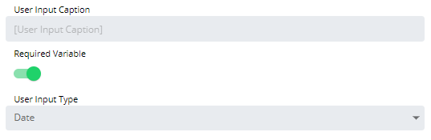

# Configuring Date User Inputs

When configured, the Date User Input will be displayed to users as a
date picker (calendar) with validation rules when they run the Service
Request.

To configure the user input:

Double-click on the specific User Input in the **User Inputs** list on
the **Service Request definition** page or click the blue **Edit**
button next to the desired user input to edit.

The **Configure User Input** page will display.

Enter the *User Input Caption* to display when users run the Service
Request. By default, the Variable name is used.

Toggle the **Required Variable** switch if you want to require the user
to input a value for this field.

Select **Date** in the **User Input Type** drop-down list to define that
type of input to present when users run the Service Request.

Set a date range for the User Input, using the following options:

- **Start Date**: Allows you to specify a start date for the range. If
    configured, users will not be able to specify or enter a date that
    is earlier than the specified start date.
  - **Today**: Optionally, you can use the **Today** toggle switch
        to set the current day as the **Start Date**.
- **End Date**: Allows you to specify an end date for the range. If
    configured, users will not be able to specify or enter a date that
    comes later than the specified end date.
  - **Today**: Optionally, you can use the **Today** toggle switch
        to set the current day as the **End Date**.

Define an output format or select one of the following predefined
formats from the drop-down list:

- YYYY/MM/DD (2020/07/30)
- YYYY-MM-DD (2020-07-30)
- dddd MMMM D YYYY (Thursday July 30 2020)
- ddd MMMM D YYYY (Thu July 30 2020)
- MM/DD/YYYY (07/30/2020)
- M/D/YY (7/30/20)
- MMMM D YYYY (July 30 2020)

:::note
The date pattern format is based on the Javascript Moment format without the support of **yo**, **N**, **NN**, **NNN**, **NNNN**, **NNNNN**, **y**, **yy**, **yyy**, and **yyyy** patterns. For more information on the official date format, refer to <https://momentjs.com/docs/#/displaying/format>.
:::

Click the **OK** button to confirm User Input configuration, or click
the **Cancel** button to discard changes. This will return you to the
**Service Request definition** page.
