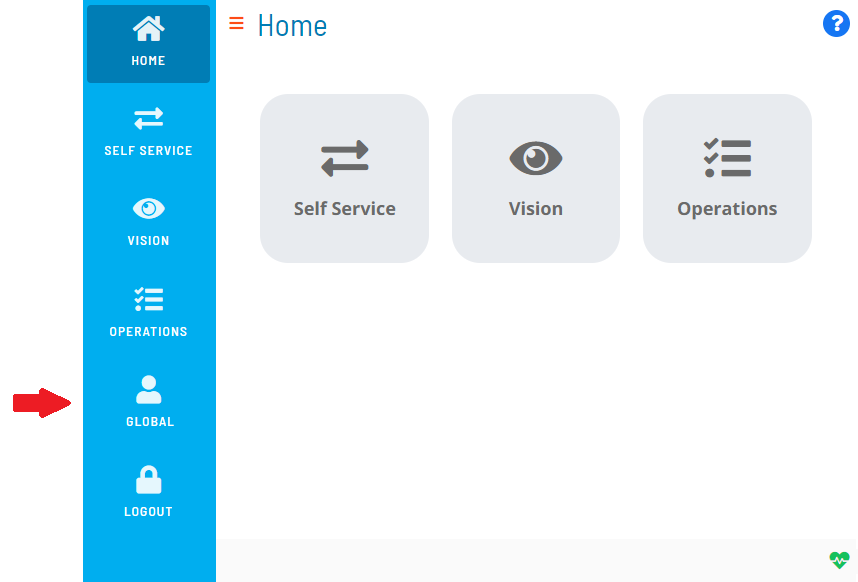
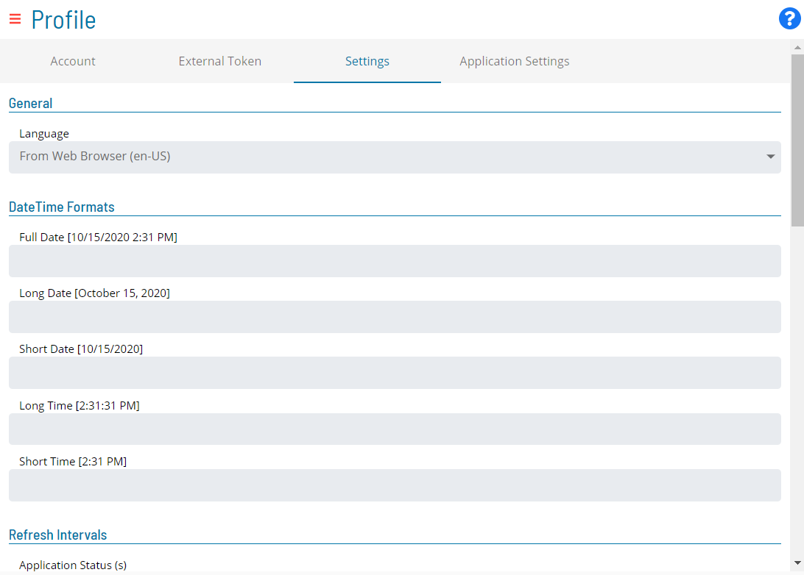

# Configuring Settings

To configure user settings:

Log into the Solution Manager, if not already logged in.

Click on the **user profile** button located in the **Navigation** menu,
as shown in the graphic.

The **Profile** page will display.

Select the **Settings** tab on the **Profile** page, as shown in the
graphic.

Configure any of the following types of settings:

- [General](#General)
- [DateTime Format](#DateTime)
- [Refresh Intervals](#Refresh)
- [Debug](#Debug)

Click **Save** to save the changes to the database.

## General

The **General** section allows you to set the language of the
application. Available options are:

- **From Web Browser**: Instructs the application to inherit the
    language settings of your web browser.
- **EN**: Sets the language to English.
- **FR**: Set the language to French.

## DateTime Format

The **DateTime** section allows you to configure the date and time
formats to control the way the Solution Manager displays dates and times
throughout the application. You can select a predefined format for the
following:

- Full Date
- Long Date
- Short Date
- Long Time
- Short Time

## Refresh Intervals

The **Refresh Intervals** section allows you set the interval (from 0 to
600 seconds) that data is automatically refreshed for services in the
application. Refresh intervals can be set for the following services:

- Application Status (s)
- Self Service (s)
- Self Service Execution (s)
- Vision Live (s)
- Operations Summary (s)
- Operations Processes (s)
- Operations Agents (s)
- Operations Graph
- Operations Schedule Build Queue

## Debug

:::note
The **Debug** section will only appear if a member of the ocadm role has not disabled your ability to configure custom debug settings.
:::

The **Debug** section allows you to configure debugging in the
application by utilizing the **Global Settings** switch. If the switch
is enabled, then the global debug settings configured by a member of the
ocadm role will be applied. If the switch is disabled, then the
following options will become available for configuration:

- **Client Log Level**: This option allows you to write logs to your
    web browser console. Since client logs are local, they will be lost
    once the browser is closed.
- **Deep Observe**: This option enables a Framework event observe.
- **Send Trigger**: This option allows you to set the trigger for
    sending server logs to the API server to be saved in files. There
    are three options:
  - **Disabled**: This option disables the trigger.
  - **Send on Interval and Max Size**: This option allows you to set
        an interval- or size-driven trigger with these settings:
    - **Log Level**: This option allows you to set the server log
            level.
    - **Api**: This option, when enabled, logs all the
            communications (requests and responses) between the Client
            and Server.
    - **Interval (s)**: This option allows you to configure the
            logs to be sent at a certain time interval (from 0 to 600
            seconds).
    - **Max Size (characters)**: This option allows you to
            configure the logs to be sent on the accumulated max
            character size limit (from 0 to 5000 characters).
  - **Send on Event**: This option allows you to set an event-driven
        trigger with these settings:
    - **Log Level**: This option allows you to set the server log
            level.
    - **Api**: This option, when enabled, logs all the
            communications (requests and responses) between the Client
            and Server.
    - **Trigger Log Level**: This option allows you to configure
            the logs to be sent when an ERROR or WARN occurs.
    - **Max Size to keep (characters)**: This options allows you
            to configure the logs to be sent on the max size to keep
            limit (from 0 to 5000 kilobytes).

:::note
In instances where you are able to reproduce an issue in the application, you can also utilize the **InstantLog Mode** feature to generate a temporary log file to send to the Support team. For more information about how to activate this feature, refer to [InstantLog Mode](SM-UI-Layout.md#InstantLog).
:::
