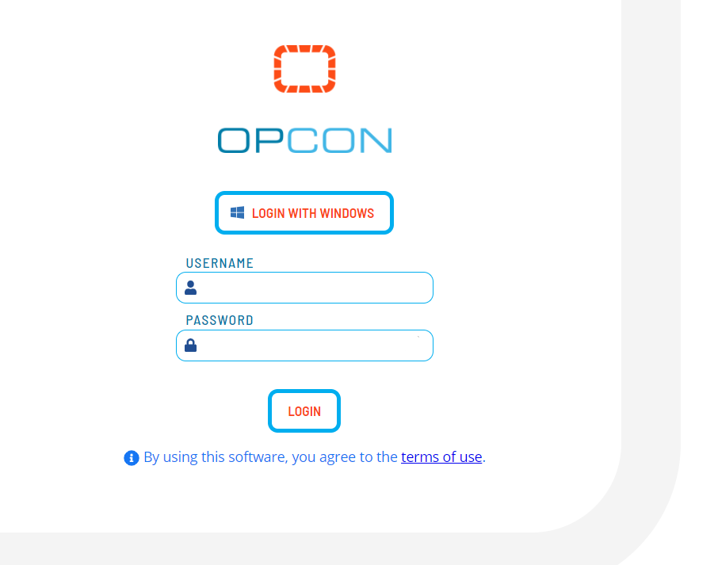
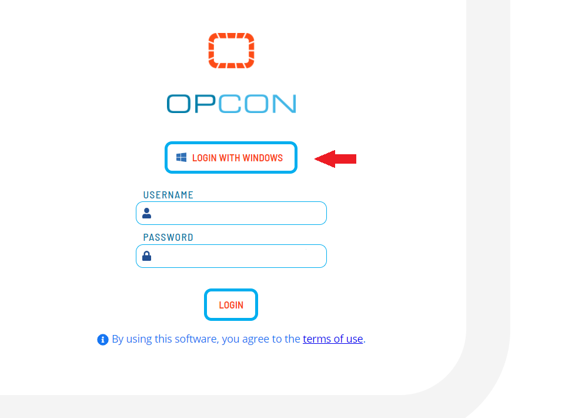
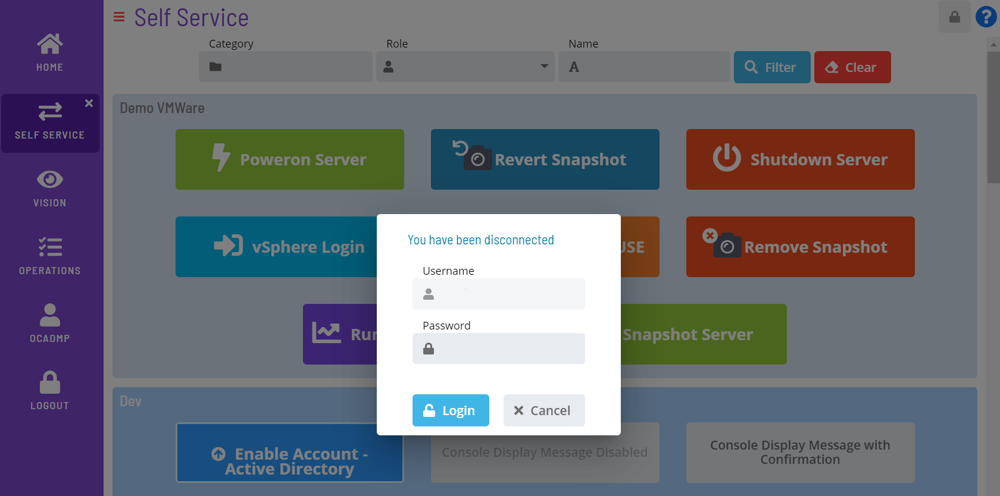

# Logging In/Out

## Logging In

Log into the SMA Solution Manager with an OpCon username and password.

:::note
Keep in mind that the OpCon password field permits up to a maximum of 12 characters.
:::

:::note
If data migration is required, your login may be rejected. A member of the ocadm role must perform [data migration](Migrating-Data.md) before you can gain access into the application.
:::

:::note
As a security measure, some users may be presented with a Security message after each manual login or attempt to access the application via automatic login. Those users must Accept or Decline this message. If accepted, then the user may proceed as normal to access the features and data in the application. If declined, then the user will either be returned to the login screen or presented with the security message.

The Security message is configured under the Generals tab of the Server Options editor in the Enterprise Manager. For more information about security message configuration, refer to the [Login Security Message](../../../administration/server-options.md#general) parameter in the Concepts online help.
:::

### Automatic Login

Solution Manager supports automatic login when Windows Authentication is turned on.

First, make sure you have configured users in OpCon for Automatic Login using the Enterprise Manager.

:::note
The user in the Enterprise Manager needs to include the Windows Domain and Username.
:::

Google Chrome uses the security settings in **Internet Options**. The Custom setting **Prompt for user name and password** should not be selected.

To configure this setting:

1. Right-click **Start** and select **Control Panel** from the **Windows** menu.
2. Navigate to **Internet Options**.
3. Navigate to the **Security** tab and select the **Local intranet** zone.
4. Click the **Custom level**... button. The **Security Settings** dialog displays.
5. Navigate to **User Authentication \> Logon** and verify that the **Prompt for user name and password** radio button is not selected.

Firefox requires configuration.  SMA Technologies recommends having only one Firefox window open during configuration.

To configure this setting:

1. Enter **about:config** in the search field and press **Enter** on your keyboard.
2. Click **Show All**.
3. Enter **network.automatic-ntlm-auth.trusted-uris** in the **Search
    preference name** search field.
4. Click the **Edit** button then enter the Solution Manager URL (e.g., `https://<servername\>:<portnumber\>`) in the text field.
5. Click **Save**.
6. Enter **network.negotiate-auth.delegation-uris** in the **Search preference name** search field.
7. Click the **Edit** button then enter the Solution Manager URL (e.g., `https://<servername\>:<portnumber\>`) in the text field.
8. Click **Save**.
9. Enter **network.negotiate-auth.trusted-uris** in the **Search preference name** search field.
10. Click the **Edit** button then enter the Solution Manager URL (e.g., `https://<servername\>:<portnumber\>`) in the text field.
11. Click **Save**.

:::note
For more information, refer to <https://developer.mozilla.org/en-US/docs/Mozilla/Integrated_authentication>.
:::

If the automatic logon fails, then the login screen will display so that you can provide the OpCon account credentials.

### Windows Authentication Login

The **Login with Windows** button is available to allow you to log into the application using Windows Authentication and bypass entering OpCon login credentials. When activated, your Windows credentials are sent to the server for authentication.

In order for the button to display on the login screen, you will need to ensure that a few settings are configured.

- **Enable Windows Authentication** option should be enabled in the **Server Options** editor in the Enterprise Manager. Alternatively, Windows Authentication can be enabled by the API.
- **Windows Pass-Through Authentication** should be enabled in the [Application Settings](Configuring-Application-Settings.md) in the Solution Manager.

### Session Expiration

Should the browser session expire, a pop-up window will display to allow you to log back into the application without having to go to the login screen. Depending on how you initially logged in, the pop-up will either prompt for your login credentials or display the **Login with Windows** button.

## Logging Out

Select **Logout** button in the **Navigation** menu to log out of the application.
