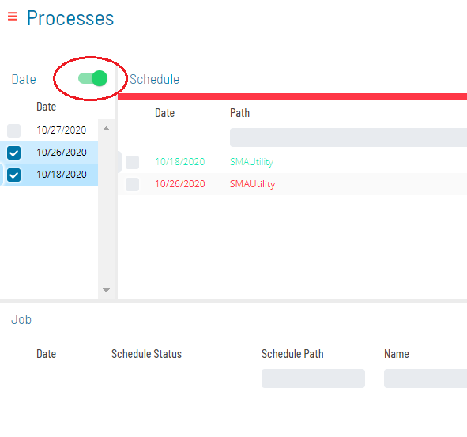
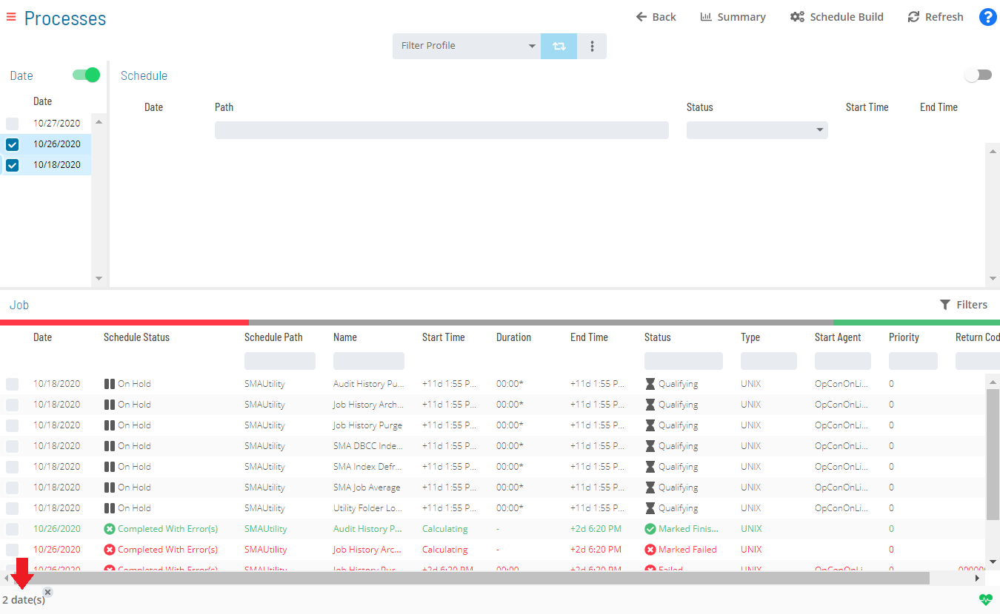
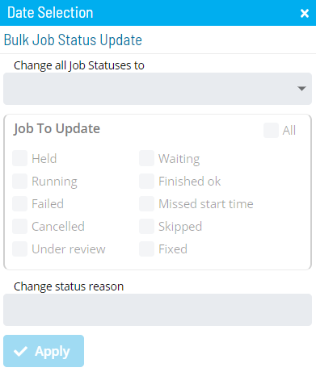

# Performing Bulk Job Status Updates (Date Level)

The **Operations** module has made performing mass action on job status
updates at the date level easier. For example, with a few simple steps,
you can update a job's status for a selected date to Mark Finished OK when the job's current state is in Waiting,
Held.

To perform bulk job status updates:

Click on the **Processes** button at the top-right of the **Operations
Summary** page. The **Processes** page will display.

Ensure that the **Date** toggle switch is enabled so that you can make
your date selection. The switch will appear green when enabled.

Select the desired **date(s)** in the list. A record of your
selection(s) will display in the [status bar](SM-UI-Layout.md#Status) at the bottom of the page in the form
of a breadcrumb trail.

Click on the date record (e.g., 3 date(s)) in the status bar to display
the **Selection** panel with the **Bulk Job Status Update** tab in
focus.

:::note
As an alternative, you can right-click on any date selected in the list to display the **Selection** panel.
:::

Select one of the following options in the **Change all Job Statuses
to** drop-down list:

**Cancel**: This option allows you to cancel all jobs for the selected
date(s), based on a filter. Any jobs dependent on cancelled jobs do not
have those dependencies met.

**Hold**: This option allows you to suspend the processing of ALL jobs
associated with the selected date(s), based on a filter.

**Mark Failed**: This option allows you to mark all jobs on the selected
date(s) as Failed, based on a filter.
**Mark Finished OK**: This option allows you to mark all jobs on the
selected date(s) as Finished OK, based on a filter.
**Mark Fixed**: This option allows you to mark all jobs on the selected
date(s) as Fixed, based on a filter.
**Mark Under Review**: This option allows you to mark all jobs on the
selected date(s) as Under Review, based on a filter.

**Release**: This option allows you to place all held jobs on the
selected date(s) back into a Qualifying state, based on a filter. Jobs start as soon as all dependencies are met.

**Restart**: This option allows you to place all jobs on the selected
date(s) back in a Qualifying state, based on a filter. Jobs are started as soon as all dependencies are met.

For Container jobs, additional options are available to perform bulk
Restart operations:

- **Restart**: Restarts the Container job and the subschedule jobs.
    This process will only impact the objects that are one level deep,
    which means that if the subschedule has another Container job, then
    the subschedule jobs associated with that Container job will not be
    restarted.
- **Rebuild**: Restarts the Container job and deletes the subschedule
    associated with it. SAM will then rebuild the subschedule and
    restart all the jobs in it.
- **None**: Applies no action on the subschedule. The subschedule
    remains untouched (neither restarted nor deleted). The Container job
    restarts but closes immediately since there is no action taking
    place on the subschedule.

Keep the following scenarios in mind for performing bulk Restart
operations on Container jobs:

**Scenario 1**: If a single date is selected and that date contains a
single Container job and **Restart** is selected from the **Change all
Job Statuses to** drop-down, then do the following next:

a.  Select the **checkbox(es)** in the **Job To Update** frame for the
    current job status(es) that will undergo the status change---any
    selection will serve as a status filter.
b.  Select one of the three \[action\] buttons that is available for the     Container job: **Restart**, **Rebuild**, or **None**.
c.  Enter or select the change status reason and click **Apply**.

**Scenario 2**: If a single date is selected and that date contains
multiple Container jobs and **Restart** is selected from the **Change
all Job Statuses to** drop-down, then do the following next:

Select the **checkbox(es)** in the **Job To Update** frame for the
current job status(es) that will undergo the status change---any
selection will serve as a status filter.

Follow either Option 1 or Option 2:

- (Option 1) Click on one of the three \[action\]     buttons---**Restart**, **Rebuild**, or **None**---in the **Job
    Containers Action frame** to apply that action to all Container jobs
    associated with that date.
- (Option 2) Click on the **Custom** button in the **Job Containers
    Action frame** to choose which action to perform on the Container
    jobs individually. Clicking **Custom** displays every Container job
    associated with the selected date, each with the **Restart**,
    **Rebuild**, and **None** options. You can then select one of the
    three options for each Container job.

Enter or select the change status reason and click **Apply**.

**Scenario 3**: If multiple dates are selected and the dates contain
multiple Container jobs and **Restart** is selected from the **Change
all Job Statuses to** drop-down, then follow steps a - c of Scenario 2. Keep in mind that clicking the **Custom** button in this
scenario will display each selected date along the Container job(s)
associated with each date.

:::note
To hide the associated Container jobs in the **Job Containers Action** frame, simply click on any of the other three Job Container Actions (Restart, Rebuild, or None).
:::

**Restart on Hold**: This option allows you to place all jobs on the
selected date(s) in an On Hold state on restart, based on a filter.

**Skip**: This option allows you to place all jobs on the selected
date(s) in a Job to be Skipped state until they qualify to start. When the jobs qualify, the jobs are skipped and the
job dependencies of all subsequent jobs will be met.

:::note
For more information about job status changes, refer to [Schedule and Job Status Change Commands](../../../operations/status-change-commands.md) in the **Concepts** online help.
:::

Select the **checkbox(es)** for the current job status(es) that will
undergo the status change. Any selection made in the **Jobs To Update**
frame will serve as a status filter.

:::note
For more information about job statuses and allowed changes, refer to [Schedule and Job Status Descriptions and Allowed Status Changes](../../../operations/status-descriptions.md) in the **Concepts** online help.
:::

*(Optional)* Enter or select a change status reason.

:::note
Depending on application configuration, the **Change Status Reason** drop-down list may store a number of the previous reasons entered for Job or Schedule status updates.
:::

Click **Apply** to apply the job status change.

Close the **Selection** panel when done.

.png "More Info icon")
Related Topics

- [Performing Schedule Status     Changes](Performing-Schedule-Status-Changes.md)
- [Performing Job Status     Changes](Performing-Job-Status-Changes.md)
- [Performing Agent Status     Updates](Performing-Agent-Status-Updates.md)
- [Viewing Job Output](Viewing-Job-Output.md)
- [Using PERT View](Using-PERT-View.md)
- [Managing Daily Processes](Managing-Daily-Processes.md)
