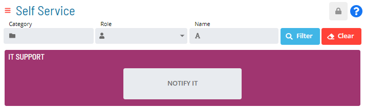

# Working in User Mode

Users not in the «ocadm» role or a role with the «Maintain Service
Request» privilege will see a Self Service page that is similar to the
example graphic here. These users will only see the Service Request
buttons to which they have privileges through their roles.

User Mode Self Service Page Display

From this page, you can do any of the following:

- [Run Service Requests](Running-Service-Requests.md)
- [Filter Service Requests](Filtering-Service-Requests.md)
- [View Service Request     Processes](Viewing-Service-Request-Process-Indicators.md)
:::
