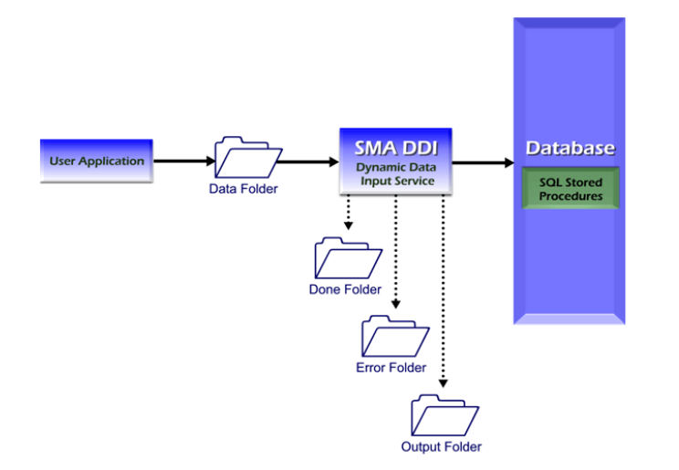

# SMA Dynamic Data Input Introduction

SMA Dynamic Data Input (SMADDI) is an optional component of
OpCon that facilitates dynamically adding
data to OpCon with a text file. SMADDI
consists of both a service used to monitor for files and stored
procedures used to update the database. The **SMA OpCon DDI Install**
package installs the SMADDI service. The **SMA OpCon Database Scripts
Install** package includes the application of the SMADDI stored
procedures to the OpCon database. Both
installation packages can be found in the <Target Directory\>\\Install\\\_Exe directory. For installation
instructions on either package, refer to the **OpCon Installation**
online help.

## SMA Dynamic Data Input Service

The SMA Dynamic Data Input (SMADDI) service monitors up to 20 different
input directories to detect files containing update information for the
OpCon database. The SMADDI service processes
any file in an input directory and moves the file to a subdirectory. The
SMADDI service requires very little processing resources because it
sleeps unless notified by the Windows operating system that a file has
been placed in one of the directories.

### Network Input Directories

The list of directories to monitor may define network directories in the
form of drive letters or UNC path names. However, the following rules
apply when the SMADDI service monitors network directories:

- The service must be running as a Domain User with the correct
    privileges. For information on setting up the service to run as a
    Domain User, refer to [First Option: Running the Service as a     Windows Domain User](Configuration.md#First).
- If the network connection is lost, the service continues to monitor
    all other accessible directories. SMADDI does not monitor the lost
    network directory until the service is stopped and is restarted.
- If a network directory is not available when the service is started,
    SMADDI does not monitor the directory until the service is stopped
    and is restarted.

:::caution
Do not use a mapped drive as the directory to monitor for SMADDI.
:::

#### Input Directories

For each input directory defined, the SMADDI service creates three
subdirectories: Done, Error, Output.

- **Done**: When a file is detected in the input directory, the
    service processes the file and moves it to the Done subdirectory.
- **Error**: If a parsing error or transactional error is detected
    with the input file, the service writes a file to the Error
    subdirectory. SMADDI names the file with the following syntax: `<InputFileName\> - Error.txt`.
- **Output**: If the service is configured to write output for each
    file received, the service writes the output from the SMADDI stored
    procedures to a file in the Output subdirectory. SMADDI names the
    file with the following syntax: `<InputFileName\> - Out.txt`. The
    Output directory contains success and failure messages. If a
    transaction error was reported in the error file, the output file
    lists the details of the transaction error encountered by the stored
    procedures.

When the SMADDI service detects a file, it parses the information and
then passes it to the stored procedures for input to the database.

## SMA Dynamic Data Input Stored Procedures

The SMA Dynamic Data Input (SMADDI) stored procedures are responsible
for updating the OpCon database with
information received from the SMADDI service. The stored procedures
first validate the data and then commit the changes to the database.

## Input Files

Using tags supported by SMA Technologies, the input files must contain an XML-type data structure and must be less
than two megabytes (MB). The text files contain information describing
both the type of data and the data itself. Input files may contain a
single transaction or many transactions. Moreover, multiple transaction
types may exist in a single input file. SMADDI processes all input files
detected in identified input directories.

## Security

The SMADDI service logs in to the OpCon
database with the Database Login ID and password stored by the SMA ODBC
Configuration Tool. Windows security handles all other security issues.
Specifically, the input directories and subdirectories should have
appropriate permissions assigned to them to prevent unauthorized
placement of files in the directories.

## Architecture

This diagram shows the relationships of all components in SMADDI.

SMA Dynamic Data Input Architecture

