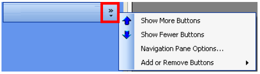

# Summary Information

The SMA Resource Monitor User Interface is used to create and manage
File Monitors, Counter Monitors, Service Monitors, Process Monitors and
Action Groups.

- An **Active** checkbox displays for every monitor type tab and the
    Action Groups tab. Place a checkmark inside the checkbox to activate
    a Monitor or Action Group. Unselect the checkbox to deactivate the
    Monitor or Action Group.
- Within each tab, click on the column headers to sort information in
    ascending or descending order.
- On each Monitor tab, when a specific **Monitor Name** is clicked,
    the Monitor Information screen shows *Monitor Details* and *Action
    Details* to provide information about the monitor and the actions
    that take place when the rule is met.
- The Action Groups tab shows actions that will take place when the
    Action Group is triggered. Action groups can be associated with any
    monitor type. Additionally, any change to an action group applies to
    all monitors associated with it.

## Menu

The menu on the left is a panel of buttons. The menu buttons include:

  ------------------------------------------------------------------ --------------------------------------------------------------------------------------------------------------------------------------
               **Add**: Add a new monitor or action group. Refer to [Start an Add Wizard](Wizards.md#Start_an_Add_Wizard).
              **Edit**: Edit a selected monitor or action group. Refer to [Start an Edit Wizard](Wizards.md#Start_an_Edit_Wizard).
              **Copy**: Copy a selected monitor or action group. Refer to [Copy](Tools.md#Copy).
            **Delete**: Delete a selected monitor or action group. Refer to [Delete](Tools.md#Delete).
              **Find**: Find a monitor. Refer to [Find](Tools.md#Find).
            **Filter**: Filter records to see a subset of the monitors. Refer to [Filter](Tools.md#Filter6).
       **Activate All**: Activate all Monitors for a selected Monitor tab.
     **DeActivate All**: Deactivate all Monitors for a selected Monitor tab.
  ------------------------------------------------------------------ --------------------------------------------------------------------------------------------------------------------------------------

### Configure Menu Options

The menu options (left-hand side of screen) allow up to seven
placeholders for the menu item graphic and name. Click **Configure
buttons** to display the following menu options:

- **Show More Buttons**: Displays the graphic and the name of the menu
    item.
- **Show Fewer Buttons**: Displays only the graphic for the menu item
    (tool tip is provided).
- **Navigation Pane Options**: Re-arrange the order of the menu items
    by selecting the **Move Up** and/or **Move Down** buttons. Remove
    menu items by clearing the checkboxes.
- **Add or Remove Buttons**: Click on the specific menu item to remove
    or replace.

## Status Bar

At the very bottom of the screen, there is a blank gray bar showing
below the tables. If there are any data entry errors in the main screen,
this is the location where the messages appear.
:::
