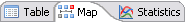

# Using Machines Status View

The **Machines Status** view displays information about each machine
defined in the OpCon database in different
formats: **Table**, **Map**, and **Statistics**.

- **Table** :
    The **Table** tab (Default view) lists the machine's information
    (e.g., Machine Status, Machine Name, Operating System, Last Update,
    Running Jobs, Groups, Socket number, Version number, TLS, and
    Activity) in the OpCon environment in a
    table format.
- The color in the **Status** column represents the status of the
    machine:
  - **Gray**: SMANetCom is not attempting communication with the
        LSAM (e.g., the machine is marked down by a         user).
  - **Blue**: The machine is marked up by a user, and the
        LSAM is communicating with the SMANetCom.
  - **Red**: The machine is marked up by a user, but the
        LSAM is not communicating with the         SMANetCom.
  - **Orange**: The machine is marked up by a user, but the
        communication is limited (e.g., SMANetCom is not sending job
        start information to the LSAM). For information         regarding disabling job starts, refer to [Job Starts: Determines
        if the SAM should send job start information to the LSAM. While
        the primary purpose of an LSAM is to start jobs, LSAMs also have
        the ability to send external OpCon events. If the condition
        exists where new job starts should not be initiated on the LSAM,
        but external OpCon events should still process, Job Starts can
        be disabled.](../../../objects/machines.md#job-starts)
         in the **Machines** section of the **Concepts** online
        help.
- **Map** :
    The **Map** tab lists the machines in the
    OpCon environment in a map format. Refer
    to the same color coding above used in the **Table** tab. The same
    right-click menu with various activities is available on the **Map**
    tab as well as the **Table** tab.
- **Statistics** :
    The **Statistics** tab displays the *Communicating Status Trend* and
    the *Operating System Trend* information in a pie chart format.
  - **Communication Status Trend Pie Chart**: Displays the number of
        machines defined in the OpCon
        environment and the number of machines in a communicating state
        or disabled.
  - **Operating System Trend Pie Chart**: Displays the different
        machine types defined within the
        OpCon environment. Each different
        machine type is assigned a color with a legend provided below
        the pie chart.

## Machines Status View Right-click Menu

The **Machines Status** view has the following right-click menu options:

- **Machine Information**: Refer to [Viewing Machine     Information](Viewing-Machine-Information.md).
- **Re-Synchronize Running Jobs**: This action counts the number of
    jobs in the database that show they are running for that machine and
    sets the running job count to that number. Refer to
    [Re-Synchronizing Running     Jobs](Re-Synchronizing-Running-Jobs.md).
- **Start Communication**: If the LSAM     is not in a started state, the status can be changed to 'started'.
    Refer to [Starting Communication](Starting-Communication.md).
- **Stop Communication**: If the LSAM is     not in a stopped state, the status can be changed to stopped. Refer
    to [Stopping Communication](Stopping-Communication.md).
- **Enable Job Starts**: This action can be used to enable jobs starts
    if a machine status is Limited. Refer to [Enabling Job     Starts](Enabling-Job-Starts.md).
- **Disable Job Starts**: This action can be used to disable jobs
    starts if a machine is in a started state. Refer to [Disabling Job     Starts](Disabling-Job-Starts.md).
- **SAP Machine**: From any SAP R/3 and CRM machine, this menu
    provides access to SAP Background Functions. Refer to [Managing SAP     R/3 and CRM Background
    Functions](Managing-SAP-R3-and-CRM-Background-Functions.md).
- **Window To Host**: Opens a program to connect to the host system.
    Refer to [Preferences for Window To     Host](Preferences-for-Windows-To-Host.md).
- **Edit Machine**: Refer to [Editing Machine     Information](Editing-Machine-Information.md).

.png "More Info icon")
Related Topics

- [Changing Machines Status Table Column     Order](Changing-MS-Table-Column-Order.md)
- [Changing Sort Order of Machines Status     Table](Changing-Sort-Order-of-MS-Table.md)
- [Refreshing Graph Layouts](Refreshing-Graph-Layouts.md)
