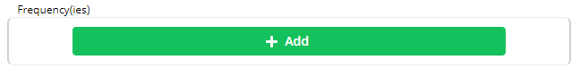
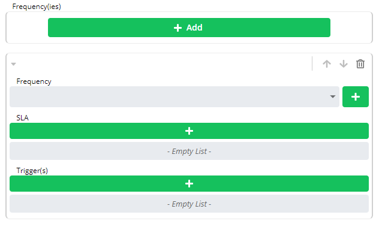
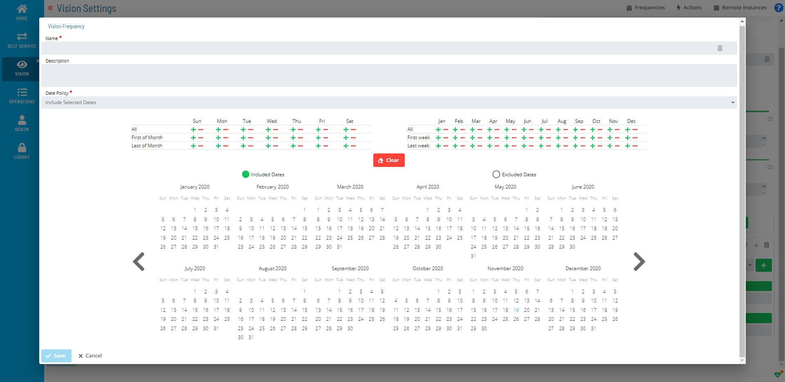

# Adding Vision Frequencies

To add a Vision Frequency:

Complete the prior steps for either [Creating Cards](Creating-Cards.md) or [Editing
Cards](Editing-Cards.md), depending on whether adding
a frequency to a new or existing card.

Click the **Add** button in the **Frequency(ies)** frame.

The following expanded **Frequency(ies)** frame will display.

Click the **+** button next to the **Frequency** drop-down.

\

The **Vision Frequency** window will display.

Enter a *Name* for the frequency.

*(Optional)* Enter a *Description* for the frequency.

Select a *dates option* from the **Date Policy** drop-down.

Click the **+** button or the **−** button to define which dates to
include or exclude. You can also select individual dates by clicking
directly on the calendars.

Click the **Save** button.

## Defining SLA

:::note
A Vision license is required to define SLA. For more information, refer to [License File Request and Storing](Working-with-Vision.md#License) in the **Solution Manager** online help.
:::

a.  Click the **+** button under **SLA**.
b.  Select an *expected time option* from the **Requirement** drop-down.
c.  Select the **Time**.
d.  Select the *day offset* in the **Day** drop-down.
e.  Click **OK**.

## Defining Trigger(s)

:::note
A Vision license is required to define Triggers. For more information, refer to [License File Request and Storing](Working-with-Vision.md#License) in the **Solution Manager** online help.
:::

a.  Click the **+** button under **Trigger(s)**.
b.  Select a *status* from the **Status** drop-down.
c.  Click the **+** button under **Runnable(s)**.
d.  Click the **+** button next to **Action**.
e.  Follow the procedure for [Adding Vision     Actions](Adding-Vision-Actions.md) and save the
    changes to return back to the **Runnable(s)** frame.
f.  *(Optional)* Select a *number of minutes* in the
    **Repeat After** drop-down.
g.  *(Optional)* Select a *remote instance* in the
    **Instance** drop-down.
h.  Click **OK**.

**On the Vision Settings page:**

Click the **Save** button.
