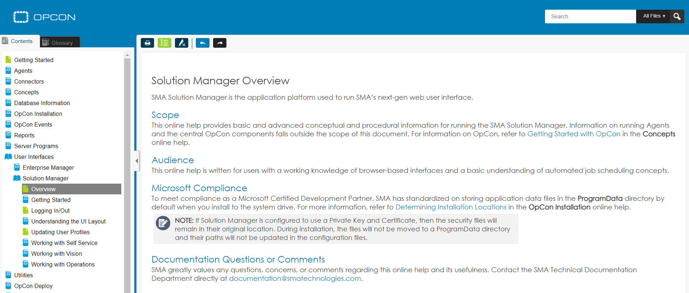

# Application Help

User help is available in web-based format directly within the application. The online help provides content for the entire suite of OpCon products. You can click the **Help** button  at the top of the page or click **Ctrl+Alt+H** to access content-specific topics or all product help.

:::note
You may need to disable your browser pop-up blocker in order to launch the help in the browser window.
:::
