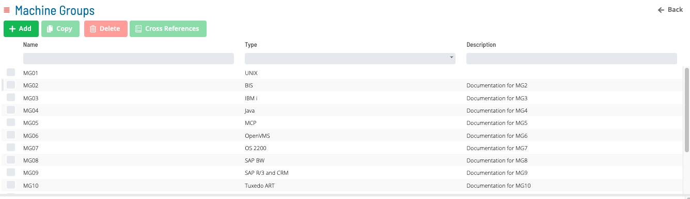
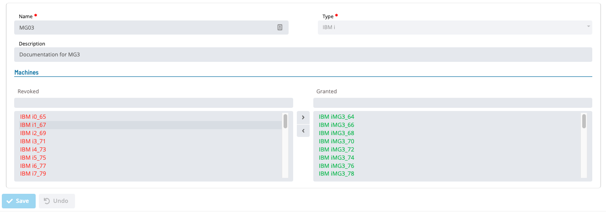
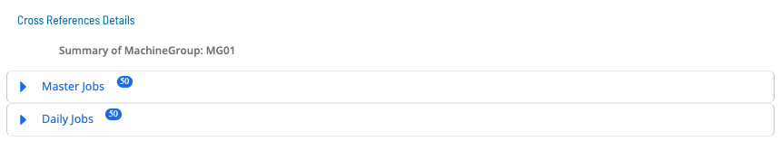
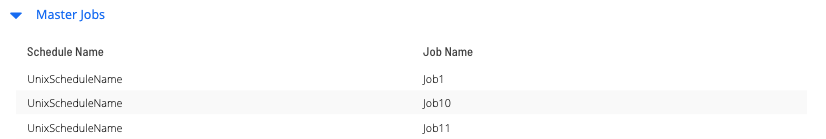
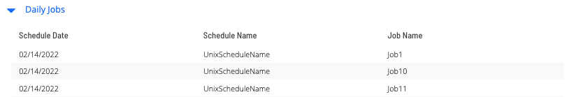

# Machine Groups

Available Machine Groups in OpCon are shown in the following Grid under Library -> Machine Groups.

Clicking the **Add**, **Copy** and **Selecting a record in the grid** will enable the bottom panel:

:::note
The **Name** field must be unique when adding or copying a machine group.
:::

Click the Cross References button to see the list of master and daily jobs that use a particular Machine Group.

Click on the expansion arrow for **Master Job** to view a list of master jobs that use the selected machine group.

Click on the expansion arrow for **Daily Job** to view a list of daily jobs that use the selected machine group.

