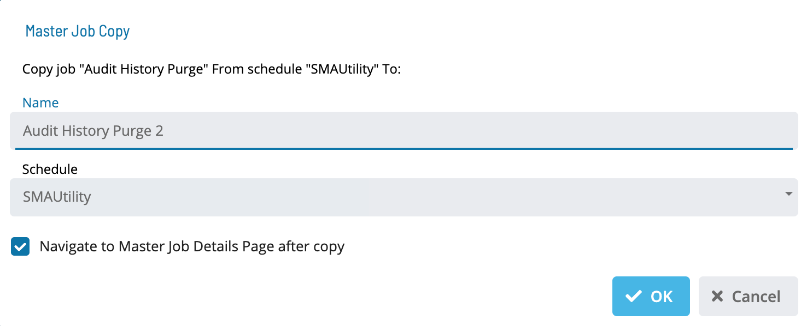

# Copying Master Jobs

## Required Privileges

In order to copy a master job, you must have at least all of the following privileges:

- **Departmental Function Privilege**: User must be at least in a role
  that has All Function Privileges, Add Jobs To Master Schedules or All Job Master Functions.

---

## Copying a Job

To copy a job, go to **Library** > **Master Jobs**.

Select a job and select **Copy**. The Master Job Copy dialog is displayed:

1. Enter a **Name**.

1. Select a **Schedule**.

1. Select **OK** to copy the job or **Cancel** to cancel the operation.
