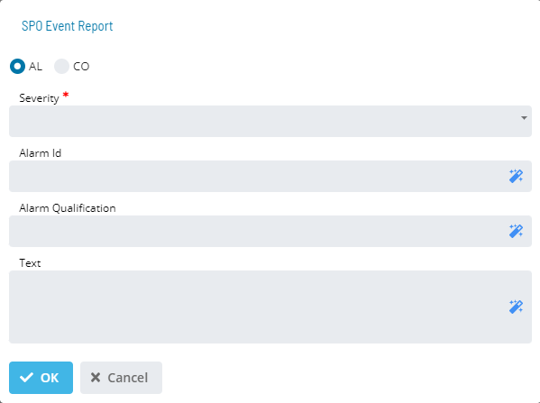
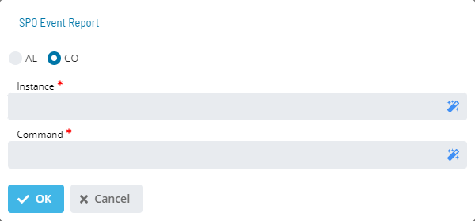

# SPO Event Report

# SPO Event Report

The **SPO** dialog provides the option of choosing between SPO AL
Report or a CO Report notification:

- **AL**: If enabled, defines the AL report fields.
- **Text**(Optional): Defines the user-defined message up to 250
    characters.
  - If no text is specified, the default information of <lsam_mach_name\> <schedule_date\> <schedule_name\><job_name\> is passed with the notification.
  - If text is specified, the resulting SPO message contains only
        the user-defined message.
- **Severity**: Defines the choices for the message's severity level.
    The choices are: Informational, Minor, Major, Warning, Critical,
    Indeterminate, or Unselect.
- **Alarm Id**(Optional): Defines any valid AL alarmid attribute. If no
    user-defined alarmid is specified and the SPO Default Alarm ID is
    not set in the UI's Administration \> Options, the LSAM Machine
    name is sent with the event report. The maximum for this field is
    250 characters.
- **Alarm Qualification**(Optional): Defines any valid AL alarmqual attribute.
    If no user-defined alarmqual is specified, the Schedule and Job Name
    are sent with the event report. The maximum for this field is 250
    characters.

- **CO**: If enabled, presents the CO report fields.
- **Instance**(Required): Defines any valid CO instance attribute. The
    attribute defined in the SPO configuration is case-sensitive. The
    maximum for this field is 250 characters.
- **Command**(Optional): Defines any valid CO command attribute. The
    Command field requires any valid Command attribute. The maximum for
    this field is 250 characters.

The resulting SPO message contains only the user-defined message.

