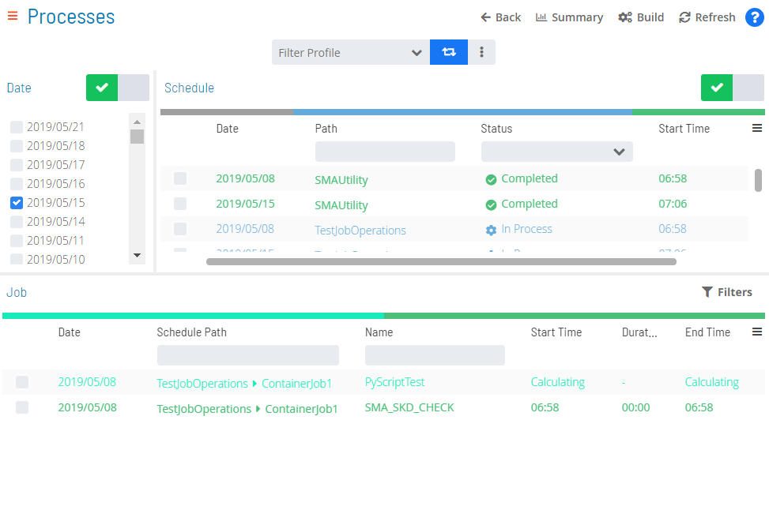
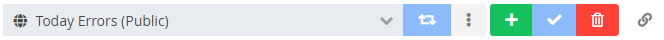
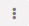
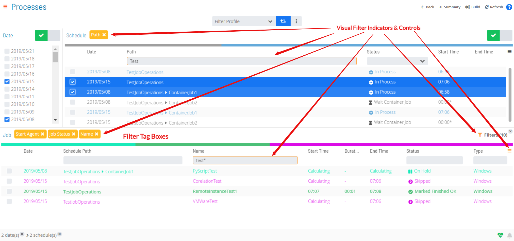
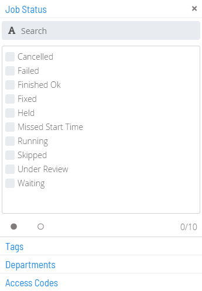
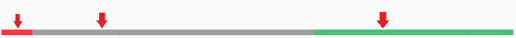
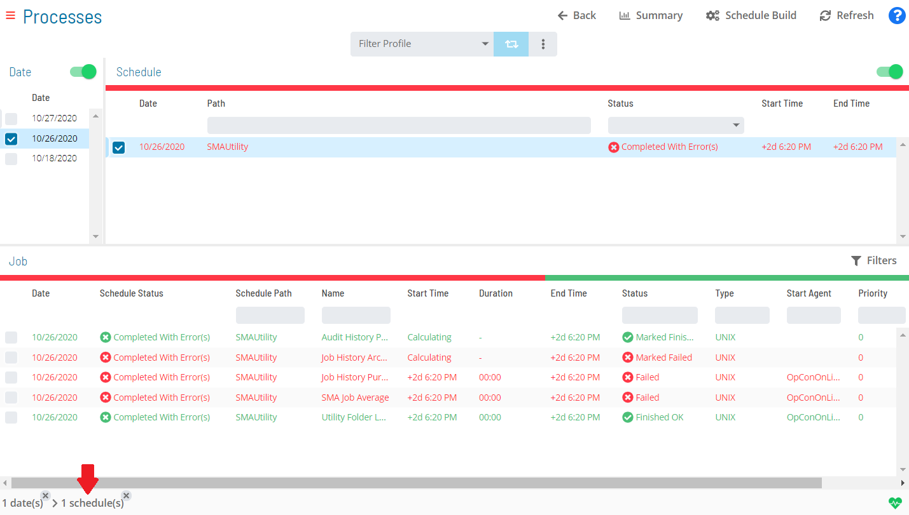

# Managing Daily Processes

The 
button on the main **Operations** page takes you to a page where you can
view and manage the Daily processes in operation.

Daily Processes Page

There are several options on this page that you can use to help enrich
your user experience. These next subsections describe these options in
detail.

## Toolbar Options

This **Daily Processes** page has the following toolbar options for
navigation or data refresh:

- **Back**: This button takes you back to the previous view or page
    that was accessed.
- **Summary**: This button takes you to the main **Operations** page.
- **Refresh**: This button refreshes the data on the **Processes**
    page so that it is up-to-date.

## Date/Schedule Selection Enabling/Disabling

The **Date** and **Schedule** toggle switches are provided for enabling
or disabling date and schedule selections, respectively. The switch will
appear with a green checkmark when enabled. When disabled, the switch
will appear with a gray circle.

## Filter Profiles

Filter profiles are user-defined filters in the Operations **Processes**
view that can be used persistently and shared with others.

Filter Profile Bar

### Creating and Sharing Filter Profiles

To create a filter profile:

Set the desired filter(s) in the Operations **Processes** view.

:::note
Keep in mind that any changes that you make to affect the column state of the grids (e.g., hiding columns) will not be stored by the filter profile.
:::

Click the **Advanced** button ()
on the filter profile bar to expose the action buttons.

Click the **Add** button ().

Enter a name for current set of filters.

Use the **Share with** drop-down list to set the share status of the
filter profile. The share detail will appear in parentheses next to the
name (e.g., Test Filter (Private) or Test Filter (Role_ocadm)).

- Select a specific role to grant anyone assigned to that particular
    role access to it and the ability to update it.
- Set the filter profile to **Public** to grant everyone access to it.
    Only those in the ocadm (or equivalent) role will have the ability
    to update it.
- Set the filter profile to **Private** if you do not wish to share it
    with others. Only the current user will have access to it and the
    ability to update it.

Click the **Save** button ()
to save the new filter profile.

:::note
Personal (private), public, or shared (those shared to and shared with) filter profiles are accessible from the **Filter Profile** drop-down list on the filter profile bar.
:::

### Modifying Filter Profiles

Any current user, assigned role, or role with adequate permission (e.g.,
ocadm) may modify a filter profile.

To modify a filter profile:

1. Select an existing filter profile from the **Filter Profile**
    drop-down list.
2. Modify the existing set of filters.
3. Click the **Advanced** button ()
    on the filter profile bar to expose the action buttons.
4. Click the **Save** button ()
    to save the updates.

:::note
You could also use an existing filter profile as a base, modify it, and save it as a new filter profile. To do so, you would select the existing profile, modify the existing set of filters, click the **Add** button (), enter a new name, configure sharing, and save it has a new filter profile.
:::

### Deleting Filter Profiles

To delete a filter profile:

1. Select an existing filter profile from the **Filter Profile**
    drop-down list.
2. Click the **Advanced** button ()
    on the filter profile bar to expose the action buttons.
3. Click the **Delete** button ()
    to delete the filter profile.

### Accessing Filter Profiles via Direct URL

Filter profiles can also be accessed via direct URLs that are obtained
from the Operations **Processes** page.

To get the direct URL:

1. Select an existing filter profile from the **Filter Profile**
    drop-down list.
2. Click the **Advanced** button ()
    on the filter profile bar to expose the action buttons.
3. Click the **Link** button ().
    A **Filter Profile Link** dialog (similar to the graphic) should
    display.

## Filtering

Filtering is available for the **Schedules**, **Jobs**, and **Agents**
grids (lists). Using this feature makes it easier to target particular
items, especially when a large number of items are returned.

Keep in mind the following visual indicators on the page when filtering
is applied:

- The color scheme of dark yellow serves as a visual identifier of
    "filtered" and will be applied to field borders, buttons,
    controls, tags, etc.
- The triple bar button on top-right corner of grids ()
    changes to dark yellow whenever a hidden column has filter criteria.
- A filter tag box, which represents the field name that has been
    filtered, will appear on a tag bar above the grid. Clicking on the
    **x** at the top-right corner of filter tag box removes the active
    filter.

Visual Filter Indicators in Operations

### Quick Filtering

For quick filtering, use the **Filter Bar** just above the grid to
filter the list. Type the keyword in the appropriate field and click
**Enter**, and the list will filter accordingly. This option is
available for the **Schedules**, **Jobs**, and **Agents** grids.

Quick Filtering

:::note
The Schedules filter bar also has a **Status** drop-down list which has the following options: Waiting, Held, In Progress, Completed, and Completed with Error(s). You can filter the list to display only those schedules that fall under the category of the selected status.
:::

### In-depth Filtering

For more in-depth filtering in the **Jobs** grid, you can use the

button to display a **Filter** panel where you can filter the list of
jobs by job status, tag, department, or access code. Use the 
button to select all or the 
button to deselect all available options in each of the according-style
tabs in the panel. The panel will also display the number of filters
turned on per tab.

Filter Panel

The filter button icon in the grid will change to dark yellow and also
display the number of filters currently turned on ().
Click on the **x** at the top-right corner of the button to remove all
selected filters at once. Any applied filter will also appear as a dark
yellow filter tag box on the tag bar above the grid.

### Interactive Filtering

For interactive filtering, use the color-coded **Statistics Bar** above
the grid to filter the list by the current status. Each color represents
a status. Click on any color in the bar to filter the list view by that
particular status. This option is available for the **Schedules**,
**Jobs**, and **Agent** grids.

Interactive Filtering

A filter tag box (),
indicating which field name has been applied, will appear on the tag bar
above the grid and the border of the **Status** field on the filter bar
will change to dark yellow while the field itself will be populated with
the status by which the grid has been filtered.

## Column Sorting and Display

Column sorting and display is available for the **Schedules**, **Jobs**,
and **Agents** grids.

- For sorting, click on the column heading to sort the column in
    ascending order (indicated by a small arrow pointing down). Click on
    the column heading again to sort the column in descending order
    (indicated by a small arrow pointing up).
- For display, use the triple bar button ()
    to select which columns are displayed.

## Right-Click Action

You can right-click on any item in the list to display its **Selection**
panel where actions can be performed based on current selection(s). This
functionality works in the **Schedules**, **Jobs**, and **Agents**
grids.

## Breadcrumb Selection

Whenever a selection is made in the **Date**, **Schedule**, **Job**, or
**Agents** list, a record of that selection is displayed in the **Status
Bar** at the bottom of the page. This record takes the form of a
breadcrumb trail. As with the right-click functionality, you can click
on the record (currently not available for date records) to display a
**Status Update** panel where you can perform actions based on current
selection(s).

Breadcrumb Selection

.png "More Info icon")
Related Topics

- [Performing Schedule Status     Changes](Performing-Schedule-Status-Changes.md)
- [Performing Job Status     Changes](Performing-Job-Status-Changes.md)
- [Performing Bulk Status Job Updates (Schedule     Level)](Performing-Bulk-Job-Status-Updates-Schedule-Level.md)
- [Performing Agent Status     Updates](Performing-Agent-Status-Updates.md)
- [Viewing Job Output](Viewing-Job-Output.md)
- [Using PERT View](Using-PERT-View.md)
