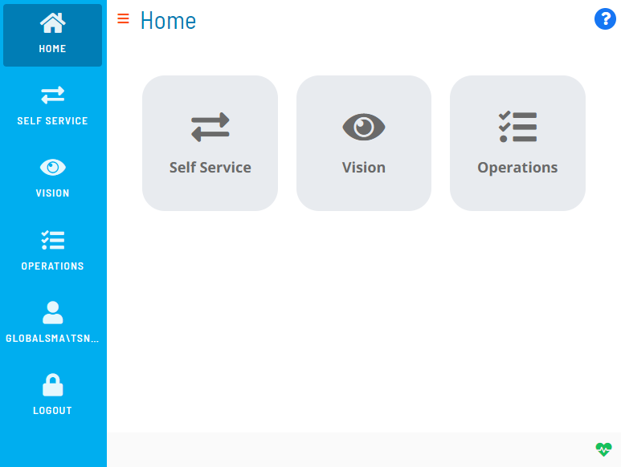

# Understanding the User Interface Layout

Once logged in, you will see the **Home** page from the desktop layout.

## Navigation Menu

The **Navigation menu** is located to the left on the page. This menu allows you to log out, navigate through the available Solution(s), and access the page to update your OpCon user profile. When viewing the Solution Manager application from a web browser (desktop mode), you can toggle between showing and hiding this menu by clicking the menu display button () at the top of the page.

## Solutions

The **Solution(s)** are located to the right of the Navigation menu. The solutions are the OpCon modules to which users have privileges to access.

## Status Bar

The **Status Bar** is located at the footer of the page and contains icons and indicators, each of which have been described in the next sections.

### Heartbeat Indicator

The **Heartbeat indicator** quickly identifies the status of the SAM and/or the Agents. Depending on the current state of the SAM and Agents, this indicator will have one of the following visual aspects:

-  - This indicates that the communication between Solution Manager and OpCon Rest API is broken.
-  - This indicates that the SAM is DOWN.
- - This indicates that the SAM is DOWN and at least one Agent is waiting on communication.
-  - This indicates that the SAM is UP and all started Agents are communicating (whether limited or not).
-  - This indicates that the SAM is UP, but at least one Agent is waiting on communication (and none is in error).
-  - This indicates that the SAM is UP, but at least one started Agent does not respond (and at least one is started or waiting).
-  - This indicates that the SAM is UP, but all started Agents do not respond (in error).

### Notification Indicator

The **Notification indicator**  allows you to access the Notification Acknowledgment page which lists any escalated notifications that have been received. Refer to [Viewing Notification Acknowledgement](Viewing-Notification-Acknowledgement.md) for more information.

### InstantLog Mode

**InstantLog Mode** allows you to capture logs temporarily and send them to SMA Technologies Customer Support. The primary use for this feature is in instances where you can or know how to reproduce the issue in the application.

To activate this mode:

1. Start from a fresh login and navigate to the **Home** page.
2. Press **Ctrl+Alt+L**. A red bug icon  should appear in the bottom-right of the status bar.
3. Reproduce your issue by navigating in the page where the issue occurs.
4. Press **Ctrl+Alt+L** again to generate the **debug.log** file.
5. Send the generated file to SMA Technologies Customer Support.

:::note
For all buttons in the Solution Manager, you only have to click once to trigger the action.
:::
