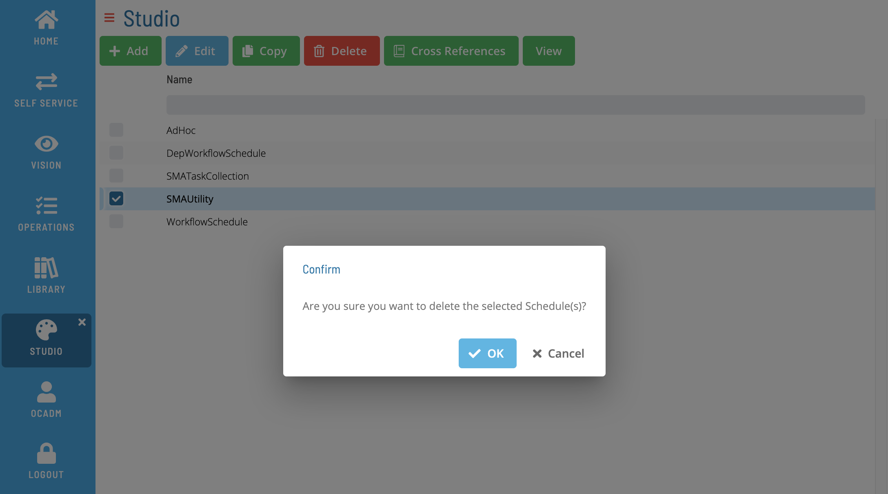

# Deleting Master Schedules

## Required Privileges

n/a

## Deleting a Schedule

To delete a Master Schedule, or multiple Master Schedule, go to **Studio**.

Select a schedule or schedules and select **Delete**. A confirmation dialog is displayed:

Select **Yes** to delete the schedules(s). Select **No** to cancel the operation.
