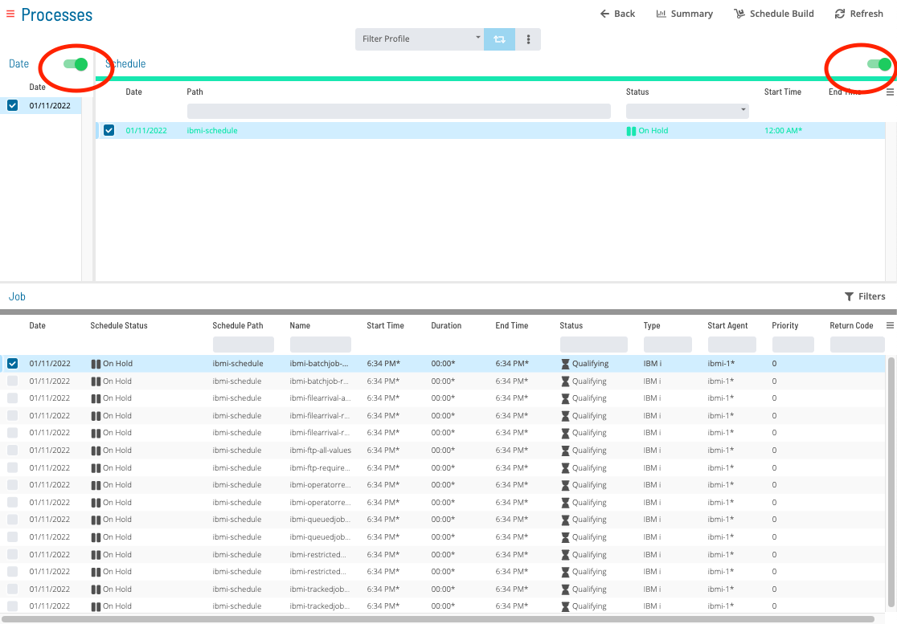
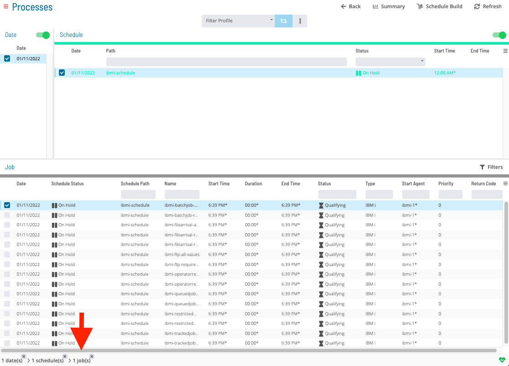
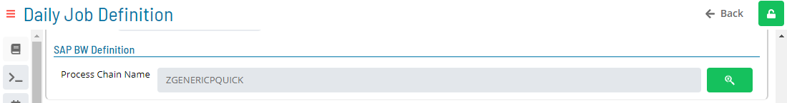
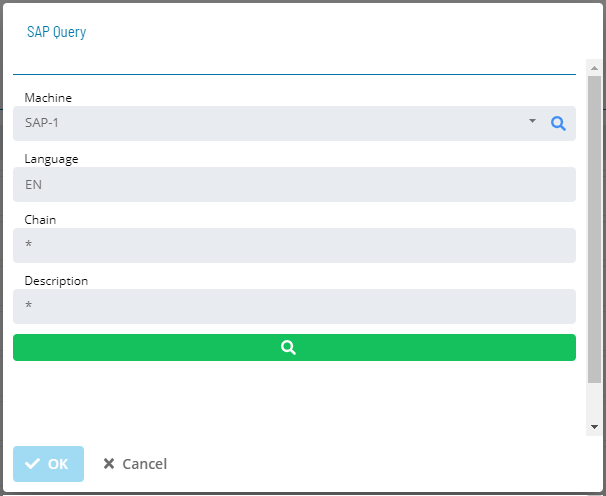
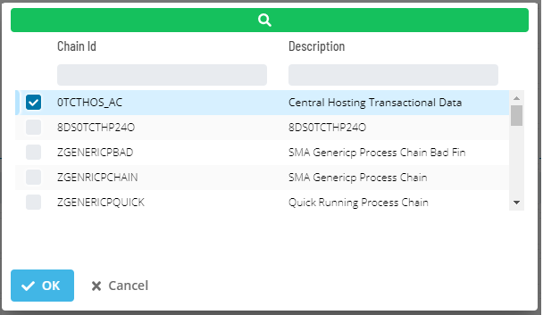
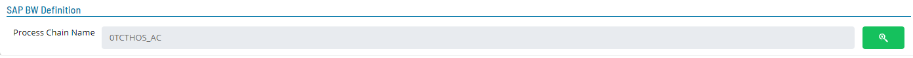

# Updating SAP BW Job Details

In **Admin** mode, SAP BW job type properties can be updated or defined.

For conceptual information, refer to [SAP BW Job Details](../../../job-types/sap-bw.md) in the **Concepts** online help.
:::note
Only those with the appropriate permissions will have access to the **Lock** button and can update job properties. For details about privileges, refer to [Required Privileges](Accessing-Daily-Job-Definition.md#Required) in the **Accessing Daily Job Definition** topic.
:::

:::note
If you do not have the Machine Privilege, then you will not be able to edit the daily job definition.
:::

:::note
Changes made to the job properties in the **Daily Job Definition** will take place immediately. If the job has already run, the changes will take effect the next time the job runs.

:::
## Updating SAP BW Job Task Details
To perform this procedure:
Click on the **Processes** button at the top-right of the **Operations Summary** page. The **Processes** page will display.
Ensure that both the **Date** and **Schedule** toggle switches are enabled so that you can make your date and schedule selection, respectively. Each switch will appear green when enabled.

Select the desired **date(s)** to display the associated schedule(s).
Select one or more **schedule(s)** in the list.
Select one **job** in the list. A record of your selection will display in the [status bar](SM-UI-Layout.md#Status) at the bottom of the page in the form of a breadcrumb trail.

Click on the job record (e.g., 1 job(s)) in the status bar to display the **Selection** panel.

:::note
As an alternative, you can right-click on the job selected in the list to display the **Selection** panel.
:::

.png "Job Summary Tab in Operations")
Click the **Daily Job Definition** button  at the top-left corner of the panel to access the **Daily Job Definition** page. By default, this page will be in **Read-only** mode.
Click the **Lock** button  at the top-right corner to place the page in **Admin** mode. The button will switch to display a white lock unlocked on a green background  when enabled.

:::note
The **Lock** button will not be visible to users who do not have the appropriate permissions.
:::
Expand the **Task Details** panel to expose its content.
Select from the **Machines or Machine Group** drop-down list the **machine** where the LSAM is installed. If you wish instead to specify a machine group, then toggle the **Machines** switch to *Machine Group* then select the **machine group** from the drop-down list. When toggled to Machine Group, the button will appear green .

**In the SAP BW Definition frame:**

- **Process Chain Name**: Defines the name of the Business Warehouse job as defined in the SAP Business Warehouse system.
- Click on the search button  to open the SAP Query dialog.

**In the SAP Query dialog:**

- **Machine**: Defines the SAP BW LSAM Machine name. 
- **Language**: Defines the two-character language abbreviation (e.g., enter EN for English).
- **Chain**: Defines text matching the name of the desired Process Chain in the SAP Business Warehouse system. If unsure of the whole process chain name, use wildcards (\*) to expand the search.
- **Description**: Defines text matching the description of the desired Process Chain in the SAP Business Warehouse system. If unsure of the whole description, use wildcards (\*) to expand the search.

- Click on the search button to initiates a request to the SAP BW system to retrieve all Process Chain names matching the search criteria.
- Select a process chain from the list and click Ok to assign it to the process chain name in the SAP BW Daily Job Definition.

:::note
Click the **Undo** button if you wish to undo your changes for any reason.
:::
Click the **Save** button to update any changes on this screen.
