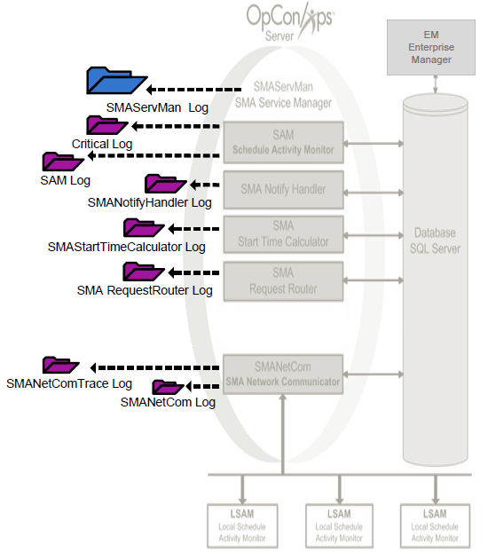

# Logging

The SAM and supporting services (SAM-SS) have several important logs. All logs are located in the <Output Directory\>\\SAM\\Log\\ directory.

The log files have the names:

- Sam.log
- Critical.log
- SMANetCom.log
- SMANetComTrace.log
- SMAServMan.log
- SMANotifyHandler.log
- SMAStartTimeCalculator.log
- SMARequestRouter.log

:::note
The Output Directory was configured during installation. For more information, refer to [File Locations](../file-locations.md) in the **Concepts** online help.
:::

## View a Log File

1. Use menu path: **Start \> Programs \> Log Monitors \> *<Log Name\>***.
2. View the log information with FileMon.
3. Close FileMon by using menu path: **File \> Exit** .

## Log Archiving

Each component archives log files at the end of the day or when they reach the maximum log file size configured in the component's .ini file. All archived log files reside in the <Output Directory\>\\SAM\\Log\\Archive folder.

:::note
The Output Directory was configured during installation. For more information, refer to [File Locations](../file-locations.md) in the **Concepts** online help.
:::

If an archive folder for the day does not already exist, the component
creates one. The folder names use the following naming convention:
yyyy_mm_dd (Weekday). The logging mechanism generates the weekday name
according to the Regional Settings of the user executing the component.

:::tip Example
If the Regional Settings are set to English, an archive folder would have the following name: 2008_01_11 (Friday).

If the Regional Settings are set to French, an archive folder would have the following name: 2008_01_11 (Vendredi).
:::

As a log file fills up, each component moves it to the current archive
folder and renames it using the following naming convention: Log
StartTime - StopTime.log.

:::tip Example
An SMANetCom archive file for the time range of 12:58:16 to 13:58:00 would be named SMANetCom 125816 - 135800.log.
:::

Once per day the SAM deletes old archive folders. The SAM retains 10
days of archived logs by default. For additional information, refer to
the "Maximum number of days archived SAM logs should be kept" logging
setting. Refer to [Logging](../administration/server-options.md#logging) in
the **Concepts** online help.

## SAM Logging

The SAM writes two logs to the <Output Directory\>\\SAM\\Log\\
directory. The log files have the names:

- [SAM.log](#SAM.log)
- [Critical.log](#Critical)

In both log files, the SAM writes the complete job name to identify the
jobs.

:::note
The Output Directory was configured during installation. For more information, refer to [File Locations](../file-locations.md) in the **Concepts** online help.
:::

### SAM.log

The SAM writes all successful processing information (i.e., Schedule/Job
starts, Schedule/Job completions, Event processing, etc.) to the SAM.log
file. Additionally, the SAM writes all configuration information to the
log when it starts or when it regenerates.

- If the SAM encounters a corrupt SAM.log file at startup, the SAM
    archives the bad log file. The naming convention for such a log file
    is SAM hhmmss - Bad File.log where hhmmss is the SAM's start time.
    For example, if the SAM tries to read a bad SAM.log file at
    09:00:00, the SAM archives the corrupt log file as SAM 090000 - Bad
    File.log.
- If the SAM log is locked when SAM starts up, it will write to the
    critical and Application Event log, and will also terminate
    immediately.
- If the SAM log is locked while SAM is running, it still writes to
    the critical log but not to the Application Event log and it     will continue to run.

### Critical.log

The SAM writes all processing errors to the Critical.log file. Examples
of errors logged are machine communication failure, database connection
problems, event processing failures, license expiration notifications,
and so forth.

## SMANetCom.log

SMANetCom writes its configuration parameters, basic communication
information and the configuration for each LSAM machine to the
SMANetCom.log. In the configuration information, the default value is
listed in parentheses next to the relevant parameter if a configuration
default is modified.

## SMANetComTrace.log

SMANetCom writes all processing information to the SMANetComTrace.log.
The trace records detailed TCP/IP messages, including socket connection
errors, to help with debugging.

### Log Messages

In the SMANetComTrace.log, every "To" (\>\>\>) message is an SMANetCom
message. Each SMANetCom message has the following syntax:
TE/TI/TX\#MachineName Message.

#### Message Numbers

The next table contains the definitions of the TE/TI/TX messages with
the associated SMA protocol types.

|TX Number|Legacy/Contemporary Protocol|Definition|
|--- |--- |--- |
|TE1|Both|Tracked or Queued Job Error|
|TI1|Both|Tracked or Queued Job Information|
|TX1|Both|Job Start|
|TX2|Both|Job Status|
|TX3|Legacy|Confirmation of Job Completion|
|TX4|Both|Machine Status|
|TX9|Legacy|Retrieve Pending Messages|

#### LSAM Response Breakdown

In the SMANetComTrace.log, every "From" (<<<) message is an LSAM response to an SMANetCom request. Embedded in a 48-character string, the message follows the machine name and job name in an LSAM response. Break down the string in the following manner:

- The first 10 characters are the OpCon job number.
- The 11th character is the LSAM response.
  - 0 - Job Not Found
  - 1 - Job Initialization Error
  - 2 - Job to be Requeued
  - 3 - Prerun Active
  - 4 - Prerun Failed
  - 5 - Job Running
  - 6 - Job Finished OK, Completion Notice Pending
  - 7 - Job Erred, Completion Notice Pending
  - 8 - Job Finished OK, Deleted from Tracking File
  - 9 - Job Erred, Deleted from Tracking File
- The 12th through 23rd characters are the start and stop time of the job.
- The 24th through 28th characters are the maximum number of jobs the LSAM is allowed to process concurrently.
- The last 20 characters are the exit condition and the status description of the job. For more information on LSAM exit conditions, refer to the individual LSAM's online help.

:::note
For most LSAMs, the status description will not be shown.
:::

## SMAServMan.log

SMAServMan writes all information to the SMAServMan.log regarding the management of all listed applications. For more information on SMA Service Manager's listed applications, refer to the [Application List](./service-manager.md#application-list) table in the **SMA Service Manager** topic.

## SMANotifyHandler.log

The SMANotifyHandler writes all notification processing information to SMANotifyHandler.log.

## SMAStartTimeCalculator.log

The SMAStartTime Calculator writes all job start time calculation processing information to SMAStartTimeCalculator.log.

## SMARequestRouter.log

The SMARequestRouter writes all request routing processing information to SMARequestRouter.log.
