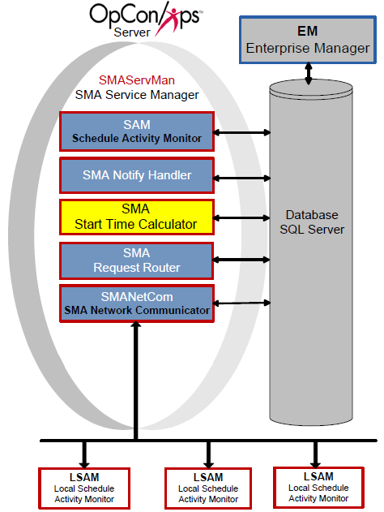

# SMA Start Time Calculator

The SMA Start Time Calculator component periodically recalculates the estimated start time for all the active jobs in the OpCon Daily tables. Following each set of calculations, this service updates the database. Schedule Operations views display the current Estimated Start Time for each job.

SMA Start Time Calculator does calculations in the following manner:

- Initially calculates estimated start times for all schedules in the Daily tables.
- Continues calculating estimated start times for:
  - "Waiting" schedules, both in the past and current day.
  - "In Process" schedules, throughout the Daily tables.
- When it detects any change to a job or schedule that is on a future date in a "Waiting" status, it recalculates all the jobs in the changed schedule and all other schedules with cross-schedule dependencies to that schedule (including subschedules).

:::caution
Since start times can continually change with dependence on a complex variety of factors (offsets, absolute/relative factors, dependent job start times, job run times, etc.), the Start Time Calculator is a process intensive program and should be configured for the unique requirements of a data center. To set the refresh interval, refer to the General Settings below for the SMAStartTimeCalulator.ini file.
:::

## Configuration

The SMA Start Time Calculator configuration determines basic service and logging behavior. The SMAStartTimeCalculator.ini file resides in the <Configuration Directory\>\\SAM\\ folder.

:::note
The Configuration Directory location is based on where you installed your programs. For more information, refer to [File Locations](../file-locations.md) in the **Concepts** online help.
:::

The tables contain the definitions of each configuration parameter. If a value of "Y" is in the Dynamic column, any changes take effect immediately upon saving the file. All other configuration settings require the service to be restarted before the change takes effect.

### SMAStartTimeCalculator.ini

The SMAStartTimeCalculator.ini file contains the following major sections:

- [General Settings](#General)
- [Debug Options](#Debug)

#### General Settings

The General Settings contain basic information for Start Time Calculator
processing.

|General Settings|Default|Dynamic (Y/N)|Definition|
|--- |--- |--- |--- |
|RefreshInterval|300|Y|Sets time interval (in seconds) at which the service recalculates the estimated start time for all the jobs in the OpCon database. The default value of 300 seconds is appropriate for smaller, less complex automation environments. SMA Technologies strongly recommends increasing the value of this setting for larger and more complex environments. Valid values: 1 through 65535 seconds|

:::caution
If the SMAStartTimeCalculator takes more time than the refresh interval to process all jobs, it will continually process and can have a negative impact on the SAM. Increase the refresh interval by 15 minute increments (900 seconds) until performance is acceptable.
:::

#### Debug Options

The Debug Options configure the Start Time Calculator's logging behavior.

|Debug Options|Default|Dynamic (Y/N)|Definition|
|--- |--- |--- |--- |
|MaximumLogFileSize|150000 (bytes)|Y|Defines the maximum size in bytes for each log file. Determines when the current log file is closed and a new file is started. When the file reaches this maximum size, it is "rolled over." This setting creates small, manageable log files.SMAStartTimeCalculator.log resides in the *Output Directory*\SAM\Log directory. Note: The Output Directory was configured during installation. For more information, refer to File Locations in the Concepts online help. When the log file reaches the maximum size, Start Time Calculator archives the log file. The SAM then maintains the archive folders. Minimum Value = 4096 bytes, Maximum Value = 65536 bytes|
|TraceLevel|0|Y|Determines the detail of logging. Valid Entries:0 = Standard logging1 = Basic, non-detailed trace2 = Detailed trace3 = Very detailed trace (Traces all the possible debug information in the application.)|
