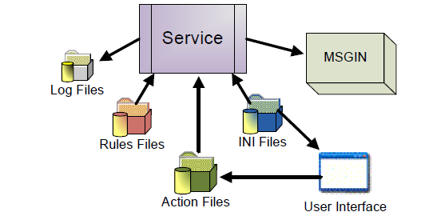

# SMA Resource Monitor Introduction

The SMA Resource Monitor for Windows is a file watcher and Windows counter monitor. Both files and other resource triggers will cause the Resource Monitor to send OpCon events for processing. Pictured below is the architecture of the SMA Resource Monitor.

Both the GUI and the Service require the INI file to determine configuration settings. The GUI reads and updates the Rules and Action files, and the Service uses the Rules and Action files to monitor entities and take actions by sending OpCon events through an MSGIN directory.
