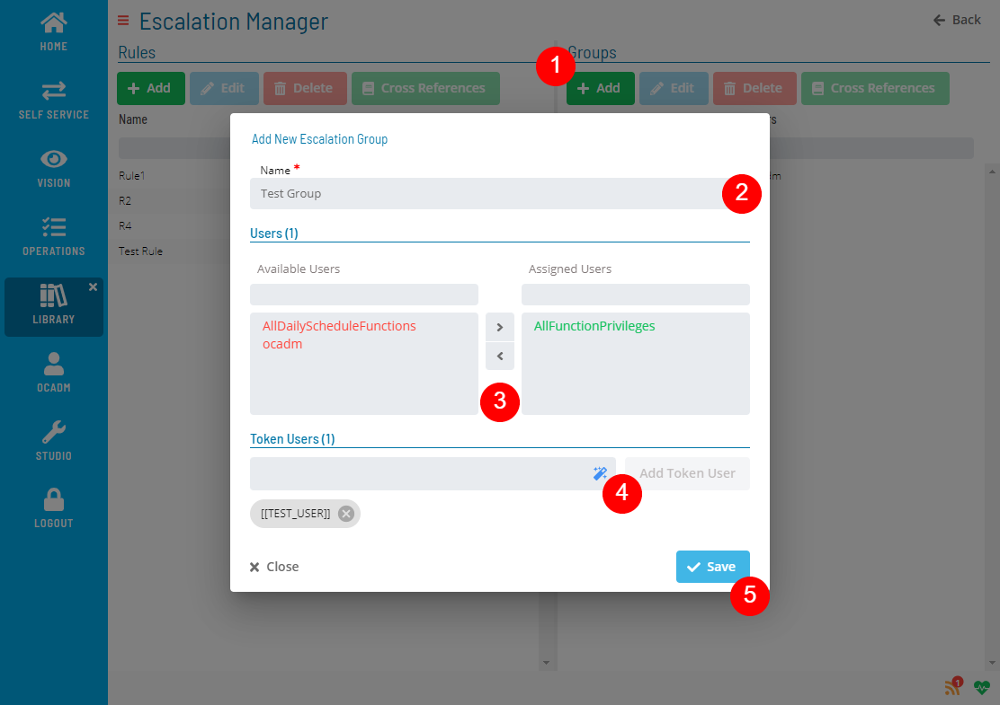

# Managing Escalation Groups

The **Escalation Manager** module allows you to add, edit, delete, and check cross-references for escalation groups.

### Creating Escalation Group

Click the Add button above the list and fill out the Escalation Group form

:::note
Escalation group must have at least one user or token user.
:::

### Editing Escalation Group
Select an Escalation Group and click the Edit button above the list and fill out the Escalation Group form

### Deleting Escalation Group

Select an Escalation Group and click the Delete button above the list

:::note
Delete operation is not allowed if Escalation Group has any cross-references.
:::

### Checking Cross References

Select an Escalation Group and click the Cross References button above the list

.png "More Info icon")
Related Topics

- [Managing Escalation Rules](Managing-Escalation-Rules.md)