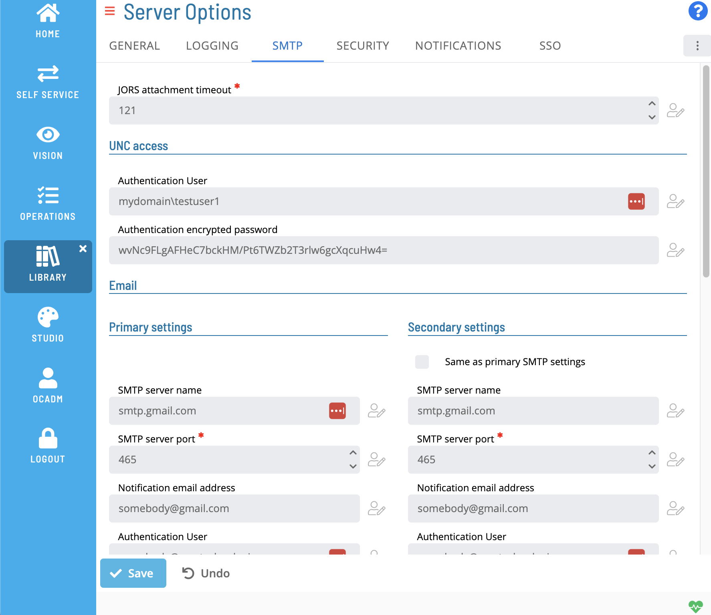

# Managing SMTP Settings

## Required Privileges

In order to configure the **SMTP** setting, you must have one of the following:

- **Role**: Role_ocadm.
- **Function Privilege**: Maintian server options.

---

## Configuring SMTP Settings

To configure SMTP Settings, go to **Library** > **Server Options** > click on the **SMTP** tab.

\*_The table below shows default values for each settings. If user changes the default value of a setting,  icon will show next to the field._

### Configuration Options

The SMTP settings tab includes configuraiton for SMTP Email and SMS settings. It includes a checkbox to mirror primary and secondary settings.

| Option Parameter                                         | Default            | Dynamic (Y/N) | Valid Options                                          | Description                                                                                                                                                                                                                                                                                                                                                                                                                                                                                                                                                                                                                                                                      |
| -------------------------------------------------------- | ------------------ | ------------- | ------------------------------------------------------ | -------------------------------------------------------------------------------------------------------------------------------------------------------------------------------------------------------------------------------------------------------------------------------------------------------------------------------------------------------------------------------------------------------------------------------------------------------------------------------------------------------------------------------------------------------------------------------------------------------------------------------------------------------------------------------- |
| JORS Attachment Timeout                                  | 120                | Y             | 60-3600                                                | Defines the number of seconds the SMA Notify Handler should wait for an attachment to return from a JORS request.                                                                                                                                                                                                                                                                                                                                                                                                                                                                                                                                                                |
| Authentication User (UNC Access)                         | <blank\>           | Y             | max 4000 characters ' (single quote) invalid character | Defines the Windows user account the SMA Notify Handler will use to gain access to machines and UNC paths on the network. This user is required if the SMA Notify Handler has to send Email attachments from network shares. This user is required if SMA Notify Handler will send Network Message notifications. Refer to Sending Network Messages in the Enterprise Manager online help. The user must have privileges to "Read" all network shares from which the SMA Notify Handler will pick up files. The user must also have "Write" privileges to the <Output Director\>\SAM\Log folder.                                                                                 |
| Authentication Encrypted Password (UNC Access)           | <blank\>           | Y             | max 4000 characters ' (single quote) invalid character | Defines the encrypted password for the Windows user the SMA Notify Handler will use to gain access to machines and UNC paths on the network. This user is required if the SMA Notify Handler has to send Email attachments from network shares. This user is required if SMA Notify Handler will send Network Message notifications. Refer to Sending Network Messages in the Enterprise Manager online help. To encrypt the password manually, use the Password encryption tool in the Enterprise Manager. Then copy and paste the encrypted password for the value of this setting. For more information, refer to Encrypting Passwords in the Enterprise Manager online help. |
| SMTP Server Name (Primary Email)                         | <blank\>           | Y             | max 4000 characters ' (single quote) invalid character | Defines the name of the Primary SMTP server for sending email. If no SMS servers are defined, this server will also send SMS text messages. If the value is blankk, the SMA Notify Handler cannot send email or text notifications.                                                                                                                                                                                                                                                                                                                                                                                                                                              |
| SMTP Server Port (Primary Email)                         | 25                 | Y             | 1-65535                                                | Defines the server port that SMA Notify Handler will use when sending email through the Primary SMTP server.                                                                                                                                                                                                                                                                                                                                                                                                                                                                                                                                                                     |
| SMTP Notification Address (Primary Email)                | noreply@mycorp.com | Y             | max 4000 characters all characters are valid           | Defines the email address the SMA Notify Handler will use as the "From" address when sending E-mail or Text Messages through the Primary Email server. If the SMTP server requires authentication, this setting is ignored and the administrator must configure the SMTP Authentication User and Password for the Primary Email server. Customers should specify an email address consistent with their domain name. The SMA Notify Handler will not validate the email address specified; it will only send the message with that "From" address, leaving the validation up to the SMTP server.                                                                                 |
| SMTP Authentication User (Primary Email)                 | <blank\>           | Y             | max 4000 characters all characters are valid           | Defines an email address for authentication to the Primary Email SMTP server. If the SMTP server requires authentication, a value must specified here. If a value is not specified when required by the SMTP server, the SMA Notify Handler will not be able to send emails or text messages. Customers should specify an email address consistent with their domain name. The SMA Notify Handler will not validate the email address specified; it will only send the message with the user and password specified, leaving the validation up to the SMTP server.                                                                                                               |
| SMTP Authentication Encrypted Password (Primary Email)   | <blank\>           | Y             | max 4000 characters all characters are valid           | Defines the password for the SMTP Authentication User for the Primary Email server. If the SMTP server requires authentication, a value must specified here that provides the encrypted password for the user. To encrypt the password manually, use the Password encryption tool in the Enterprise Manager. Then copy and paste the encrypted password for the value of this setting. For more information, refer to Encrypting Passwords in the Enterprise Manager online help.                                                                                                                                                                                                |
| SMTP Authentication -Enable SSL (Primary Email)          | False              | Y             | True/False                                             | Determines if the SMA Notify Handler will use SSL encryption when connecting to the Primary Email SMTP server. If the SMTP server requires SSL Encryption, the value must be set to True.                                                                                                                                                                                                                                                                                                                                                                                                                                                                                        |
| SMTP Total Attachment Size in MB (Primary Email)         | 10                 | Y             | 0-99                                                   | Determines the maximum total of MB in the attachments for an email attachments notification from the Primary Email SMTP server. This value should match the limit set by the SMTP server.                                                                                                                                                                                                                                                                                                                                                                                                                                                                                        |
| SMTP Maximum Number of Attachments (Primary Email)       | 50                 | Y             | 0-999                                                  | Determines the maximum number of attachments allowed per email on a notification from the Primary Email SMTP server. This value should match the limit set by the SMTP server.                                                                                                                                                                                                                                                                                                                                                                                                                                                                                                   |
| SMTP Server Name (Secondary Email)                       | <blank\>           | Y             | max 4000 characters all characters are valid           | Defines the name of the Secondary SMTP server for sending email. If messages fail to send through the Primary Email server, the SMA Notify Handler will attempt to send the message again through the Secondary Email server. If no SMS servers are defined, this server will also serve as a Secondary server to send SMS text messages. If the value is blankk, the SMA Notify Handler will not attempt messages through a Secondary server.                                                                                                                                                                                                                                   |
| SMTP Server Port (Secondary Email)                       | 25                 | Y             | 1-65535                                                | Defines the server port that SMA Notify Handler will use when sending email through the Secondary SMTP server. The user can set the value for this option.                                                                                                                                                                                                                                                                                                                                                                                                                                                                                                                       |
| SMTP Notification Address (Secondary Email)              | noreply@mycorp.com | Y             | max 4000 characters all characters are valid           | Defines the email address the SMA Notify Handler will use as the "From" address when sending E-mail or Text Messages through the Secondary Email server. If the SMTP server requires authentication, this setting is ignored and the administrator must configure the SMTP Authentication User and Password for the Secondary Email server. Customers should specify an email address consistent with their domain name. The SMA Notify Handler will not validate the email address specified; it will only send the message with that "From" address, leaving the validation up to the SMTP server.                                                                             |
| SMTP Authentication User (Secondary Email)               | <blank\>           | Y             | max 4000 characters all characters are valid           | Defines an email address for authentication to the Secondary Email SMTP server. If the SMTP server requires authentication, a value must specified here. If a value is not specified when required by the SMTP server, the SMA Notify Handler will not be able to send emails or text messages through the Secondary server. Customers should specify an email address consistent with their domain name. The SMA Notify Handler will not validate the email address specified; it will only send the message with the user and password specified, leaving the validation up to the SMTP server.                                                                                |
| SMTP Authentication Encrypted Password (Secondary Email) | <blank\>           | Y             | max 4000 characters all characters are valid           | Defines the password for the SMTP Authentication User for the Secondary Email server. If the SMTP server requires authentication, a value must specified here that provides the encrypted password for the user. To encrypt the password manually, use the Password encryption tool in the Enterprise Manager. Then copy and paste the encrypted password for the value of this setting. For more information, refer to Encrypting Passwords in the Enterprise Manager online help.                                                                                                                                                                                              |
| SMTP Authentication -Enable SSL (Secondary Email)        | False              | Y             | True/False                                             | Determines if the SMA Notify Handler will use SSL encryption when connecting to the Secondary Email SMTP server. If the SMTP server requires SSL Encryption, the value must be set to True.                                                                                                                                                                                                                                                                                                                                                                                                                                                                                      |
| SMTP Total Attachment Size in MB (Secondary Email)       | 10                 | Y             | 0-99                                                   | Determines the maximum total of MB in the attachments for an email attachments notification from the Secondary Email SMTP server. This value should match the limit set by the SMTP Server.                                                                                                                                                                                                                                                                                                                                                                                                                                                                                      |
| SMTP Maximum Number of Attachments (Secondary Email)     | 50                 | Y             | 0-999                                                  | Determines the maximum number of attachments allowed per email on a notification from the Secondary Email SMTP server. This value should match the limit set by the SMTP server.                                                                                                                                                                                                                                                                                                                                                                                                                                                                                                 |
| SMTP Server Name (Primary SMS)                           | <blank\>           | Y             | max 4000 characters all characters are valid           | Defines the name of the Primary SMTP server for sending SMS text messages. If this server is defined, the SMA Notify Handler will not only attempt SMS messages through the defined SMS server(s) (the email servers will only be used for email messages). If the value is blankk, the SMA Notify Handler will try to use the Primary Email SMTP server for SMS text messages.                                                                                                                                                                                                                                                                                                  |
| SMTP Server Port Number (Primary SMS)                    | 25                 | Y             | 1-65535                                                | Defines the server port that SMA Notify Handler will use when sending SMS text messages through the Primary SMS server.                                                                                                                                                                                                                                                                                                                                                                                                                                                                                                                                                          |
| SMTP Notification Address (Primary SMS)                  | noreply@mycorp.com | Y             | max 4000 characters all characters are valid           | Defines the email address the SMA Notify Handler will use as the "From" address when sending SMS Text Messages through the Primary SMS server. If the SMTP server requires authentication, this setting is ignored and the administrator must configure the SMTP Authentication User and Password for the Primary SMS server. Customers should specify an email address consistent with their domain name. The SMA Notify Handler will not validate the email address specified; it will only send the message with that "From" address, leaving the validation up to the SMTP server.                                                                                           |
| SMTP Authentication User (Primary SMS)                   | <blank\>           | Y             | max 4000 characters all characters are valid           | Defines an email address for authentication to the Primary SMS SMTP server. If the SMTP server requires authentication, a value must specified here. If a value is not specified when required by the SMTP server, the SMA Notify Handler will not be able to send SMS text messages. Customers should specify an email address consistent with their domain name. The SMA Notify Handler will not validate the email address specified; it will only send the message with the user and password specified, leaving the validation up to the SMTP server.                                                                                                                       |
| SMTP Authentication Encrypted Password (Primary SMS)     | <blank\>           | Y             | max 4000 characters all characters are valid           | Defines the password for the SMTP Authentication User for the Primary SMS server. If the SMTP server requires authentication, a value must specified here that provides the encrypted password for the user. To encrypt the password manually, use the Password encryption tool in the Enterprise Manager. Then copy and paste the encrypted password for the value of this setting. For more information, refer Encrypting Passwords in the Enterprise Manager online help.                                                                                                                                                                                                     |
| SMTP Authentication -Enable SSL (Primary SMS)            | False              | Y             | True/False                                             | Determines if the SMA Notify Handler will use SSL encryption when connecting to the Primary SMS SMTP server. If the SMTP server requires SSL Encryption, the value must be set to True.                                                                                                                                                                                                                                                                                                                                                                                                                                                                                          |
| SMTP Server Name (Secondary SMS)                         | <blank\>           | Y             | max 4000 characters all characters are valid           | Defines the name of the Secondary SMTP server for sending SMS text messages. If messages fail to send through the Primary SMS server, the SMA Notify Handler will attempt to send the message again through the Secondary SMS server. If the Primary SMS server is not defined, this server will send SMS text messages. If the value is blankk, the SMA Notify Handler will not attempt messages through a Secondary server.                                                                                                                                                                                                                                                    |
| SMTP Server Port Number (Secondary SMS)                  | 25                 | Y             | 1-65535                                                | Defines the server port that SMA Notify Handler will use when sending SMS text messages through the Secondary SMS server.                                                                                                                                                                                                                                                                                                                                                                                                                                                                                                                                                        |
| SMTP Notification Address (Secondary SMS)                | noreply@mycorp.com | Y             | max 4000 characters all characters are valid           | Defines the email address the SMA Notify Handler will use as the "From" address when sending Text Messages through the Secondary SMS server. If the SMTP server requires authentication, this setting is ignored and the administrator must configure the SMTP Authentication User and Password for the Secondary SMS server. Customers should specify an email address consistent with their domain name. The SMA Notify Handler will not validate the email address specified; it will only send the message with that "From" address, leaving the validation up to the SMTP server.                                                                                           |
| SMTP Authentication User (Secondary SMS)                 | <blank\>           | Y             | max 4000 characters all characters are valid           | Defines an email address for authentication to the Secondary SMS SMTP server. If the SMTP server requires authentication, a value must specified here. If a value is not specified when required by the SMTP server, the SMA Notify Handler will not be able to send text messages through a secondary server. Customers should specify an email address consistent with their domain name. The SMA Notify Handler will not validate the email address specified; it will only send the message with the user and password specified, leaving the validation up to the SMTP server.                                                                                              |
| SMTP Authentication Encrypted Password (Secondary SMS)   | <blank\>           | Y             | max 4000 characters all characters are valid           | Defines the password for the SMTP Authentication User for the Secondary SMS server. If the SMTP server requires authentication, a value must specified here that provides the encrypted password for the user. To encrypt the password manually, use the Password encryption tool in the Enterprise Manager. Then copy and paste the encrypted password for the value of this setting. For more information, refer to Encrypting Passwords in the Enterprise Manager online help.                                                                                                                                                                                                |
| SMTP Authentication -Enable SSL (Secondary SMS)          | False              | Y             | True/False                                             | Determines if the SMA Notify Handler will use SSL encryption when connecting to the Secondary SMS SMTP server. If the SMTP server requires SSL Encryption, the value must be set to True.                                                                                                                                                                                                                                                                                                                                                                                                                                                                                        |
