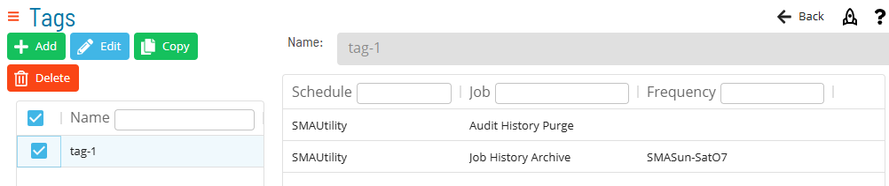
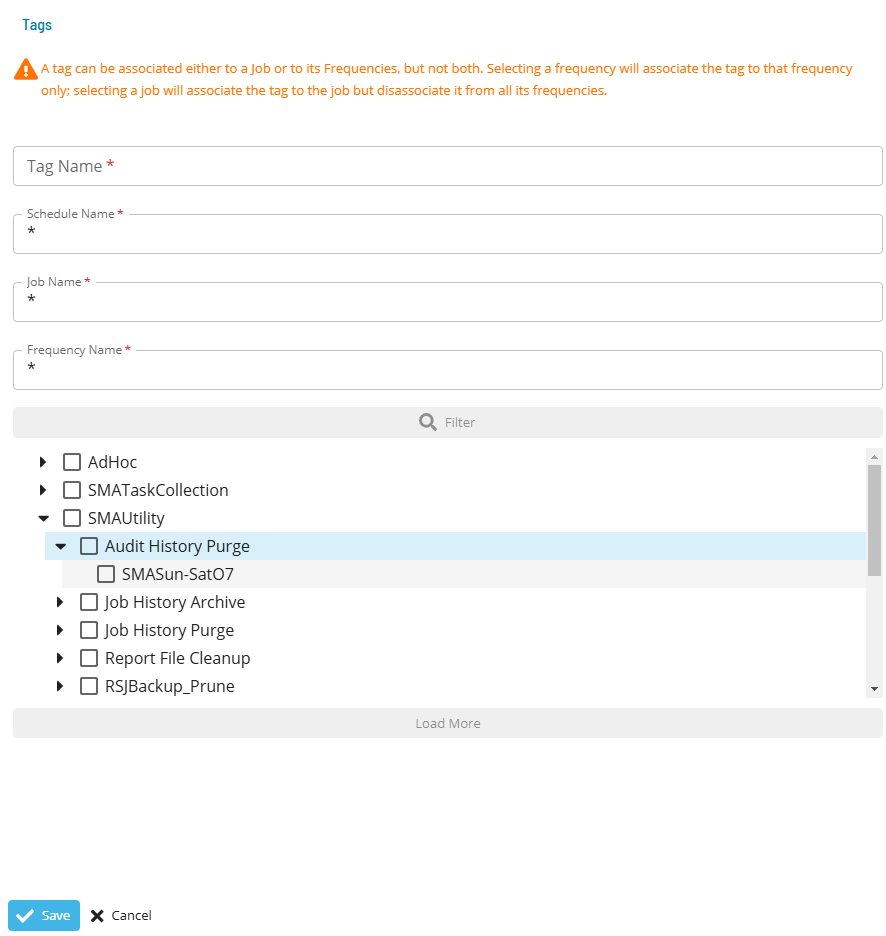

# Managing Tags
Available Tags in OpCon are shown in the following Grid under Library > Tags.

Clicking the **Add**, **Copy** or **Edit** button brings up the following dialog:

Selecting the **Filter** button exposes the schedule-job-frequency tree to select items to associate with the tag.  A tag can be associated either to a job or to its frequencies, but not both. Selecting a frequency will associate the tag to that frequency only; selecting a job will associate the tag to the job but disassociate it from all its frequencies.

:::note
The **Tag Name** field is unique across all tags.
:::

Select a tag in the tags list to see the tag associations grid. This grid displays the schedules, jobs, and frequencies to which a tag is associated.

See [Tag Concepts](../../../../job-components/tags.md).
