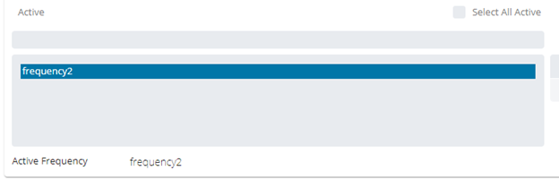
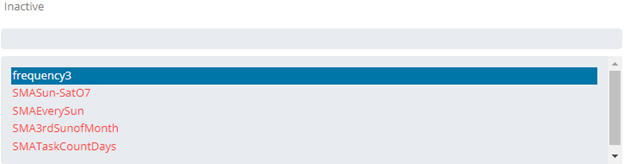

# Viewing and Updating Frequencies

The **Frequencies** panel in **Master Job Definition** displays the
Frequencies relating to the job.

- The panel can be placed in **Full Screen** mode by simply clicking
  the icon ()
  to the far-right side of the panel bar. Escape **Full Screen** mode
  by clicking on the icon again.
- When the panel contains defined properties, a blue circular
  indicator containing a number ()
  will appear to the right of the panel name to indicate the number of
  properties that have been defined.

## Adding or Updating Frequencies

In **Admin** mode, frequencies can be updated. For
conceptual information, refer to
[Frrequency](../../../../../../job-components/frequency.md) in the
**Concepts** online help.

:::note
Only those with the appropriate permissions will have access to the **Lock** button and can update job properties. For details about privileges, refer to [Required Privileges](Accessing-Master-Jobs.md#Required) in the **Accessing Master Job Definition** topic.
:::

To perform this procedure:

1. See [Accessing Master Jobs](Accessing-Master-Jobs.md) to navigate to the master job definition page.
2. Expand the **Frequency** panel to expose its content.
3. Select a frequency from the **Active** left side list (Note: More than one frequency can be selected for Multi-Forecasting).
   
4. Click one of the available buttons (). Or edit the job specific settings.
5. To remove existing frequencies from the job, select a frequency from the **Active** left side list and click the right arrow button ().
6. To add existing frequencies to the job, select a frequency from the **Inactive** right side list and click the left arrow button ().
   
7. Click the **Save** button.
