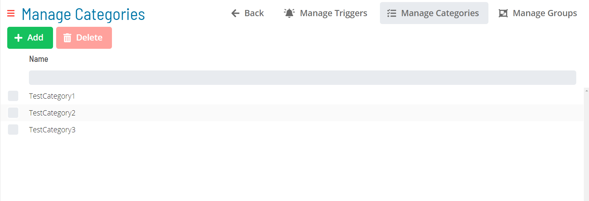
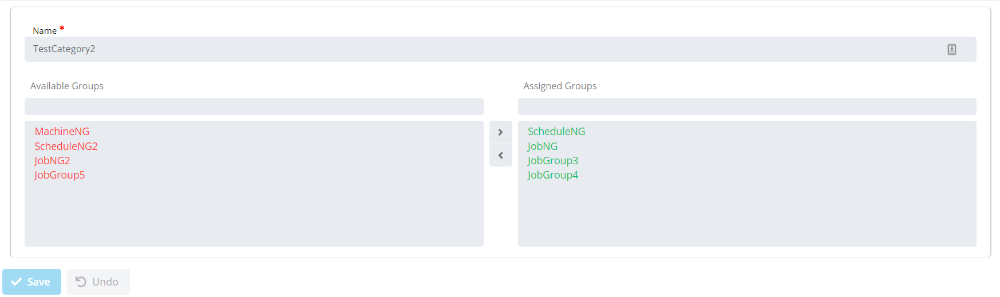

# Notification Categories

Available Notification Categories in OpCon are shown in the following Grid under Library -> Notification Triggers -> Manage Categories.

Clicking the **Add** and **Selecting a record in the grid** will enable the bottom panel:

:::note
The **Name** field must be unique when adding or editing a notification category.
:::
